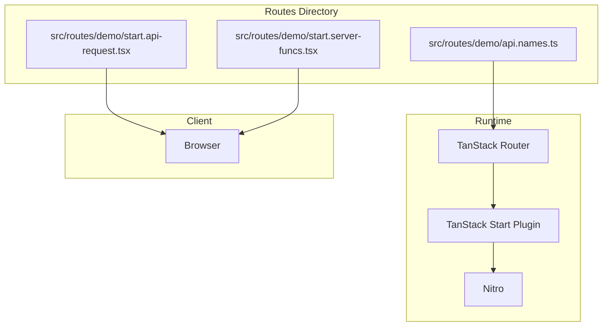
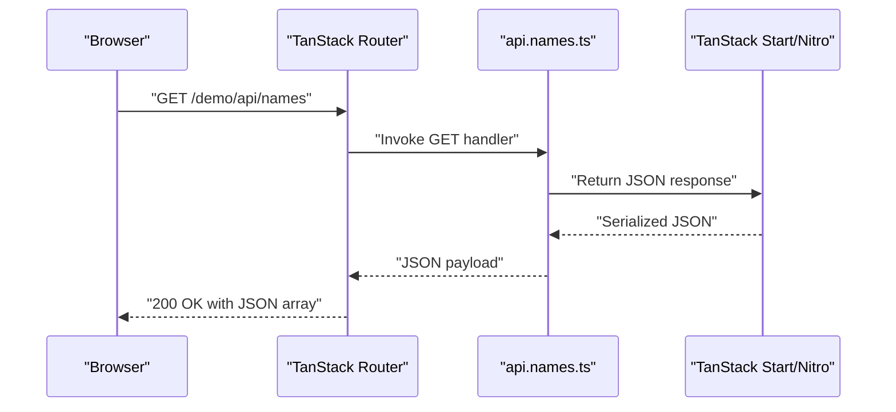
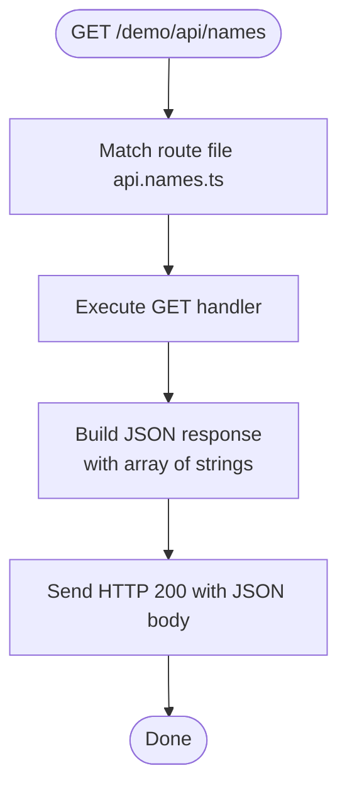
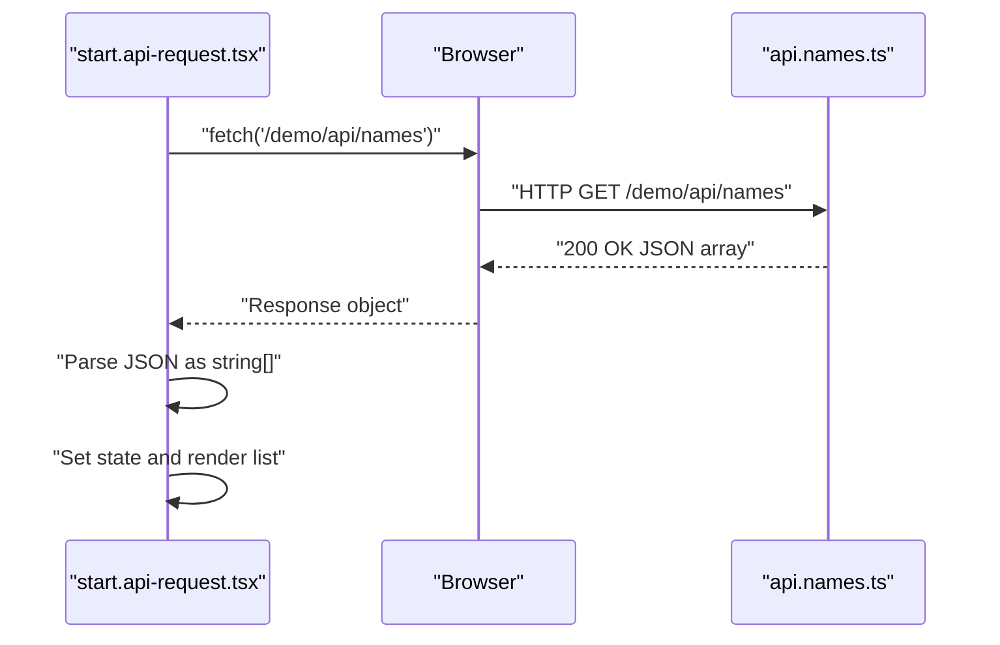
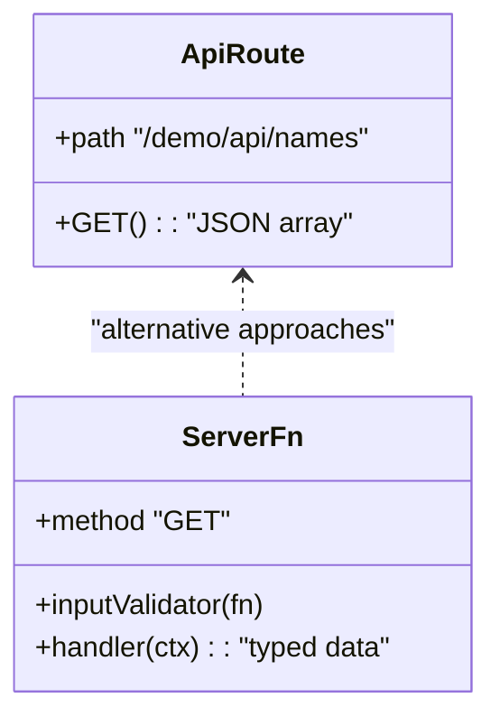
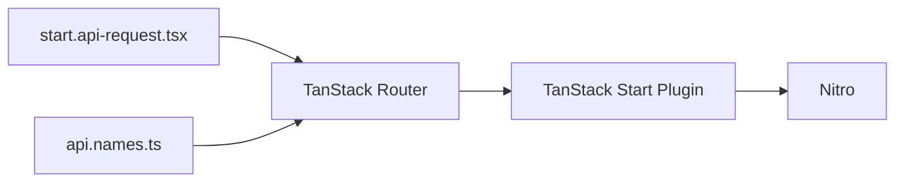

# API Routes

<cite>
**Referenced Files in This Document**
- [api.names.ts](file://src/routes/demo/api.names.ts)
- [start.api-request.tsx](file://src/routes/demo/start.api-request.tsx)
- [start.server-funcs.tsx](file://src/routes/demo/start.server-funcs.tsx)
- [router.tsx](file://src/router.tsx)
- [vite.config.ts](file://vite.config.ts)
- [package.json](file://package.json)
- [tsconfig.json](file://tsconfig.json)
</cite>

## Table of Contents
1. [Introduction](#introduction)
2. [Project Structure](#project-structure)
3. [Core Components](#core-components)
4. [Architecture Overview](#architecture-overview)
5. [Detailed Component Analysis](#detailed-component-analysis)
6. [Dependency Analysis](#dependency-analysis)
7. [Performance Considerations](#performance-considerations)
8. [Troubleshooting Guide](#troubleshooting-guide)
9. [Conclusion](#conclusion)
10. [Appendices](#appendices)

## Introduction
This document describes the /demo/api/names endpoint, a simple GET API that returns a JSON array of strings (names). It explains how API routes are defined using the .api.ts file naming convention under the routes directory, documents the implementation in api.names.ts, and shows client-side consumption via fetch in start.api-request.tsx. It also covers configuration options such as route path derivation, request/response typing, security considerations, and client implementation guidelines. Finally, it contrasts this approach with server functions and explains when to use each.

## Project Structure
The API route is defined as a file-based route under src/routes/demo/api.names.ts. The TanStack Router plugin and TanStack Start plugin are configured in the Vite configuration, enabling file-based routing and server-side capabilities. The client-side example demonstrates consuming the endpoint using fetch inside a React component.

**Diagram sources**
- [api.names.ts](file://src/routes/demo/api.names.ts#L1-L11)
- [start.api-request.tsx](file://src/routes/demo/start.api-request.tsx#L1-L45)
- [start.server-funcs.tsx](file://src/routes/demo/start.server-funcs.tsx#L1-L110)
- [vite.config.ts](file://vite.config.ts#L1-L24)

**Section sources**
- [vite.config.ts](file://vite.config.ts#L1-L24)
- [package.json](file://package.json#L1-L49)
- [tsconfig.json](file://tsconfig.json#L1-L29)

## Core Components
- Endpoint definition: The /demo/api/names endpoint is defined as a file-based route named api.names.ts under the demo route group. The route exposes a GET handler that returns a JSON array of strings.
- Handler signature and response: The handler is declared under the server.handlers.GET property and returns a JSON response containing an array of strings.
- Client-side consumption: A client component demonstrates fetching the endpoint with fetch and parsing the response as a string array.

Key implementation references:
- Route definition and handler: [api.names.ts](file://src/routes/demo/api.names.ts#L1-L11)
- Client fetch and rendering: [start.api-request.tsx](file://src/routes/demo/start.api-request.tsx#L1-L45)

**Section sources**
- [api.names.ts](file://src/routes/demo/api.names.ts#L1-L11)
- [start.api-request.tsx](file://src/routes/demo/start.api-request.tsx#L1-L45)

## Architecture Overview
The endpoint is part of a file-based routing system. The TanStack Start plugin integrates with Nitro to enable server-side features. The client consumes the endpoint via a standard browser fetch call.

**Diagram sources**
- [api.names.ts](file://src/routes/demo/api.names.ts#L1-L11)
- [vite.config.ts](file://vite.config.ts#L1-L24)

## Detailed Component Analysis

### API Route Definition: /demo/api/names
- File naming convention: Routes are defined as files with the .api.ts extension under the routes directory. The path is derived from the file’s position within the routes tree.
- Path derivation: The route path is inferred from the file path. In this case, api.names.ts under demo yields the path /demo/api/names.
- Handler registration: The GET handler is registered under server.handlers.GET and returns a JSON response containing an array of strings.
- Response format: The handler returns a JSON array of strings. The response is produced by the json helper from TanStack Start.

Implementation references:
- Route creation and GET handler: [api.names.ts](file://src/routes/demo/api.names.ts#L1-L11)

**Diagram sources**
- [api.names.ts](file://src/routes/demo/api.names.ts#L1-L11)

**Section sources**
- [api.names.ts](file://src/routes/demo/api.names.ts#L1-L11)

### Client-Side Consumption via fetch
- Fetch call: The client performs a fetch against /demo/api/names and parses the response as a string array.
- Rendering: The resulting array is stored in component state and rendered as a list.
- Typing: The client uses a type assertion to treat the parsed JSON as string[].

Implementation references:
- Fetch and parsing: [start.api-request.tsx](file://src/routes/demo/start.api-request.tsx#L1-L45)

**Diagram sources**
- [start.api-request.tsx](file://src/routes/demo/start.api-request.tsx#L1-L45)
- [api.names.ts](file://src/routes/demo/api.names.ts#L1-L11)

**Section sources**
- [start.api-request.tsx](file://src/routes/demo/start.api-request.tsx#L1-L45)

### Comparison with Server Functions
- API routes (.api.ts): Defined as files with .api.ts under routes. Expose HTTP endpoints directly. Suitable for simple, stateless endpoints returning arrays or primitives.
- Server functions: Created with createServerFn and handler methods. Offer richer features like input validation, middleware, typed inputs/outputs, and tighter integration with loaders and SSR. Better for complex workflows requiring validation, authentication, or SSR-friendly data loading.

Implementation references:
- Server function creation and handler: [start.server-funcs.tsx](file://src/routes/demo/start.server-funcs.tsx#L1-L110)

**Diagram sources**
- [api.names.ts](file://src/routes/demo/api.names.ts#L1-L11)
- [start.server-funcs.tsx](file://src/routes/demo/start.server-funcs.tsx#L1-L110)

**Section sources**
- [start.server-funcs.tsx](file://src/routes/demo/start.server-funcs.tsx#L1-L110)

## Dependency Analysis
- Routing engine: TanStack Router manages route matching and navigation.
- Runtime plugins: TanStack Start plugin and Nitro integrate server-side features and HTTP handling.
- Client runtime: React component consumes the endpoint via fetch.

**Diagram sources**
- [router.tsx](file://src/router.tsx#L1-L16)
- [vite.config.ts](file://vite.config.ts#L1-L24)
- [api.names.ts](file://src/routes/demo/api.names.ts#L1-L11)
- [start.api-request.tsx](file://src/routes/demo/start.api-request.tsx#L1-L45)

**Section sources**
- [router.tsx](file://src/router.tsx#L1-L16)
- [vite.config.ts](file://vite.config.ts#L1-L24)
- [package.json](file://package.json#L1-L49)

## Performance Considerations
- Endpoint simplicity: The GET handler returns a small, static array. No database or heavy computation is involved, minimizing latency.
- Client caching: Consider adding cache-control headers at the server level if the data is static and can be cached.
- Network efficiency: For larger datasets, consider pagination or streaming responses.
- SSR vs client fetch: If the data is needed during SSR, consider using loaders or server functions to avoid client-side roundtrips.

[No sources needed since this section provides general guidance]

## Troubleshooting Guide
- Endpoint not found: Verify the file path and naming convention. Ensure the file is placed under src/routes/demo/api.names.ts and that the TanStack Start plugin is enabled in Vite.
- Incorrect response type: Confirm the client expects a JSON array of strings. If the server returns a different shape, adjust either the server response or client parsing.
- CORS issues: If the client is served from a different origin, configure CORS in the server. For TanStack Start/Nitro, consult the server configuration to allow cross-origin requests.
- Type errors: Ensure the client treats the parsed JSON as string[]. If the server returns a different type, update the handler or client typing accordingly.

**Section sources**
- [api.names.ts](file://src/routes/demo/api.names.ts#L1-L11)
- [start.api-request.tsx](file://src/routes/demo/start.api-request.tsx#L1-L45)
- [vite.config.ts](file://vite.config.ts#L1-L24)

## Conclusion
The /demo/api/names endpoint is a minimal, file-based API route that returns a JSON array of strings. It is defined using the .api.ts naming convention and exposed via TanStack Start and Nitro. Client-side consumption is straightforward using fetch and React state. For more complex scenarios involving validation, middleware, or SSR integration, consider server functions instead.

[No sources needed since this section summarizes without analyzing specific files]

## Appendices

### API Definition Summary
- Method: GET
- Path: /demo/api/names
- Response: JSON array of strings
- Handler: server.handlers.GET in api.names.ts

**Section sources**
- [api.names.ts](file://src/routes/demo/api.names.ts#L1-L11)

### Client Implementation Guidelines
- Use fetch to call the endpoint.
- Parse the response as JSON and assert the type as string[].
- Handle loading and error states appropriately.
- For SSR, consider using loaders or server functions to avoid client-side fetch.

**Section sources**
- [start.api-request.tsx](file://src/routes/demo/start.api-request.tsx#L1-L45)

### Security Considerations
- Input validation: Not implemented in this example. For production, validate and sanitize inputs if accepting parameters.
- CORS: Configure CORS policies on the server if serving from different origins.
- Authentication/Authorization: Not implemented here. Add middleware or guards as needed.

**Section sources**
- [api.names.ts](file://src/routes/demo/api.names.ts#L1-L11)
- [vite.config.ts](file://vite.config.ts#L1-L24)