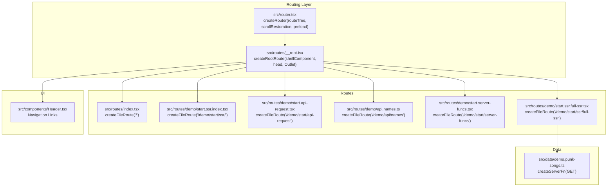
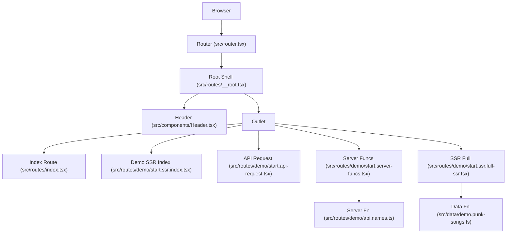
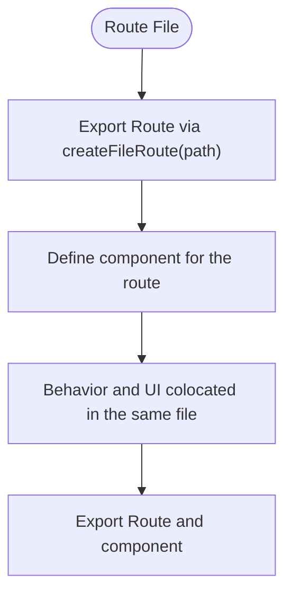
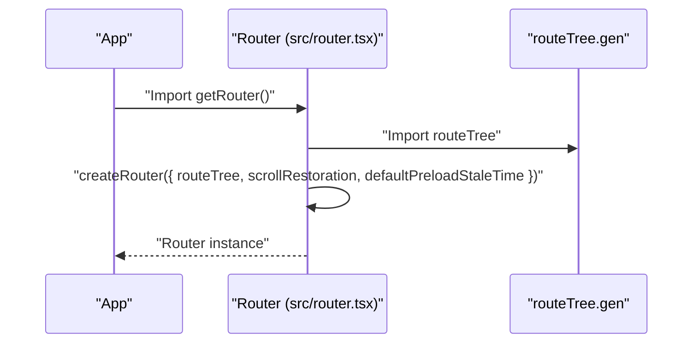
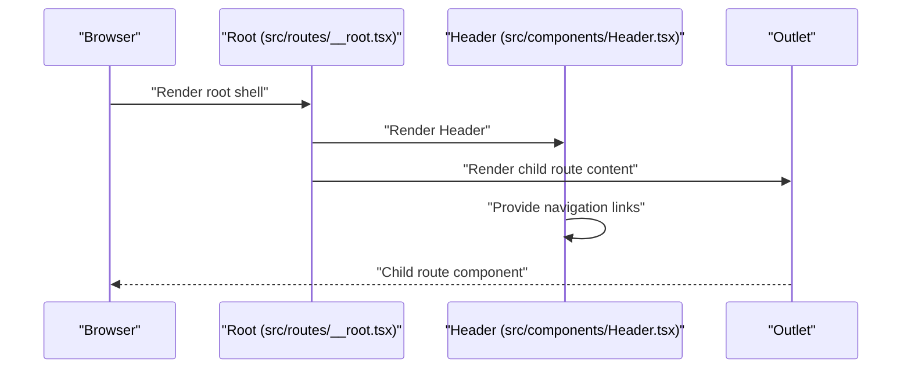
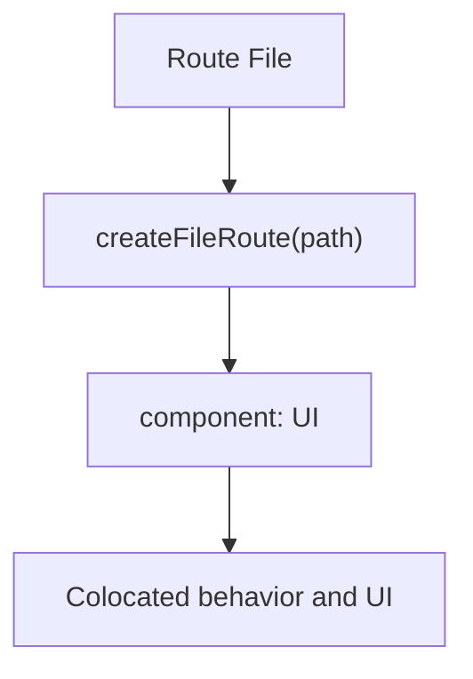
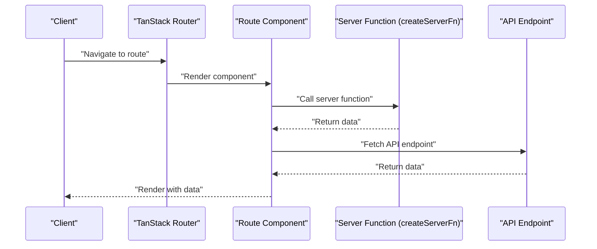
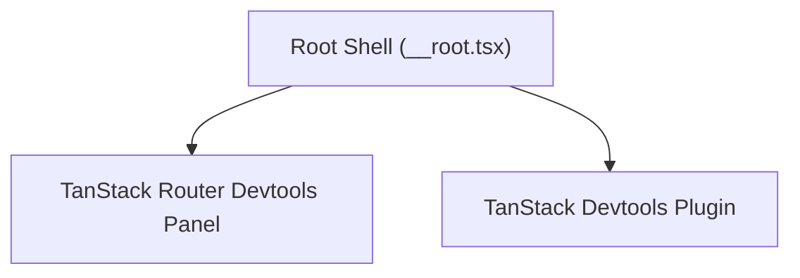
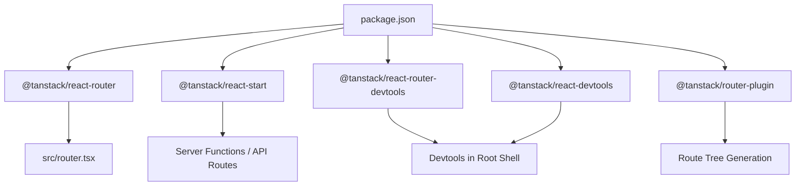

# Core Concepts

<cite>
**Referenced Files in This Document**
- [README.md](file://README.md)
- [package.json](file://package.json)
- [src/router.tsx](file://src/router.tsx)
- [src/routes/__root.tsx](file://src/routes/__root.tsx)
- [src/components/Header.tsx](file://src/components/Header.tsx)
- [src/routes/index.tsx](file://src/routes/index.tsx)
- [src/routes/demo/start.ssr.index.tsx](file://src/routes/demo/start.ssr.index.tsx)
- [src/routes/demo/start.server-funcs.tsx](file://src/routes/demo/start.server-funcs.tsx)
- [src/routes/demo/start.api-request.tsx](file://src/routes/demo/start.api-request.tsx)
- [src/routes/demo/api.names.ts](file://src/routes/demo/api.names.ts)
- [src/routes/demo/start.ssr.full-ssr.tsx](file://src/routes/demo/start.ssr.full-ssr.tsx)
- [src/data/demo.punk-songs.ts](file://src/data/demo.punk-songs.ts)
</cite>

## Table of Contents
1. [Introduction](#introduction)
2. [Project Structure](#project-structure)
3. [Core Components](#core-components)
4. [Architecture Overview](#architecture-overview)
5. [Detailed Component Analysis](#detailed-component-analysis)
6. [Dependency Analysis](#dependency-analysis)
7. [Performance Considerations](#performance-considerations)
8. [Troubleshooting Guide](#troubleshooting-guide)
9. [Conclusion](#conclusion)

## Introduction
This document explains the core concepts of the TanStack Start framework as demonstrated in this project. It focuses on file-based routing with createFileRoute, the auto-generated route tree, router configuration with scroll restoration and preload settings, the root layout pattern, the component co-location pattern, and the integration between @tanstack/react-router and @tanstack/react-start for full-stack capabilities. It also highlights how TanStack Router Devtools enhances development experience and provides concrete examples from the implementation.

## Project Structure
The project follows a file-based routing convention where each route is defined by a file under src/routes. The router is configured in a single place and relies on an auto-generated route tree. The root layout injects a shared Header and integrates TanStack Router Devtools. Demo pages illustrate server functions, API routes, and SSR modes.

**Diagram sources**
- [src/router.tsx](file://src/router.tsx#L1-L16)
- [src/routes/__root.tsx](file://src/routes/__root.tsx#L1-L59)
- [src/routes/index.tsx](file://src/routes/index.tsx#L1-L119)
- [src/routes/demo/start.ssr.index.tsx](file://src/routes/demo/start.ssr.index.tsx#L1-L44)
- [src/routes/demo/start.api-request.tsx](file://src/routes/demo/start.api-request.tsx#L1-L45)
- [src/routes/demo/api.names.ts](file://src/routes/demo/api.names.ts#L1-L11)
- [src/routes/demo/start.server-funcs.tsx](file://src/routes/demo/start.server-funcs.tsx#L1-L110)
- [src/routes/demo/start.ssr.full-ssr.tsx](file://src/routes/demo/start.ssr.full-ssr.tsx#L1-L41)
- [src/components/Header.tsx](file://src/components/Header.tsx#L1-L178)
- [src/data/demo.punk-songs.ts](file://src/data/demo.punk-songs.ts#L1-L14)

**Section sources**
- [README.md](file://README.md#L46-L106)
- [src/router.tsx](file://src/router.tsx#L1-L16)
- [src/routes/__root.tsx](file://src/routes/__root.tsx#L1-L59)

## Core Components
- File-based routing with createFileRoute: Each route file exports a Route object created via createFileRoute(path) and a component. This enables colocating route behavior and UI in the same file.
- Auto-generated route tree: The router imports routeTree from a generated file and passes it to createRouter.
- Router configuration: The router enables scroll restoration and sets default preload stale time.
- Root layout pattern: The root route defines a shellComponent and head metadata, and renders a shared Header and Outlet.
- Component co-location: Each route file defines both the route definition and the UI component, keeping concerns together.
- Full-stack integration: The project uses @tanstack/react-router for routing and @tanstack/react-start for server functions, API routes, and SSR.

**Section sources**
- [src/routes/index.tsx](file://src/routes/index.tsx#L1-L119)
- [src/router.tsx](file://src/router.tsx#L1-L16)
- [src/routes/__root.tsx](file://src/routes/__root.tsx#L1-L59)
- [README.md](file://README.md#L46-L106)

## Architecture Overview
The architecture centers on file-based routing and a root layout that injects a consistent navigation header. The router is configured once and relies on an auto-generated route tree. Demo routes showcase server functions, API endpoints, and SSR modes. TanStack Router Devtools are integrated into the root shell for development.

**Diagram sources**
- [src/router.tsx](file://src/router.tsx#L1-L16)
- [src/routes/__root.tsx](file://src/routes/__root.tsx#L1-L59)
- [src/components/Header.tsx](file://src/components/Header.tsx#L1-L178)
- [src/routes/index.tsx](file://src/routes/index.tsx#L1-L119)
- [src/routes/demo/start.ssr.index.tsx](file://src/routes/demo/start.ssr.index.tsx#L1-L44)
- [src/routes/demo/start.api-request.tsx](file://src/routes/demo/start.api-request.tsx#L1-L45)
- [src/routes/demo/start.server-funcs.tsx](file://src/routes/demo/start.server-funcs.tsx#L1-L110)
- [src/routes/demo/api.names.ts](file://src/routes/demo/api.names.ts#L1-L11)
- [src/routes/demo/start.ssr.full-ssr.tsx](file://src/routes/demo/start.ssr.full-ssr.tsx#L1-L41)
- [src/data/demo.punk-songs.ts](file://src/data/demo.punk-songs.ts#L1-L14)

## Detailed Component Analysis

### File-based Routing with createFileRoute
- Each route file defines a Route export using createFileRoute(path) and a component. This pattern colocates route behavior and UI.
- Examples:
  - Root route: [src/routes/index.tsx](file://src/routes/index.tsx#L1-L119)
  - Demo SSR index: [src/routes/demo/start.ssr.index.tsx](file://src/routes/demo/start.ssr.index.tsx#L1-L44)
  - API request route: [src/routes/demo/start.api-request.tsx](file://src/routes/demo/start.api-request.tsx#L1-L45)
  - Server functions route: [src/routes/demo/start.server-funcs.tsx](file://src/routes/demo/start.server-funcs.tsx#L1-L110)
  - API endpoint: [src/routes/demo/api.names.ts](file://src/routes/demo/api.names.ts#L1-L11)
  - SSR full route: [src/routes/demo/start.ssr.full-ssr.tsx](file://src/routes/demo/start.ssr.full-ssr.tsx#L1-L41)

**Diagram sources**
- [src/routes/index.tsx](file://src/routes/index.tsx#L1-L119)
- [src/routes/demo/start.ssr.index.tsx](file://src/routes/demo/start.ssr.index.tsx#L1-L44)
- [src/routes/demo/start.api-request.tsx](file://src/routes/demo/start.api-request.tsx#L1-L45)
- [src/routes/demo/start.server-funcs.tsx](file://src/routes/demo/start.server-funcs.tsx#L1-L110)
- [src/routes/demo/api.names.ts](file://src/routes/demo/api.names.ts#L1-L11)
- [src/routes/demo/start.ssr.full-ssr.tsx](file://src/routes/demo/start.ssr.full-ssr.tsx#L1-L41)

**Section sources**
- [src/routes/index.tsx](file://src/routes/index.tsx#L1-L119)
- [src/routes/demo/start.ssr.index.tsx](file://src/routes/demo/start.ssr.index.tsx#L1-L44)
- [src/routes/demo/start.api-request.tsx](file://src/routes/demo/start.api-request.tsx#L1-L45)
- [src/routes/demo/start.server-funcs.tsx](file://src/routes/demo/start.server-funcs.tsx#L1-L110)
- [src/routes/demo/api.names.ts](file://src/routes/demo/api.names.ts#L1-L11)
- [src/routes/demo/start.ssr.full-ssr.tsx](file://src/routes/demo/start.ssr.full-ssr.tsx#L1-L41)

### Auto-generated Route Tree and Router Configuration
- The router imports routeTree from a generated file and creates a router instance with scroll restoration enabled and default preload stale time set to zero.
- This setup ensures smooth scrolling after navigation and precise control over preloading behavior.

**Diagram sources**
- [src/router.tsx](file://src/router.tsx#L1-L16)

**Section sources**
- [src/router.tsx](file://src/router.tsx#L1-L16)

### Root Layout Pattern and Header Navigation
- The root route defines a shellComponent that renders a shared Header and the Outlet for child routes.
- The Header provides consistent navigation across all pages, including grouped demos and active link styling.
- TanStack Router Devtools are integrated into the root shell for development.

**Diagram sources**
- [src/routes/__root.tsx](file://src/routes/__root.tsx#L1-L59)
- [src/components/Header.tsx](file://src/components/Header.tsx#L1-L178)

**Section sources**
- [src/routes/__root.tsx](file://src/routes/__root.tsx#L1-L59)
- [src/components/Header.tsx](file://src/components/Header.tsx#L1-L178)

### Component Co-location Pattern
- Each route file defines both the route definition (createFileRoute) and the UI component, keeping behavior and presentation together.
- Examples:
  - Root page: [src/routes/index.tsx](file://src/routes/index.tsx#L1-L119)
  - Demo SSR index: [src/routes/demo/start.ssr.index.tsx](file://src/routes/demo/start.ssr.index.tsx#L1-L44)
  - API request route: [src/routes/demo/start.api-request.tsx](file://src/routes/demo/start.api-request.tsx#L1-L45)
  - Server functions route: [src/routes/demo/start.server-funcs.tsx](file://src/routes/demo/start.server-funcs.tsx#L1-L110)

**Diagram sources**
- [src/routes/index.tsx](file://src/routes/index.tsx#L1-L119)
- [src/routes/demo/start.ssr.index.tsx](file://src/routes/demo/start.ssr.index.tsx#L1-L44)
- [src/routes/demo/start.api-request.tsx](file://src/routes/demo/start.api-request.tsx#L1-L45)
- [src/routes/demo/start.server-funcs.tsx](file://src/routes/demo/start.server-funcs.tsx#L1-L110)

**Section sources**
- [src/routes/index.tsx](file://src/routes/index.tsx#L1-L119)
- [src/routes/demo/start.ssr.index.tsx](file://src/routes/demo/start.ssr.index.tsx#L1-L44)
- [src/routes/demo/start.api-request.tsx](file://src/routes/demo/start.api-request.tsx#L1-L45)
- [src/routes/demo/start.server-funcs.tsx](file://src/routes/demo/start.server-funcs.tsx#L1-L110)

### Full-stack Integration with @tanstack/react-router and @tanstack/react-start
- Routing: @tanstack/react-router powers file-based routing and navigation.
- Server functions and API routes: @tanstack/react-start enables creating server functions and API endpoints colocated with routes.
- SSR: Routes can leverage loaders and server functions to support full SSR, data-only rendering, and SPA mode.
- Data fetching: Server functions can be used to fetch data for SSR and loaders.

Examples:
- Server functions route and API endpoint: [src/routes/demo/start.server-funcs.tsx](file://src/routes/demo/start.server-funcs.tsx#L1-L110), [src/routes/demo/api.names.ts](file://src/routes/demo/api.names.ts#L1-L11)
- SSR full route with loader: [src/routes/demo/start.ssr.full-ssr.tsx](file://src/routes/demo/start.ssr.full-ssr.tsx#L1-L41)
- Data function for SSR: [src/data/demo.punk-songs.ts](file://src/data/demo.punk-songs.ts#L1-L14)

**Diagram sources**
- [src/routes/demo/start.server-funcs.tsx](file://src/routes/demo/start.server-funcs.tsx#L1-L110)
- [src/routes/demo/api.names.ts](file://src/routes/demo/api.names.ts#L1-L11)
- [src/routes/demo/start.ssr.full-ssr.tsx](file://src/routes/demo/start.ssr.full-ssr.tsx#L1-L41)
- [src/data/demo.punk-songs.ts](file://src/data/demo.punk-songs.ts#L1-L14)

**Section sources**
- [src/routes/demo/start.server-funcs.tsx](file://src/routes/demo/start.server-funcs.tsx#L1-L110)
- [src/routes/demo/api.names.ts](file://src/routes/demo/api.names.ts#L1-L11)
- [src/routes/demo/start.ssr.full-ssr.tsx](file://src/routes/demo/start.ssr.full-ssr.tsx#L1-L41)
- [src/data/demo.punk-songs.ts](file://src/data/demo.punk-songs.ts#L1-L14)

### TanStack Router Devtools Integration
- The root shell integrates TanStack Router Devtools into the application shell, enabling inspection of router state during development.
- The project also includes TanStack Devtools with a plugin for TanStack Router.

References:
- Root shell with Devtools: [src/routes/__root.tsx](file://src/routes/__root.tsx#L1-L59)
- Dependencies: [package.json](file://package.json#L14-L31)

**Diagram sources**
- [src/routes/__root.tsx](file://src/routes/__root.tsx#L1-L59)
- [package.json](file://package.json#L14-L31)

**Section sources**
- [src/routes/__root.tsx](file://src/routes/__root.tsx#L1-L59)
- [package.json](file://package.json#L14-L31)

## Dependency Analysis
The project depends on TanStack packages for routing, SSR, and development tools. The router configuration imports the generated route tree and enables scroll restoration and preload settings. The root layout integrates the Header and Devtools. Demo routes demonstrate server functions, API routes, and SSR.

**Diagram sources**
- [package.json](file://package.json#L14-L31)
- [src/router.tsx](file://src/router.tsx#L1-L16)
- [src/routes/__root.tsx](file://src/routes/__root.tsx#L1-L59)

**Section sources**
- [package.json](file://package.json#L14-L31)
- [src/router.tsx](file://src/router.tsx#L1-L16)
- [src/routes/__root.tsx](file://src/routes/__root.tsx#L1-L59)

## Performance Considerations
- Scroll restoration is enabled in the router configuration to improve perceived performance and UX after navigation.
- Preload stale time is set to zero, which can influence when preloaded data is considered fresh and can affect network usage and cache behavior.
- SSR routes can reduce initial load time and improve SEO by rendering content on the server.

**Section sources**
- [src/router.tsx](file://src/router.tsx#L1-L16)
- [src/routes/demo/start.ssr.full-ssr.tsx](file://src/routes/demo/start.ssr.full-ssr.tsx#L1-L41)

## Troubleshooting Guide
- If navigation links do not highlight as active, verify the activeProps usage in the Header component and ensure the Link targets match the route paths.
- If SSR demos fail to render data, confirm that the loader is defined and returns the expected data shape in the route component.
- If server functions or API endpoints are unreachable, verify the route path and handler configuration in the route file and ensure the server function is exported correctly.
- If Devtools are not visible, ensure the root shell includes the Devtools integration and that the browser developer tools are open.

**Section sources**
- [src/components/Header.tsx](file://src/components/Header.tsx#L1-L178)
- [src/routes/demo/start.ssr.full-ssr.tsx](file://src/routes/demo/start.ssr.full-ssr.tsx#L1-L41)
- [src/routes/demo/start.server-funcs.tsx](file://src/routes/demo/start.server-funcs.tsx#L1-L110)
- [src/routes/demo/api.names.ts](file://src/routes/demo/api.names.ts#L1-L11)
- [src/routes/__root.tsx](file://src/routes/__root.tsx#L1-L59)

## Conclusion
This project demonstrates TanStack Start’s core concepts: file-based routing with createFileRoute, auto-generated route trees, a root layout with consistent navigation, component co-location, and full-stack capabilities via @tanstack/react-router and @tanstack/react-start. TanStack Router Devtools are integrated into the root shell to enhance development. The demo routes illustrate server functions, API routes, and SSR modes, showcasing the framework’s flexibility and type-safe integrations.