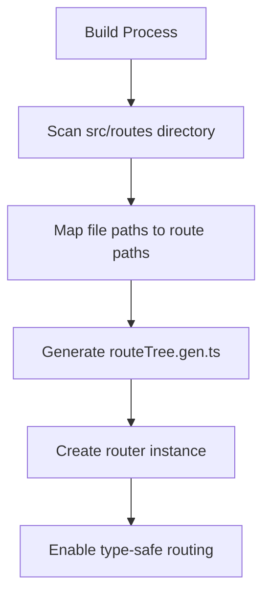
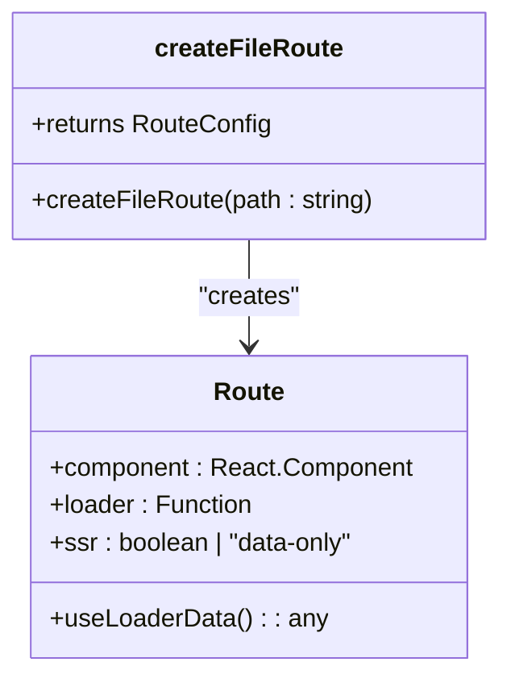
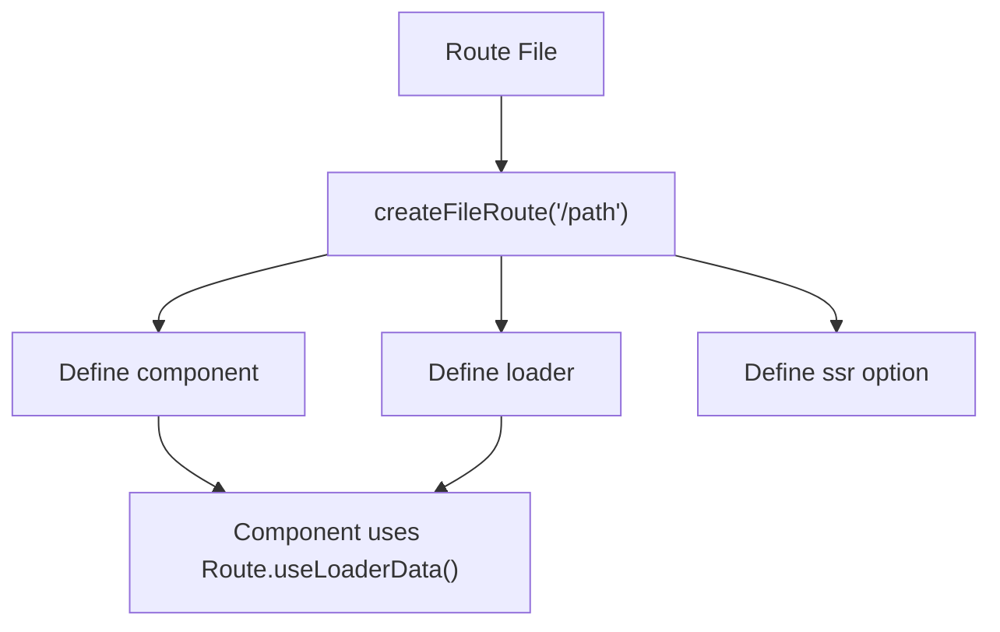
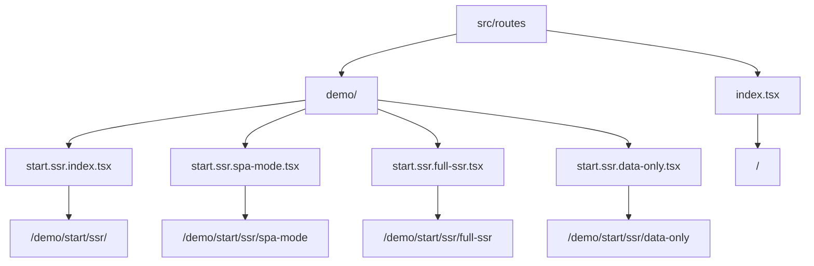
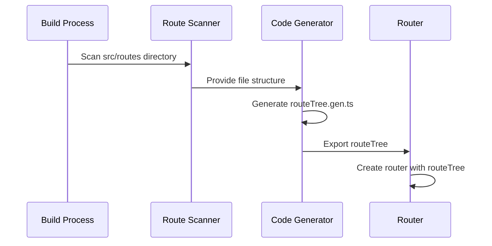
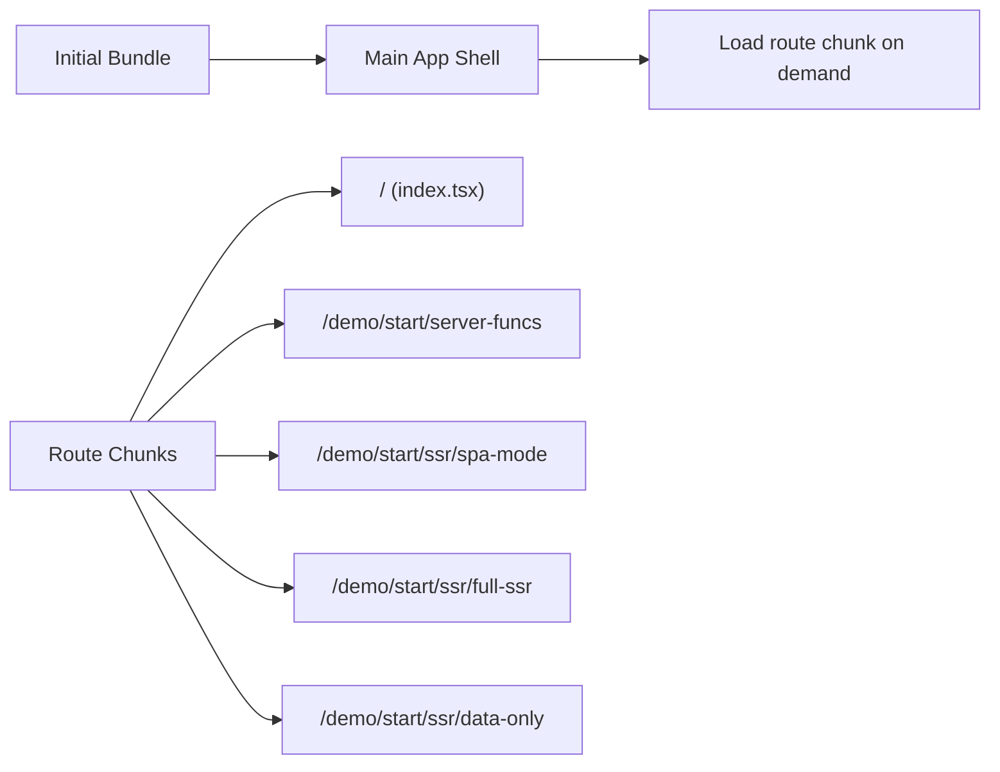
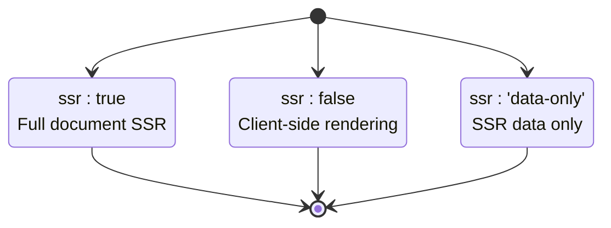
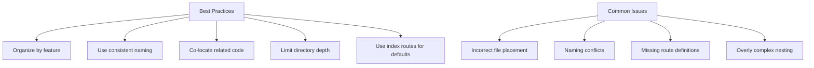

# File-Based Routing

<cite>
**Referenced Files in This Document**   
- [router.tsx](file://src/router.tsx)
- [index.tsx](file://src/routes/index.tsx)
- [start.server-funcs.tsx](file://src/routes/demo/start.server-funcs.tsx)
- [start.ssr.index.tsx](file://src/routes/demo/start.ssr.index.tsx)
- [start.ssr.spa-mode.tsx](file://src/routes/demo/start.ssr.spa-mode.tsx)
- [start.ssr.full-ssr.tsx](file://src/routes/demo/start.ssr.full-ssr.tsx)
- [start.ssr.data-only.tsx](file://src/routes/demo/start.ssr.data-only.tsx)
- [start.api-request.tsx](file://src/routes/demo/start.api-request.tsx)
- [api.names.ts](file://src/routes/demo/api.names.ts)
- [demo.punk-songs.ts](file://src/data/demo.punk-songs.ts)
- [README.md](file://README.md)
</cite>

## Table of Contents
1. [Introduction](#introduction)
2. [Project Structure and Route Discovery](#project-structure-and-route-discovery)
3. [Core Routing Mechanism](#core-routing-mechanism)
4. [Route Configuration and Co-location](#route-configuration-and-co-location)
5. [Nested Routing and Directory Structure](#nested-routing-and-directory-structure)
6. [Type-Safe Route Generation with routeTree.gen](#type-safe-route-generation-with-routetreegen)
7. [Automatic Code Splitting and Bundle Optimization](#automatic-code-splitting-and-bundle-optimization)
8. [Server Functions and API Routes](#server-functions-and-api-routes)
9. [Server-Side Rendering (SSR) Modes](#server-side-rendering-ssr-modes)
10. [Common Issues and Best Practices](#common-issues-and-best-practices)
11. [Conclusion](#conclusion)

## Introduction

TanStack Start implements a file-based routing system that automatically generates routes from the file structure under `src/routes`. This approach eliminates the need for manual route configuration and enables powerful features like type-safe routing, automatic code splitting, and co-located route components, loaders, and configurations. The system leverages `createFileRoute` to define routes based on file paths, with route discovery occurring at build time. This document details how the routing system works, covering route generation, nested routing, SSR modes, server functions, and best practices for organizing complex route hierarchies.

## Project Structure and Route Discovery

The file-based routing system in TanStack Start discovers routes by analyzing the directory structure under `src/routes`. Each file in this directory corresponds to a route, with the file path determining the route path. The system automatically scans this directory at build time to generate the route configuration.



**Diagram sources**
- [README.md](file://README.md#L47-L54)
- [router.tsx](file://src/router.tsx#L4)

**Section sources**
- [README.md](file://README.md#L47-L54)
- [src/routes](file://src/routes)

## Core Routing Mechanism

The core routing mechanism uses `createFileRoute` from `@tanstack/react-router` to define routes based on file paths. Each route file exports a `Route` constant that configures the route's component, loader, and other properties. The route path is derived from the file path, with special characters like dots replaced by slashes.



**Diagram sources**
- [index.tsx](file://src/routes/index.tsx#L11)
- [start.server-funcs.tsx](file://src/routes/demo/start.server-funcs.tsx#L48)

**Section sources**
- [index.tsx](file://src/routes/index.tsx#L1-L119)
- [start.server-funcs.tsx](file://src/routes/demo/start.server-funcs.tsx#L1-L110)

## Route Configuration and Co-location

Route files co-locate their component, loader, and configuration in a single file. This pattern improves maintainability by keeping related code together. The `Route` object is created using `createFileRoute` and configured with properties like `component`, `loader`, and `ssr`. Data from loaders is accessed using `Route.useLoaderData()`.



**Diagram sources**
- [start.server-funcs.tsx](file://src/routes/demo/start.server-funcs.tsx#L48-L51)
- [start.ssr.full-ssr.tsx](file://src/routes/demo/start.ssr.full-ssr.tsx#L4-L7)

**Section sources**
- [start.server-funcs.tsx](file://src/routes/demo/start.server-funcs.tsx#L48-L110)
- [start.ssr.full-ssr.tsx](file://src/routes/demo/start.ssr.full-ssr.tsx#L1-L41)

## Nested Routing and Directory Structure

Nested routing is achieved through directory structure in the `src/routes` folder. Subdirectories create parent-child route relationships, enabling layout sharing and hierarchical navigation. Index routes are created using `index.tsx` files, which serve as the default route for their parent directory.



**Diagram sources**
- [index.tsx](file://src/routes/index.tsx)
- [start.ssr.index.tsx](file://src/routes/demo/start.ssr.index.tsx)
- [start.ssr.spa-mode.tsx](file://src/routes/demo/start.ssr.spa-mode.tsx)

**Section sources**
- [src/routes](file://src/routes)
- [start.ssr.index.tsx](file://src/routes/demo/start.ssr.index.tsx#L1-L44)

## Type-Safe Route Generation with routeTree.gen

The `routeTree.gen.ts` file is automatically generated at build time and contains the type-safe route tree used by the router. This file is imported in `router.tsx` and passed to `createRouter`. The generation process analyzes the `src/routes` directory structure to create a type-safe representation of all routes, enabling compile-time route validation and autocompletion.



**Diagram sources**
- [router.tsx](file://src/router.tsx#L4)
- [biome.json](file://biome.json#L14)

**Section sources**
- [router.tsx](file://src/router.tsx#L1-L16)
- [biome.json](file://biome.json#L14)

## Automatic Code Splitting and Bundle Optimization

The file-based routing system enables automatic code splitting, where each route is bundled separately. This optimization reduces initial load time by only loading the code needed for the current route. The build process creates separate chunks for each route file, which are loaded on-demand when navigating to that route.



**Diagram sources**
- [package.json](file://package.json#L6-L8)
- [vite.config.ts](file://vite.config.ts)

**Section sources**
- [package.json](file://package.json#L6-L8)
- [vite.config.ts](file://vite.config.ts)

## Server Functions and API Routes

TanStack Start supports server functions and API routes alongside regular routes. Server functions are created using `createServerFn` and can be used for data mutations or server-side logic. API routes are defined with the `server` property in the route configuration, allowing direct HTTP handler definition for specific routes.

```mermaid
classDiagram
class createServerFn {
+createServerFn(config)
+handler(fn)
+inputValidator(fn)
}
class APIRoute {
+server : ServerConfig
+handlers : {GET, POST, etc.}
}
class Route {
+loader : Function
+component : Component
}
createServerFn --> Route : "used in"
APIRoute --> Route : "extends"
```

**Diagram sources**
- [start.server-funcs.tsx](file://src/routes/demo/start.server-funcs.tsx#L35-L46)
- [api.names.ts](file://src/routes/demo/api.names.ts#L4-L10)

**Section sources**
- [start.server-funcs.tsx](file://src/routes/demo/start.server-funcs.tsx#L1-L110)
- [api.names.ts](file://src/routes/demo/api.names.ts#L1-L11)
- [demo.punk-songs.ts](file://src/data/demo.punk-songs.ts#L1-L14)

## Server-Side Rendering (SSR) Modes

The routing system supports multiple SSR modes through the `ssr` route option. Routes can be configured for full SSR (`ssr: true`), SPA mode (`ssr: false`), or data-only SSR (`ssr: 'data-only'`). This flexibility allows fine-grained control over rendering behavior for different parts of the application.



**Diagram sources**
- [start.ssr.spa-mode.tsx](file://src/routes/demo/start.ssr.spa-mode.tsx#L6)
- [start.ssr.full-ssr.tsx](file://src/routes/demo/start.ssr.full-ssr.tsx#L4)
- [start.ssr.data-only.tsx](file://src/routes/demo/start.ssr.data-only.tsx#L5)

**Section sources**
- [start.ssr.spa-mode.tsx](file://src/routes/demo/start.ssr.spa-mode.tsx#L1-L48)
- [start.ssr.full-ssr.tsx](file://src/routes/demo/start.ssr.full-ssr.tsx#L1-L41)
- [start.ssr.data-only.tsx](file://src/routes/demo/start.ssr.data-only.tsx#L1-L42)

## Common Issues and Best Practices

Common issues in the file-based routing system include incorrect file placement, naming conflicts, and missing route definitions. Best practices include organizing routes by feature, using consistent naming conventions, and leveraging the co-location pattern to keep related code together. Complex route hierarchies should be organized with clear directory structures to maintain readability.



**Diagram sources**
- [README.md](file://README.md#L49-L53)
- [src/routes](file://src/routes)

**Section sources**
- [README.md](file://README.md#L49-L53)
- [src/routes](file://src/routes)

## Conclusion

The file-based routing system in TanStack Start provides a powerful and intuitive way to define routes through the file system. By leveraging `createFileRoute` and automatic route discovery, it enables type-safe routing, automatic code splitting, and co-location of route components and logic. The system supports nested routing, multiple SSR modes, server functions, and API routes, making it suitable for complex applications. Understanding the relationship between file structure and route paths, along with best practices for organization, is key to effectively using this routing system.