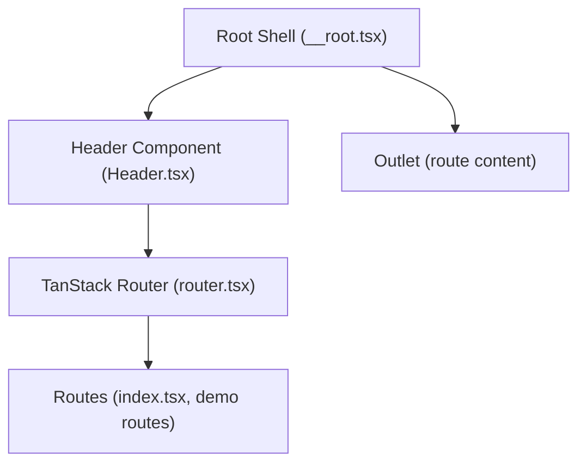
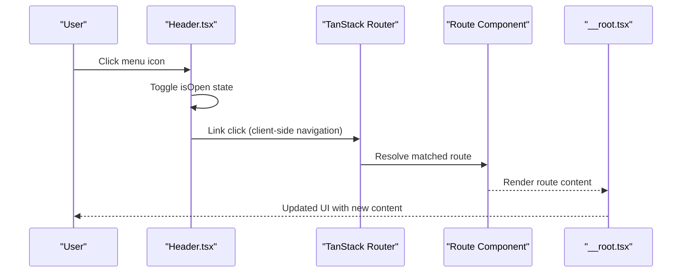
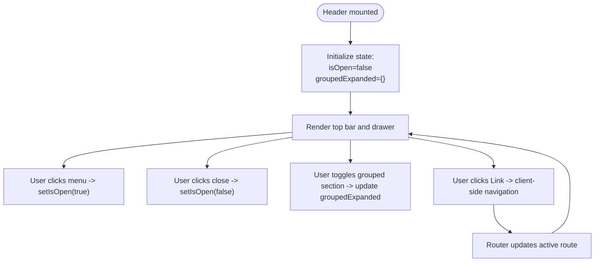
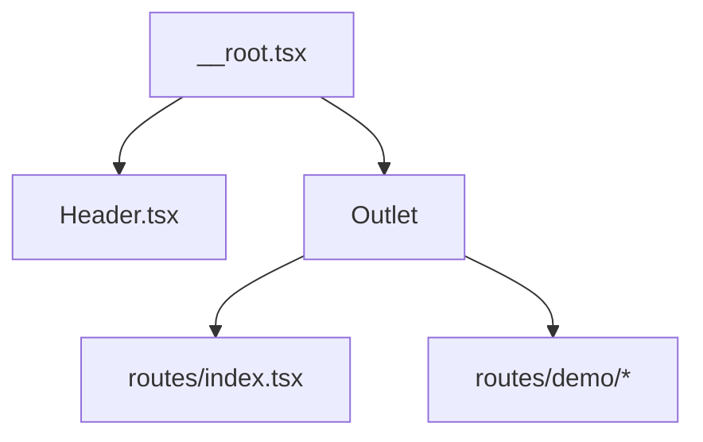
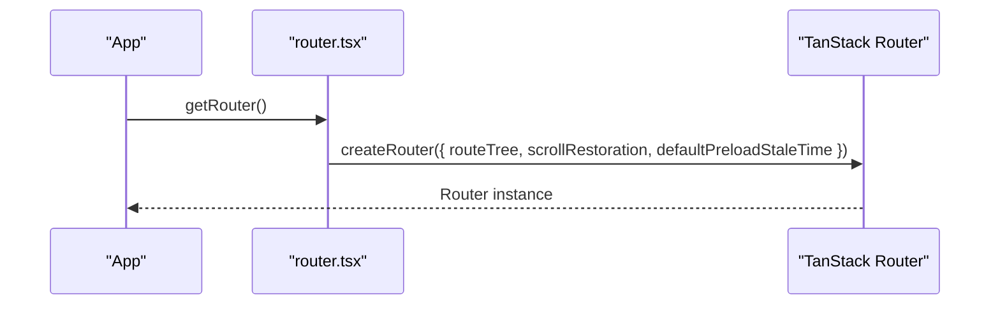
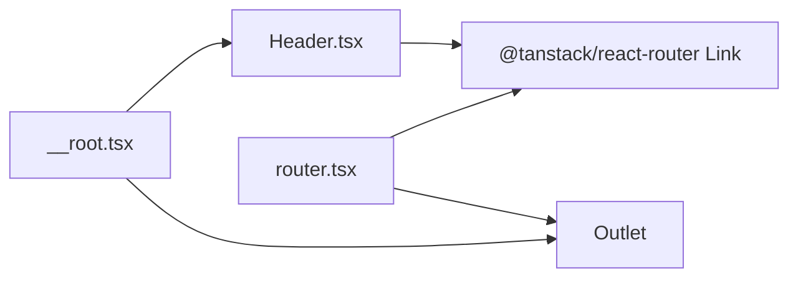

# Layout Management

<cite>
**Referenced Files in This Document**
- [Header.tsx](file://src/components/Header.tsx)
- [__root.tsx](file://src/routes/__root.tsx)
- [router.tsx](file://src/router.tsx)
- [index.tsx](file://src/routes/index.tsx)
- [README.md](file://README.md)
</cite>

## Table of Contents
1. [Introduction](#introduction)
2. [Project Structure](#project-structure)
3. [Core Components](#core-components)
4. [Architecture Overview](#architecture-overview)
5. [Detailed Component Analysis](#detailed-component-analysis)
6. [Dependency Analysis](#dependency-analysis)
7. [Performance Considerations](#performance-considerations)
8. [Accessibility Considerations](#accessibility-considerations)
9. [Troubleshooting Guide](#troubleshooting-guide)
10. [Conclusion](#conclusion)

## Introduction
This document explains the layout management strategy centered on the Header component. It describes how the Header provides a consistent navigation interface across all routes with an expandable sidebar and route links powered by TanStack Router’s Link component. It also covers local state management for the sidebar, integration with the routing system, and practical guidance for building responsive, accessible navigation that works on both desktop and mobile.

## Project Structure
The application uses file-based routing with a root shell that composes the Header into every route. The Header is rendered inside the root shell and manages its own expandable navigation drawer. Navigation links are implemented with TanStack Router’s Link component, enabling client-side navigation and active route highlighting.

**Diagram sources**
- [__root.tsx](file://src/routes/__root.tsx#L1-L59)
- [Header.tsx](file://src/components/Header.tsx#L1-L178)
- [router.tsx](file://src/router.tsx#L1-L16)
- [index.tsx](file://src/routes/index.tsx#L1-L119)

**Section sources**
- [__root.tsx](file://src/routes/__root.tsx#L1-L59)
- [README.md](file://README.md#L46-L106)

## Core Components
- Header component: Provides a top bar with a menu trigger and a persistent sidebar drawer containing navigation links. Uses local state to manage drawer visibility and grouped navigation expansion.
- Root shell: Renders the Header and the page content outlet for all routes.
- Router: Creates the TanStack Router instance and enables scroll restoration and preloading behavior.

Key responsibilities:
- Header: Render top bar, open/close drawer, render navigation links, handle active link styling, and toggle grouped navigation sections.
- Root shell: Compose the Header and outlet for every route.
- Router: Initialize the router with route tree and global defaults.

**Section sources**
- [Header.tsx](file://src/components/Header.tsx#L1-L178)
- [__root.tsx](file://src/routes/__root.tsx#L1-L59)
- [router.tsx](file://src/router.tsx#L1-L16)

## Architecture Overview
The layout is co-located within components rather than using a dedicated layout route. The root shell composes the Header at the top of every route, while individual route components define their own content. Navigation is handled by TanStack Router’s Link component, which performs client-side navigation and applies active styling based on the current route.

**Diagram sources**
- [Header.tsx](file://src/components/Header.tsx#L1-L178)
- [router.tsx](file://src/router.tsx#L1-L16)
- [__root.tsx](file://src/routes/__root.tsx#L1-L59)

## Detailed Component Analysis

### Header Component
The Header component encapsulates:
- Top bar with a menu button to open the drawer and a logo area.
- An overlay drawer that slides in from the left, controlled by local state.
- Navigation links using TanStack Router’s Link component with active styling props.
- Grouped navigation sections with expand/collapse toggles and nested links.

Local state management:
- Sidebar open/closed state is managed with useState.
- Grouped navigation expansion state is tracked per group using a record keyed by group identifiers.

Active route highlighting:
- Each Link uses activeProps to apply a distinct style when the current route matches the link’s destination.

Programmatic navigation:
- While the component does not directly use useRouter for programmatic navigation, TanStack Router’s Link handles client-side navigation. Programmatic navigation elsewhere in the app can leverage the router instance created in router.tsx.

Responsive behavior:
- The drawer is fixed and translates horizontally to show/hide. On smaller screens, the drawer overlays content, and the menu button opens it. On larger screens, the drawer remains accessible and can be used similarly.

Accessibility:
- Buttons include aria-label attributes for screen readers.
- Keyboard navigation is supported by default for interactive elements; ensure focus management when opening/closing the drawer.

Integration with routing:
- Links are defined with to props pointing to route paths.
- activeProps controls active link appearance.

**Diagram sources**
- [Header.tsx](file://src/components/Header.tsx#L1-L178)

**Section sources**
- [Header.tsx](file://src/components/Header.tsx#L1-L178)

### Root Shell Composition
The root shell composes the Header at the top of every route and renders the outlet for the current route content. This ensures the Header appears consistently across all pages without requiring a separate layout route.

**Diagram sources**
- [__root.tsx](file://src/routes/__root.tsx#L1-L59)
- [index.tsx](file://src/routes/index.tsx#L1-L119)

**Section sources**
- [__root.tsx](file://src/routes/__root.tsx#L1-L59)

### Router Initialization
The router is created with a route tree and configured with scroll restoration and preload behavior. This provides a consistent navigation foundation for the app.

**Diagram sources**
- [router.tsx](file://src/router.tsx#L1-L16)

**Section sources**
- [router.tsx](file://src/router.tsx#L1-L16)

## Dependency Analysis
- Header depends on TanStack Router’s Link for navigation and active styling.
- Root shell composes Header and renders the outlet for route content.
- Router initialization provides the navigation context for all components.

**Diagram sources**
- [Header.tsx](file://src/components/Header.tsx#L1-L178)
- [__root.tsx](file://src/routes/__root.tsx#L1-L59)
- [router.tsx](file://src/router.tsx#L1-L16)

**Section sources**
- [Header.tsx](file://src/components/Header.tsx#L1-L178)
- [__root.tsx](file://src/routes/__root.tsx#L1-L59)
- [router.tsx](file://src/router.tsx#L1-L16)

## Performance Considerations
- Drawer rendering: The drawer is always present in the DOM but hidden off-screen until opened. This avoids expensive mount/unmount cycles and improves perceived performance when toggling.
- Active link styling: activeProps is efficient because it only applies a class when the route matches, minimizing unnecessary re-renders.
- Large navigation menus: Grouped sections reduce visual clutter and improve navigation speed. Consider lazy-loading or virtualization for extremely large menus.
- Preloading: The router is configured with default preloading behavior; tune stale times and preload strategies to balance responsiveness and resource usage.

[No sources needed since this section provides general guidance]

## Accessibility Considerations
- Keyboard navigation: Ensure focus moves into the drawer when opened and back to the trigger when closed. Add focus trapping if needed.
- ARIA attributes: Buttons include aria-labels. Consider adding aria-expanded to the menu button and aria-controls to the drawer container.
- Screen readers: Announce drawer state changes and provide clear labels for grouped sections.
- Focus management: When a link is clicked, focus should move to the newly loaded content region.

[No sources needed since this section provides general guidance]

## Troubleshooting Guide
- Navigation not triggering re-renders:
  - Verify that the Link component is used for navigation and that the to prop targets an existing route.
  - Confirm that the router instance is created and passed to the RouterProvider.
- Link styling not applying:
  - Ensure activeProps is configured on each Link and that the class names match the intended active state.
  - Check that the current route matches the Link’s to prop exactly.
- Drawer not closing after navigation:
  - Ensure the onClick handler on each Link calls setIsOpen(false) to close the drawer on selection.
- Mobile vs desktop behavior:
  - On small screens, the drawer overlays content. Test touch gestures and ensure the close button is reachable.
  - On larger screens, verify that the drawer remains usable and that content is not clipped.
- Performance with large navigation menus:
  - Consider grouping related links under collapsible sections to reduce DOM nodes and improve scrolling performance.

**Section sources**
- [Header.tsx](file://src/components/Header.tsx#L1-L178)
- [router.tsx](file://src/router.tsx#L1-L16)
- [README.md](file://README.md#L46-L106)

## Conclusion
The Header component delivers a consistent, accessible navigation experience across all routes by combining a top bar with an expandable sidebar drawer. Local state management keeps the drawer open/closed and grouped sections toggled, while TanStack Router’s Link component provides seamless client-side navigation and active route highlighting. The layout is co-located within the root shell, enabling flexible composition without a dedicated layout route. This approach supports both desktop and mobile experiences and can be extended to meet evolving navigation needs.