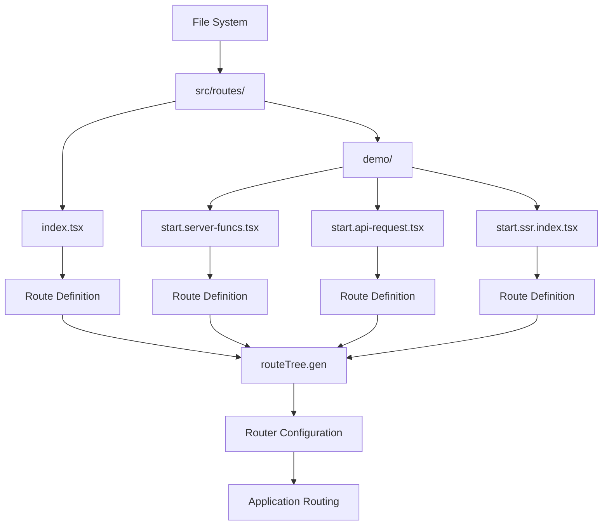
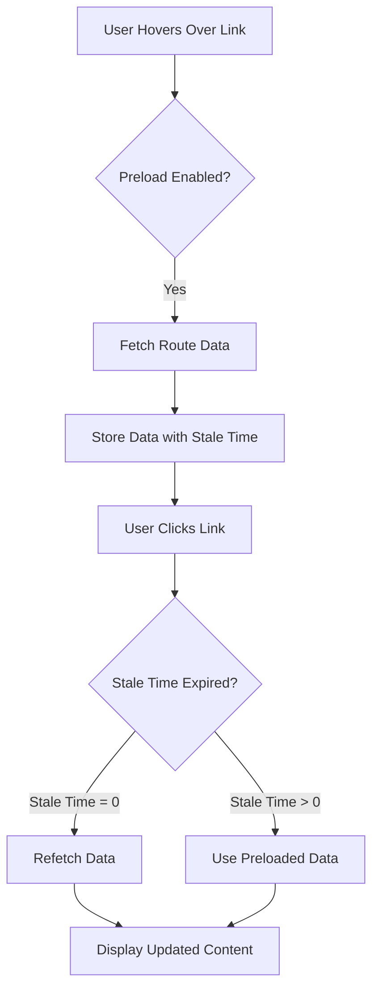
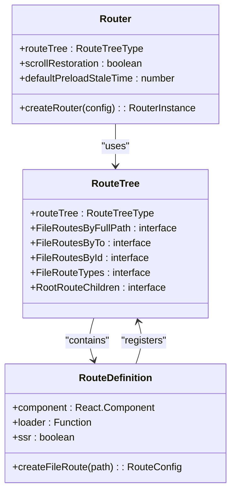

# Router Configuration

<cite>
**Referenced Files in This Document**   
- [router.tsx](file://src/router.tsx)
- [routeTree.gen.ts](file://src/routeTree.gen.ts)
- [__root.tsx](file://src/routes/__root.tsx)
- [index.tsx](file://src/routes/index.tsx)
</cite>

## Table of Contents
1. [Router Configuration](#router-configuration)
2. [Core Router Setup](#core-router-setup)
3. [Route Tree Integration](#route-tree-integration)
4. [Configuration Options](#configuration-options)
5. [Router Factory Pattern](#router-factory-pattern)
6. [Type Safety and Auto-Generated Route Tree](#type-safety-and-auto-generated-route-tree)
7. [Practical Examples of Route Structure Changes](#practical-examples-of-route-structure-changes)
8. [Debugging Common Router Issues](#debugging-common-router-issues)
9. [Extending Router Configuration](#extending-router-configuration)

## Core Router Setup

The router configuration in this project is centered around the TanStack React Router, a powerful routing solution that provides type safety, file-based routing, and server-side rendering capabilities. The core router instance is created in the `src/router.tsx` file, which serves as the central configuration point for the application's routing system.

The router setup follows a clean and modular approach, separating the router configuration from the route definitions and component implementations. This separation of concerns allows for better maintainability and easier testing of the routing configuration.

**Section sources**
- [router.tsx](file://src/router.tsx#L1-L15)

## Route Tree Integration

The router configuration integrates with the auto-generated route tree through the `routeTree` import from `./routeTree.gen`. This generated file contains the complete route hierarchy based on the file structure in the `src/routes` directory. The route tree is automatically generated by the TanStack Router plugin during the build process, ensuring that all routes defined in the file system are properly registered with the router.

The route tree serves as the blueprint for the application's navigation structure, defining all available routes, their paths, and their relationships. By importing this generated route tree, the router can automatically handle navigation between different views in the application without requiring manual route configuration.



**Diagram sources**
- [routeTree.gen.ts](file://src/routeTree.gen.ts#L1-L220)
- [router.tsx](file://src/router.tsx#L4-L5)

**Section sources**
- [routeTree.gen.ts](file://src/routeTree.gen.ts#L1-L220)
- [router.tsx](file://src/router.tsx#L4-L5)

## Configuration Options

The router is configured with several important options that control its behavior and performance characteristics. These options are passed to the `createRouter` function when creating the router instance.

### Scroll Restoration

The `scrollRestoration` option is set to `true`, which enables automatic scroll position restoration when navigating between routes. This means that when a user navigates back to a previous route, the scroll position is restored to where it was when they left that route. This provides a more natural user experience, especially for long pages where users may have scrolled down to specific content.

### Default Preload Stale Time

The `defaultPreloadStaleTime` option is set to `0`, which controls how route preloading behaves. With a value of `0`, preloaded route data is considered immediately stale, meaning that when a user navigates to a preloaded route, the data will be refetched rather than using the potentially outdated preloaded data. This ensures that users always see the most up-to-date content when navigating to a route, at the cost of potentially additional network requests.



**Diagram sources**
- [router.tsx](file://src/router.tsx#L10-L11)

**Section sources**
- [router.tsx](file://src/router.tsx#L10-L11)

## Router Factory Pattern

The router configuration implements a factory pattern through the `getRouter` function, which returns a new router instance when called. This pattern provides several benefits:

1. **Testability**: The factory pattern allows for easy creation of isolated router instances for testing purposes. Tests can create fresh router instances without affecting other tests, ensuring test isolation and reliability.

2. **Reusability**: Multiple router instances can be created if needed for different contexts or configurations. This flexibility is particularly useful in complex applications that may need different routing behaviors in different scenarios.

3. **Dependency Injection**: The factory pattern facilitates dependency injection, allowing the router to be easily provided to different parts of the application without creating tight coupling.

4. **Configuration Flexibility**: The factory function can be extended to accept parameters that customize the router configuration, enabling dynamic router creation based on runtime conditions.

The factory pattern also aligns with functional programming principles by making the router creation process explicit and predictable. Each call to `getRouter` produces a new, independent router instance with the same configuration, ensuring consistency across the application.

**Section sources**
- [router.tsx](file://src/router.tsx#L7-L15)

## Type Safety and Auto-Generated Route Tree

The route tree generation system is a key feature of the TanStack React Router that provides end-to-end type safety for routing. The `routeTree.gen.ts` file is automatically generated based on the file structure in the `src/routes` directory, creating a comprehensive type definition for all routes in the application.

### Auto-Generation Process

The route tree is generated through a build-time process that scans the `src/routes` directory and creates route definitions for each `.tsx` file found. The generation process follows these steps:

1. Scan the `src/routes` directory recursively
2. Identify all `.tsx` files that contain route definitions
3. Extract route configuration from `createFileRoute` calls
4. Generate a hierarchical route tree structure
5. Create TypeScript types for all routes
6. Export the complete route tree for use in the router configuration

### Type Safety Benefits

The auto-generated route tree provides several type safety benefits:

- **Route Parameter Types**: Route parameters are automatically typed based on the route path definition
- **Search Parameter Types**: Search parameters are strongly typed, preventing invalid parameter names
- **Route Transition Safety**: Navigation between routes is type-checked, preventing invalid route transitions
- **Loader Data Types**: Loader data is properly typed, ensuring type safety when accessing loaded data

The generated route tree also includes comprehensive type definitions that are merged into the TanStack Router's type system through declaration merging in the `routeTree.gen.ts` file. This ensures that the entire application has access to the complete route type information.



**Diagram sources**
- [routeTree.gen.ts](file://src/routeTree.gen.ts#L62-L220)
- [router.tsx](file://src/router.tsx#L4-L5)

**Section sources**
- [routeTree.gen.ts](file://src/routeTree.gen.ts#L1-L220)

## Practical Examples of Route Structure Changes

When changes are made to the route structure, the auto-generation system ensures that the router configuration stays in sync with the file system. Here are practical examples of how route structure changes propagate to the router configuration:

### Adding a New Route

When a new route file is added to the `src/routes` directory, the following changes occur:

1. A new file is created (e.g., `src/routes/about.tsx`)
2. The build process detects the new file and generates a route definition
3. The `routeTree.gen.ts` file is updated to include the new route
4. The router automatically recognizes the new route without any configuration changes

### Modifying a Route Path

When a route's path is modified in the `createFileRoute` call:

1. The route definition in the source file is updated
2. The build process regenerates the route tree with the new path
3. Type definitions are updated to reflect the new path
4. The router uses the updated path for navigation

### Removing a Route

When a route file is deleted:

1. The file is removed from the `src/routes` directory
2. The build process detects the removal
3. The `routeTree.gen.ts` file is regenerated without the removed route
4. Type definitions are updated to remove references to the deleted route
5. Attempts to navigate to the removed route will result in type errors

These automatic updates ensure that the routing configuration remains consistent with the application structure, reducing the risk of configuration errors and improving developer productivity.

**Section sources**
- [routeTree.gen.ts](file://src/routeTree.gen.ts#L1-L220)
- [index.tsx](file://src/routes/index.tsx#L11-L119)

## Debugging Common Router Issues

When working with the TanStack React Router, several common issues may arise. Understanding how to diagnose and resolve these issues is essential for maintaining a reliable routing system.

### Route Not Found Errors

When a route fails to load, check the following:

1. Verify that the route file exists in the correct location within `src/routes`
2. Ensure the file name matches the expected route path
3. Check that the `createFileRoute` call uses the correct path parameter
4. Verify that the route tree has been regenerated after file changes

### Type Errors

Type errors related to routing typically indicate a mismatch between the route definition and usage:

1. Check that route parameters are properly typed in both the route definition and usage
2. Verify that search parameters match the expected types
3. Ensure that loader data types are correctly defined and used
4. Confirm that the route tree has been regenerated after type changes

### Server-Side Rendering Issues

For routes with SSR configuration, ensure:

1. The `ssr` property is correctly set in the route definition
2. Server-side data requirements are properly configured
3. The route tree generation process has completed successfully
4. The server environment can access all required resources

### Debugging Tools

The project includes several tools to assist with router debugging:

- TanStack Router Devtools for visualizing route transitions and state
- TypeScript compiler errors for catching type mismatches
- Console logging for tracking route lifecycle events
- Network monitoring for observing data loading behavior

**Section sources**
- [router.tsx](file://src/router.tsx#L1-L15)
- [routeTree.gen.ts](file://src/routeTree.gen.ts#L1-L220)
- [__root.tsx](file://src/routes/__root.tsx#L1-L59)

## Extending Router Configuration

The router configuration can be extended to support additional features and integration points. Here are several ways to enhance the router setup:

### Custom Context

The router can be extended with custom context to provide additional data to route components:

```typescript
// Example of extending router with custom context
const router = createRouter({
  routeTree,
  context: {
    auth: undefined,
    apiClient: undefined,
  },
  // other options
})
```

This allows route components to access shared resources through the router context, promoting consistency and reducing prop drilling.

### History Management

Custom history management can be implemented to integrate with external analytics or to provide custom navigation behavior:

```typescript
const router = createRouter({
  routeTree,
  history: createMemoryHistory(),
  // other options
})
```

This enables scenarios like testing with simulated navigation or integrating with platform-specific navigation systems.

### Server-Side Rendering Integration

The router configuration can be enhanced to support advanced SSR scenarios:

```typescript
const router = createRouter({
  routeTree,
  ssr: true,
  // other SSR-specific options
})
```

This enables full-document server-side rendering, streaming, and progressive enhancement capabilities.

### Performance Optimization

Additional configuration options can be added to optimize router performance:

```typescript
const router = createRouter({
  routeTree,
  preload: 'intent',
  preloadDelay: 100,
  // other performance options
})
```

These options control how and when routes are preloaded, balancing performance with resource usage.

The extensibility of the router configuration ensures that it can adapt to the evolving needs of the application while maintaining a clean and maintainable codebase.

**Section sources**
- [router.tsx](file://src/router.tsx#L1-L15)
- [__root.tsx](file://src/routes/__root.tsx#L1-L59)