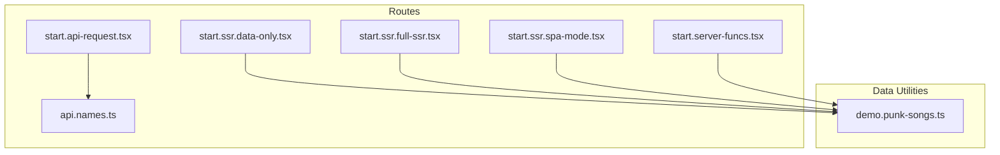
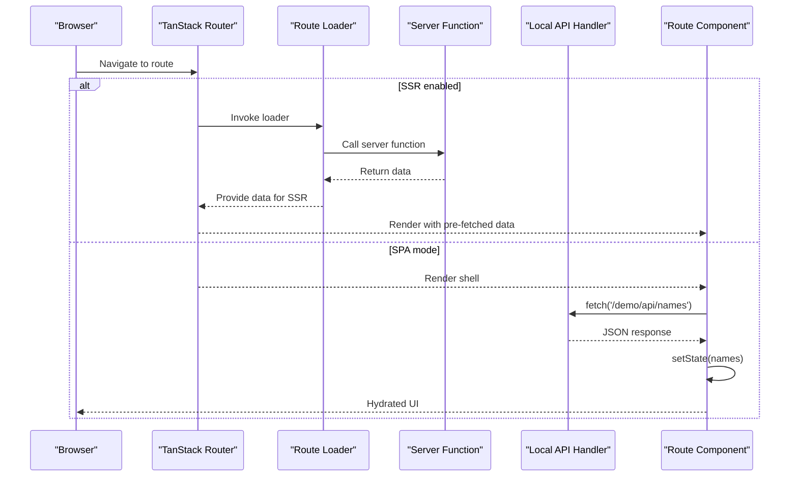
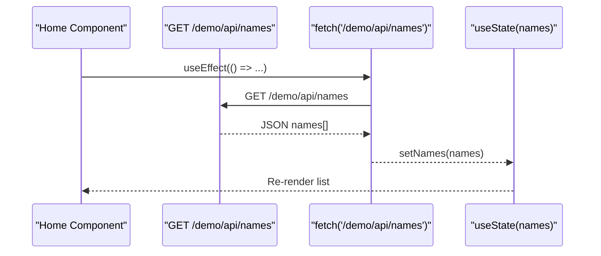
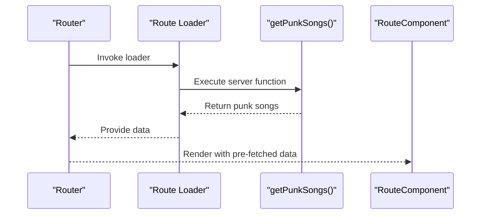
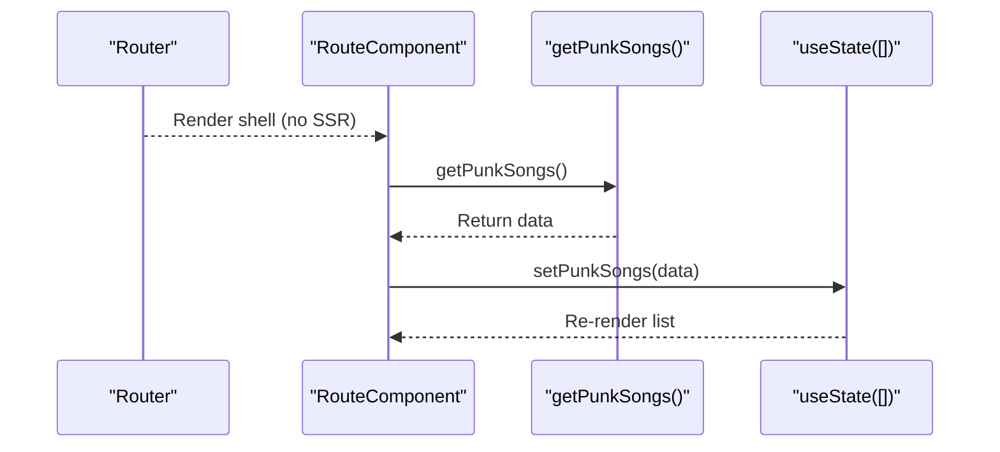
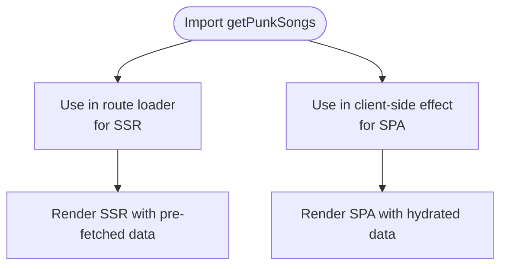
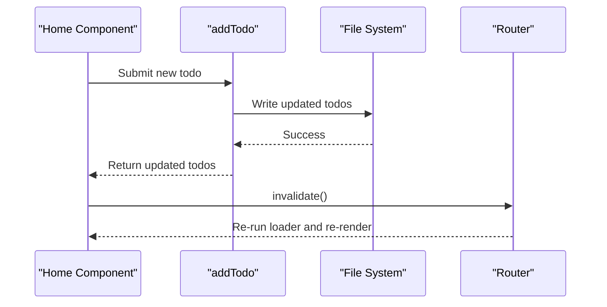
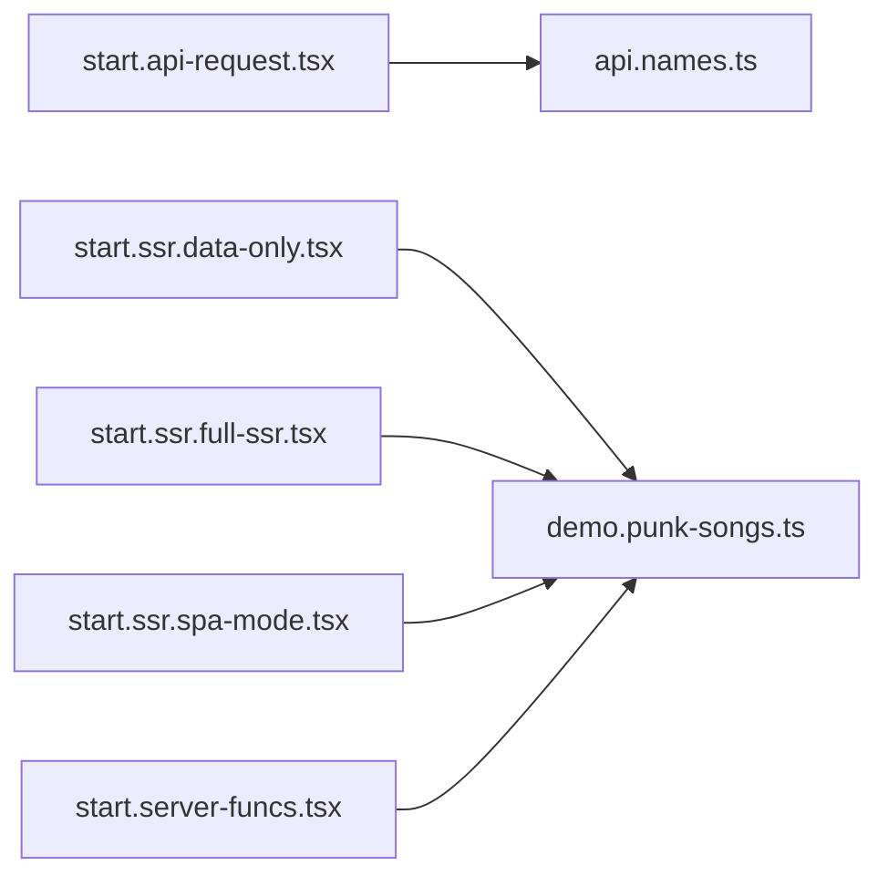

# Data Fetching Patterns

<cite>
**Referenced Files in This Document**
- [README.md](file://README.md)
- [start.api-request.tsx](file://src/routes/demo/start.api-request.tsx)
- [api.names.ts](file://src/routes/demo/api.names.ts)
- [demo.punk-songs.ts](file://src/data/demo.punk-songs.ts)
- [start.ssr.data-only.tsx](file://src/routes/demo/start.ssr.data-only.tsx)
- [start.ssr.full-ssr.tsx](file://src/routes/demo/start.ssr.full-ssr.tsx)
- [start.ssr.spa-mode.tsx](file://src/routes/demo/start.ssr.spa-mode.tsx)
- [start.server-funcs.tsx](file://src/routes/demo/start.server-funcs.tsx)
</cite>

## Table of Contents
1. [Introduction](#introduction)
2. [Project Structure](#project-structure)
3. [Core Components](#core-components)
4. [Architecture Overview](#architecture-overview)
5. [Detailed Component Analysis](#detailed-component-analysis)
6. [Dependency Analysis](#dependency-analysis)
7. [Performance Considerations](#performance-considerations)
8. [Troubleshooting Guide](#troubleshooting-guide)
9. [Conclusion](#conclusion)

## Introduction
This document explains data fetching patterns in TanStack Start with a focus on two primary approaches:
- Route loaders for server-side pre-rendering and hydration
- Client-side data fetching via direct API requests using useEffect and state management

It contrasts the client-side pattern demonstrated in start.api-request.tsx with the loader-based SSR patterns shown in the SSR demo routes. It also documents the shared data utility pattern in demo.punk-songs.ts, where server functions encapsulate data access logic. Guidance is provided on error handling, loading states, caching, and choosing the right pattern based on UX and performance goals. Waterfall avoidance and proper suspense boundaries are addressed using TanStack Start’s concurrent rendering features.

## Project Structure
The demo-related files relevant to data fetching are organized under src/routes/demo and src/data. The key files include:
- Client-side API request demo: start.api-request.tsx
- Server API endpoint for names: api.names.ts
- Shared server function utility: demo.punk-songs.ts
- SSR demos using loaders and server functions: start.ssr.data-only.tsx, start.ssr.full-ssr.tsx, start.ssr.spa-mode.tsx
- Server functions example with input validation and persistence: start.server-funcs.tsx

**Diagram sources**
- [start.api-request.tsx](file://src/routes/demo/start.api-request.tsx#L1-L45)
- [api.names.ts](file://src/routes/demo/api.names.ts#L1-L11)
- [demo.punk-songs.ts](file://src/data/demo.punk-songs.ts#L1-L14)
- [start.ssr.data-only.tsx](file://src/routes/demo/start.ssr.data-only.tsx#L1-L42)
- [start.ssr.full-ssr.tsx](file://src/routes/demo/start.ssr.full-ssr.tsx#L1-L41)
- [start.ssr.spa-mode.tsx](file://src/routes/demo/start.ssr.spa-mode.tsx#L1-L48)
- [start.server-funcs.tsx](file://src/routes/demo/start.server-funcs.tsx#L1-L110)

**Section sources**
- [README.md](file://README.md#L108-L140)
- [start.api-request.tsx](file://src/routes/demo/start.api-request.tsx#L1-L45)
- [api.names.ts](file://src/routes/demo/api.names.ts#L1-L11)
- [demo.punk-songs.ts](file://src/data/demo.punk-songs.ts#L1-L14)
- [start.ssr.data-only.tsx](file://src/routes/demo/start.ssr.data-only.tsx#L1-L42)
- [start.ssr.full-ssr.tsx](file://src/routes/demo/start.ssr.full-ssr.tsx#L1-L41)
- [start.ssr.spa-mode.tsx](file://src/routes/demo/start.ssr.spa-mode.tsx#L1-L48)
- [start.server-funcs.tsx](file://src/routes/demo/start.server-funcs.tsx#L1-L110)

## Core Components
- Client-side API request demo: Demonstrates fetching data via a direct API route handler and managing state with useEffect and useState.
- Loader-based SSR demos: Show how to pre-render data on the server using route loaders and render it on the client.
- Shared server function utility: Encapsulates data access logic behind a server function for reuse across routes.
- Server functions example: Demonstrates typed input validation, server-side persistence, and revalidation via router invalidation.

Key patterns:
- Client-side fetch: start.api-request.tsx uses a local API route handler to return JSON and then sets state in useEffect.
- Loader-based SSR: start.ssr.data-only.tsx and start.ssr.full-ssr.tsx use getPunkSongs (a server function) in route loaders to hydrate data on the server.
- SPA mode fallback: start.ssr.spa-mode.tsx disables SSR and fetches data client-side.
- Shared utility: demo.punk-songs.ts defines a reusable server function for song data.

**Section sources**
- [start.api-request.tsx](file://src/routes/demo/start.api-request.tsx#L1-L45)
- [api.names.ts](file://src/routes/demo/api.names.ts#L1-L11)
- [demo.punk-songs.ts](file://src/data/demo.punk-songs.ts#L1-L14)
- [start.ssr.data-only.tsx](file://src/routes/demo/start.ssr.data-only.tsx#L1-L42)
- [start.ssr.full-ssr.tsx](file://src/routes/demo/start.ssr.full-ssr.tsx#L1-L41)
- [start.ssr.spa-mode.tsx](file://src/routes/demo/start.ssr.spa-mode.tsx#L1-L48)
- [start.server-funcs.tsx](file://src/routes/demo/start.server-funcs.tsx#L1-L110)

## Architecture Overview
The data fetching architecture combines:
- Client-side route loaders for SSR-ready data
- Local API routes returning JSON responses
- Reusable server functions for data access logic
- Client-side fetch with state management for dynamic or non-SSR scenarios

**Diagram sources**
- [start.ssr.full-ssr.tsx](file://src/routes/demo/start.ssr.full-ssr.tsx#L1-L41)
- [start.ssr.data-only.tsx](file://src/routes/demo/start.ssr.data-only.tsx#L1-L42)
- [demo.punk-songs.ts](file://src/data/demo.punk-songs.ts#L1-L14)
- [api.names.ts](file://src/routes/demo/api.names.ts#L1-L11)
- [start.api-request.tsx](file://src/routes/demo/start.api-request.tsx#L1-L45)

## Detailed Component Analysis

### Client-Side Data Fetching with useEffect and State Management
This pattern is demonstrated in start.api-request.tsx:
- A local API route handler returns JSON data.
- The route component fetches data in useEffect and stores it in state.
- The component renders the fetched list.

**Diagram sources**
- [start.api-request.tsx](file://src/routes/demo/start.api-request.tsx#L1-L45)
- [api.names.ts](file://src/routes/demo/api.names.ts#L1-L11)

**Section sources**
- [start.api-request.tsx](file://src/routes/demo/start.api-request.tsx#L1-L45)
- [api.names.ts](file://src/routes/demo/api.names.ts#L1-L11)

### Loader-Based SSR with Server Functions
Two SSR demos illustrate the loader pattern:
- start.ssr.full-ssr.tsx: Uses a loader to fetch data via a server function and renders on the server.
- start.ssr.data-only.tsx: Uses the same server function but marks the route as data-only SSR.

**Diagram sources**
- [start.ssr.full-ssr.tsx](file://src/routes/demo/start.ssr.full-ssr.tsx#L1-L41)
- [start.ssr.data-only.tsx](file://src/routes/demo/start.ssr.data-only.tsx#L1-L42)
- [demo.punk-songs.ts](file://src/data/demo.punk-songs.ts#L1-L14)

**Section sources**
- [start.ssr.full-ssr.tsx](file://src/routes/demo/start.ssr.full-ssr.tsx#L1-L41)
- [start.ssr.data-only.tsx](file://src/routes/demo/start.ssr.data-only.tsx#L1-L42)
- [demo.punk-songs.ts](file://src/data/demo.punk-songs.ts#L1-L14)

### SPA Mode Without SSR
The spa-mode demo disables SSR and performs client-side fetching:
- The route sets ssr: false.
- On mount, it fetches data via the server function and updates state.

**Diagram sources**
- [start.ssr.spa-mode.tsx](file://src/routes/demo/start.ssr.spa-mode.tsx#L1-L48)
- [demo.punk-songs.ts](file://src/data/demo.punk-songs.ts#L1-L14)

**Section sources**
- [start.ssr.spa-mode.tsx](file://src/routes/demo/start.ssr.spa-mode.tsx#L1-L48)
- [demo.punk-songs.ts](file://src/data/demo.punk-songs.ts#L1-L14)

### Shared Data Utility Pattern with Server Functions
The shared utility demo.punk-songs.ts defines a server function that encapsulates data access logic. Routes import and call this function in loaders or client-side code, promoting reuse and consistency.

**Diagram sources**
- [demo.punk-songs.ts](file://src/data/demo.punk-songs.ts#L1-L14)
- [start.ssr.full-ssr.tsx](file://src/routes/demo/start.ssr.full-ssr.tsx#L1-L41)
- [start.ssr.spa-mode.tsx](file://src/routes/demo/start.ssr.spa-mode.tsx#L1-L48)

**Section sources**
- [demo.punk-songs.ts](file://src/data/demo.punk-songs.ts#L1-L14)

### Server Functions with Input Validation and Persistence
The server-funcs demo illustrates:
- Creating server functions with input validators
- Executing server-side operations (e.g., reading/writing files)
- Triggering route invalidation to refresh data after mutations

**Diagram sources**
- [start.server-funcs.tsx](file://src/routes/demo/start.server-funcs.tsx#L1-L110)

**Section sources**
- [start.server-funcs.tsx](file://src/routes/demo/start.server-funcs.tsx#L1-L110)

## Dependency Analysis
- start.api-request.tsx depends on api.names.ts for the names endpoint.
- SSR demos depend on demo.punk-songs.ts for shared data access logic.
- start.server-funcs.tsx depends on demo.punk-songs.ts for data operations and uses router invalidation to refresh data.

**Diagram sources**
- [start.api-request.tsx](file://src/routes/demo/start.api-request.tsx#L1-L45)
- [api.names.ts](file://src/routes/demo/api.names.ts#L1-L11)
- [demo.punk-songs.ts](file://src/data/demo.punk-songs.ts#L1-L14)
- [start.ssr.data-only.tsx](file://src/routes/demo/start.ssr.data-only.tsx#L1-L42)
- [start.ssr.full-ssr.tsx](file://src/routes/demo/start.ssr.full-ssr.tsx#L1-L41)
- [start.ssr.spa-mode.tsx](file://src/routes/demo/start.ssr.spa-mode.tsx#L1-L48)
- [start.server-funcs.tsx](file://src/routes/demo/start.server-funcs.tsx#L1-L110)

**Section sources**
- [start.api-request.tsx](file://src/routes/demo/start.api-request.tsx#L1-L45)
- [api.names.ts](file://src/routes/demo/api.names.ts#L1-L11)
- [demo.punk-songs.ts](file://src/data/demo.punk-songs.ts#L1-L14)
- [start.ssr.data-only.tsx](file://src/routes/demo/start.ssr.data-only.tsx#L1-L42)
- [start.ssr.full-ssr.tsx](file://src/routes/demo/start.ssr.full-ssr.tsx#L1-L41)
- [start.ssr.spa-mode.tsx](file://src/routes/demo/start.ssr.spa-mode.tsx#L1-L48)
- [start.server-funcs.tsx](file://src/routes/demo/start.server-funcs.tsx#L1-L110)

## Performance Considerations
- Prefer route loaders for SSR when SEO and initial page speed are priorities. This avoids client hydration delays and ensures content is ready on first paint.
- Use client-side fetch for dynamic, frequently changing data or when SSR is not desired (spa-mode).
- Minimize waterfall effects by:
  - Coalescing multiple fetches into a single loader or a single client-side effect
  - Leveraging TanStack Start’s concurrent rendering and suspense boundaries to render fallbacks while data loads
- Caching:
  - For loaders, rely on TanStack Router’s built-in caching during navigation
  - For client-side fetch, consider integrating TanStack Query for centralized caching, background refetching, and cache normalization
- Suspense boundaries:
  - Wrap data-dependent sections with suspense boundaries to show loading states progressively
  - Use route-level loaders to guarantee data availability before rendering

[No sources needed since this section provides general guidance]

## Troubleshooting Guide
Common issues and solutions:
- Waterfalls:
  - Symptom: Multiple dependent fetches cause slow renders.
  - Solution: Combine data fetching into a single loader or a single client-side effect; use suspense boundaries to avoid blocking the UI.
- Loading states:
  - Use a loading indicator while data is pending. For SSR, preload data in loaders; for client-side, initialize state with a loading placeholder and update after fetch completes.
- Error handling:
  - For loaders, throw errors or return structured error responses; handle them in route-level error boundaries.
  - For client-side fetch, catch errors and surface user-friendly messages; consider retry logic and optimistic updates where appropriate.
- Caching:
  - For loaders, rely on TanStack Router’s caching behavior.
  - For client-side, integrate TanStack Query to manage cache keys, stale times, and background refetching.
- SSR vs SPA:
  - If a route requires SSR, keep ssr true or data-only and use loaders. If SPA-only, disable SSR and fetch client-side.
- Mutations and revalidation:
  - After mutating data (e.g., adding a todo), invalidate the route to re-run loaders and refresh the UI.

**Section sources**
- [start.ssr.full-ssr.tsx](file://src/routes/demo/start.ssr.full-ssr.tsx#L1-L41)
- [start.ssr.data-only.tsx](file://src/routes/demo/start.ssr.data-only.tsx#L1-L42)
- [start.ssr.spa-mode.tsx](file://src/routes/demo/start.ssr.spa-mode.tsx#L1-L48)
- [start.server-funcs.tsx](file://src/routes/demo/start.server-funcs.tsx#L1-L110)

## Conclusion
Choose the loader pattern for SSR when content readiness and SEO are critical. Use client-side fetch for dynamic, SPA-like experiences. Encapsulate shared data logic in server functions for reuse and consistency. Employ suspense boundaries and concurrent rendering to prevent waterfalls and deliver responsive UIs. Integrate TanStack Query for advanced caching and offline behavior when needed.

[No sources needed since this section summarizes without analyzing specific files]