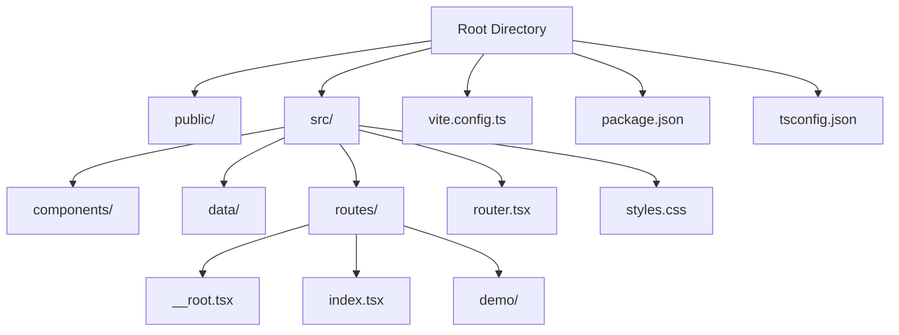
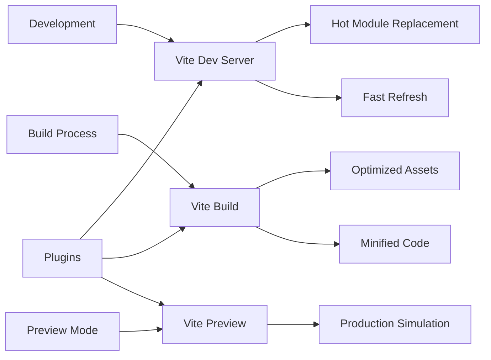
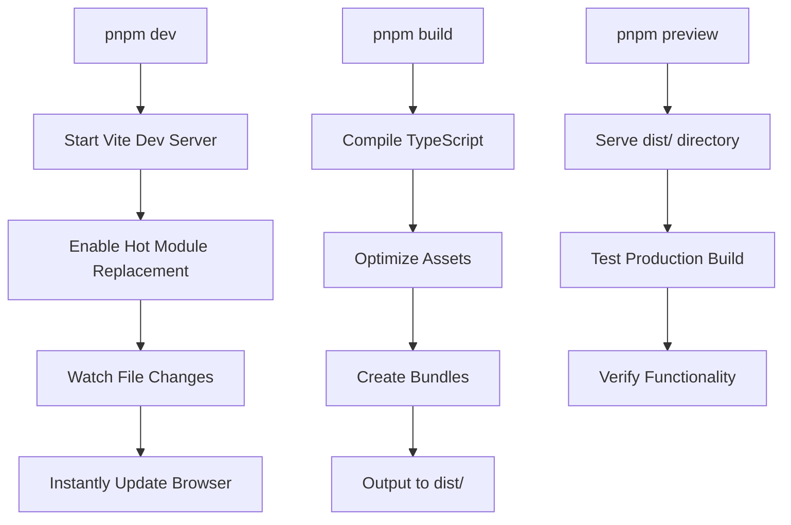
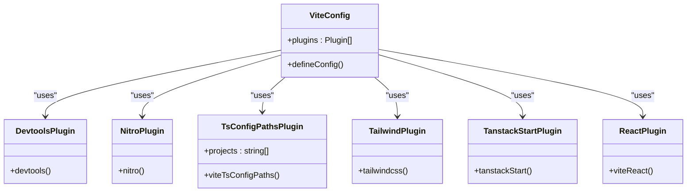

# Build and Development Server Configuration

<cite>
**Referenced Files in This Document**   
- [vite.config.ts](file://vite.config.ts)
- [package.json](file://package.json)
- [tsconfig.json](file://tsconfig.json)
- [src/routes/__root.tsx](file://src/routes/__root.tsx)
- [src/router.tsx](file://src/router.tsx)
</cite>

## Table of Contents
1. [Introduction](#introduction)
2. [Project Structure](#project-structure)
3. [Core Components](#core-components)
4. [Architecture Overview](#architecture-overview)
5. [Detailed Component Analysis](#detailed-component-analysis)
6. [Dependency Analysis](#dependency-analysis)
7. [Performance Considerations](#performance-considerations)
8. [Troubleshooting Guide](#troubleshooting-guide)
9. [Conclusion](#conclusion)

## Introduction
This document provides a comprehensive analysis of the build and development server configuration using Vite in the TanStack Start framework. It details how the development, build, and preview scripts interface with Vite's core functionality, and explains the configuration of essential plugins that enable debugging, backend integration, path resolution, CSS processing, and framework-specific features. The documentation covers practical configuration examples, common issues, and optimization strategies for an efficient development workflow.

## Project Structure
The project follows a standard TanStack Start structure with clear separation of concerns. The source code resides in the `src/` directory with components, routes, and styles organized in dedicated subdirectories. Configuration files for Vite, TypeScript, and package management are located at the root level.



**Diagram sources**
- [vite.config.ts](file://vite.config.ts#L1-L24)
- [package.json](file://package.json#L1-L49)

**Section sources**
- [vite.config.ts](file://vite.config.ts#L1-L24)
- [package.json](file://package.json#L1-L49)

## Core Components
The core components of the build and development configuration revolve around Vite's plugin system and script commands defined in package.json. The `dev`, `build`, and `preview` scripts provide the primary interface for development workflows, while the Vite configuration file orchestrates the plugin ecosystem that extends Vite's capabilities for the TanStack Start framework.

**Section sources**
- [package.json](file://package.json#L6-L8)
- [vite.config.ts](file://vite.config.ts#L1-L24)

## Architecture Overview
The architecture leverages Vite's native development server for fast hot module replacement (HMR) and instant feedback during development. During the build process, Vite compiles the application into optimized static assets. The preview command serves these built assets locally to simulate production behavior. The plugin system extends Vite's functionality to support framework-specific features and development tools.



**Diagram sources**
- [vite.config.ts](file://vite.config.ts#L1-L24)
- [package.json](file://package.json#L6-L8)

## Detailed Component Analysis

### Script Commands Analysis
The package.json file defines three primary scripts that interface with Vite's core functionality. The `dev` script starts the development server on port 3000, enabling real-time code updates. The `build` script compiles the application for production deployment, and the `preview` script serves the built assets locally to verify the production build.



**Diagram sources**
- [package.json](file://package.json#L6-L8)

**Section sources**
- [package.json](file://package.json#L6-L8)

### Vite Configuration Analysis
The vite.config.ts file defines the plugin configuration that extends Vite's capabilities for the TanStack Start framework. The plugin order is critical for proper functionality, with certain plugins needing to execute before others to ensure correct processing of code and assets.



**Diagram sources**
- [vite.config.ts](file://vite.config.ts#L1-L24)

**Section sources**
- [vite.config.ts](file://vite.config.ts#L1-L24)

### Plugin Functionality Analysis
Each plugin in the configuration serves a specific purpose in the development and build workflow. The @tanstack/devtools-vite plugin provides debugging capabilities, nitro/vite enables backend integration, vite-tsconfig-paths resolves path aliases, @tailwindcss/vite processes CSS, and @tanstack/react-start/plugin/vite adds framework-specific functionality.

```mermaid
flowchart TD
A[Source Code] --> B[@tanstack/devtools-vite]
B --> C[Nitro/Vite]
C --> D[vite-tsconfig-paths]
D --> E[@tailwindcss/vite]
E --> F[@tanstack/react-start/plugin/vite]
F --> G[@vitejs/plugin-react]
G --> H[Processed Output]
B --> I[Debugging Tools]
C --> J[Backend Integration]
D --> K[Path Alias Resolution]
E --> L[CSS Processing]
F --> M[Framework Features]
G --> N[React Support]
```

**Diagram sources**
- [vite.config.ts](file://vite.config.ts#L2-L7)
- [tsconfig.json](file://tsconfig.json#L23-L26)

**Section sources**
- [vite.config.ts](file://vite.config.ts#L2-L7)
- [tsconfig.json](file://tsconfig.json#L23-L26)

## Dependency Analysis
The project dependencies are organized into production and development categories. The Vite-related plugins and configuration work together to create a cohesive development environment that supports modern web development practices.

```mermaid
graph TD
A[vite] --> B[@vitejs/plugin-react]
A --> C[vite-tsconfig-paths]
A --> D[@tailwindcss/vite]
E[@tanstack/react-start] --> F[@tanstack/react-router]
E --> G[@tanstack/devtools-vite]
E --> H[nitro/vite]
B --> I[React Development]
C --> J[Path Resolution]
D --> K[Tailwind CSS]
F --> L[Routing]
G --> M[Development Tools]
H --> N[Server Integration]
```

**Diagram sources**
- [package.json](file://package.json#L14-L46)

**Section sources**
- [package.json](file://package.json#L14-L46)

## Performance Considerations
The Vite configuration provides several opportunities for performance optimization. The plugin order can impact build times, with certain plugins benefiting from early execution. Asset handling can be optimized through proper configuration of the build process, and development server performance can be enhanced by fine-tuning the HMR settings.

**Section sources**
- [vite.config.ts](file://vite.config.ts#L1-L24)
- [package.json](file://package.json#L7-L8)

## Troubleshooting Guide
Common issues in Vite-based development environments include plugin conflicts, module resolution errors, and dev server startup failures. These can often be resolved by adjusting the plugin order, verifying path configurations, or checking for version compatibility between dependencies.

**Section sources**
- [vite.config.ts](file://vite.config.ts#L1-L24)
- [tsconfig.json](file://tsconfig.json#L1-L29)
- [package.json](file://package.json#L14-L46)

## Conclusion
The build and development server configuration using Vite in this TanStack Start application provides a robust foundation for modern web development. The integration of specialized plugins extends Vite's capabilities to support framework-specific features while maintaining the fast development experience that Vite is known for. By understanding the relationship between the script commands, configuration file, and plugin ecosystem, developers can effectively customize and optimize their development workflow.