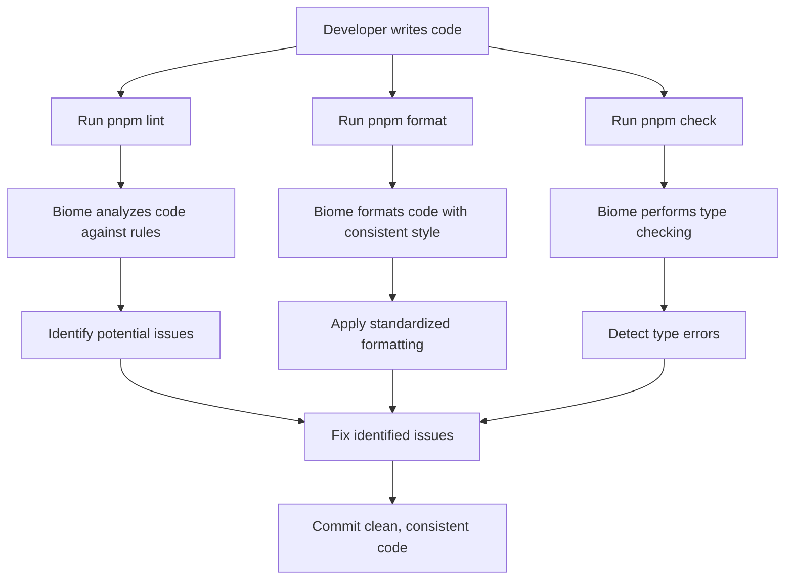
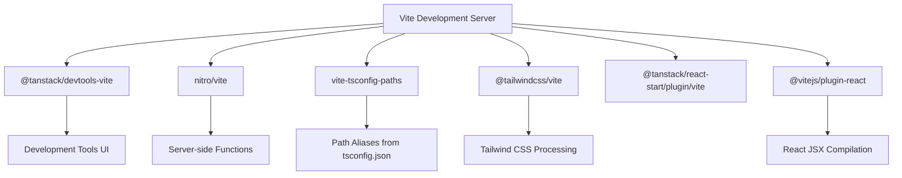

# Development Tools

<cite>
**Referenced Files in This Document**   
- [package.json](file://package.json)
- [vite.config.ts](file://vite.config.ts)
- [biome.json](file://biome.json)
- [tsconfig.json](file://tsconfig.json)
- [README.md](file://README.md)
</cite>

## Table of Contents
1. [Introduction](#introduction)
2. [Testing with Vitest](#testing-with-vitest)
3. [Code Quality with Biome](#code-quality-with-biome)
4. [Vite Configuration](#vite-configuration)
5. [Debugging Tools](#debugging-tools)
6. [Troubleshooting Common Issues](#troubleshooting-common-issues)
7. [Conclusion](#conclusion)

## Introduction
This document provides comprehensive guidance on the development tooling ecosystem for the TanStack Start project. The toolchain is designed to streamline development workflows with modern JavaScript/TypeScript tools. The ecosystem includes Vitest for testing, Biome for linting and formatting, Vite for development and build operations, and specialized debugging tools from the TanStack ecosystem. This documentation covers setup, execution patterns, configuration details, and troubleshooting tips to help developers effectively use these tools in their local environment.

## Testing with Vitest
The project utilizes Vitest as its primary testing framework, configured through the `test` script in package.json. Vitest is a modern testing framework optimized for Vite-based projects, providing fast test execution and seamless integration with the development server. The configuration leverages jsdom as the test environment, enabling browser-like DOM testing for React components. Test execution is initiated via the `pnpm test` command, which runs the `vitest run` command specified in the package.json scripts. The project includes @testing-library/react and @testing-library/dom for component testing, following best practices for React testing. While no explicit vitest.config.ts file is present, Vitest uses sensible defaults that integrate with the existing Vite configuration, inheriting settings like module resolution and TypeScript support.

**Section sources**
- [package.json](file://package.json#L9)
- [pnpm-lock.yaml](file://pnpm-lock.yaml#L93-L95)
- [README.md](file://README.md#L22-L26)

## Code Quality with Biome
Biome is integrated into the project as a unified tool for code formatting, linting, and type checking, replacing traditional combinations of ESLint, Prettier, and TypeScript type checking. The biome.json configuration file defines the rules and settings for all code quality operations. The project uses Biome's formatter with tab indentation and double quotes for JavaScript/TypeScript strings. The linter is enabled with the recommended ruleset, providing consistent code quality enforcement. Three distinct scripts are provided in package.json for different code quality operations: `pnpm lint` for linting, `pnpm format` for code formatting, and `pnpm check` for type checking. The files configuration in biome.json specifies which files to include in these operations, focusing on source files while excluding generated files like routeTree.gen.ts. This integrated approach simplifies the development workflow by providing a single tool for multiple code quality concerns.

**Diagram sources**
- [biome.json](file://biome.json)
- [package.json](file://package.json#L10-L12)

**Section sources**
- [biome.json](file://biome.json)
- [package.json](file://package.json#L10-L12)
- [README.md](file://README.md#L35-L42)

## Vite Configuration
The Vite configuration in vite.config.ts is central to the development and build process, integrating multiple plugins to enhance functionality. The configuration imports and registers several key plugins: @tanstack/devtools-vite for development tools integration, nitro/vite for server-side functionality, vite-tsconfig-paths for TypeScript path alias resolution, @tailwindcss/vite for Tailwind CSS integration, @tanstack/react-start/plugin/vite for TanStack Start features, and @vitejs/plugin-react for React support. The vite-tsconfig-paths plugin is configured to use the tsconfig.json file for path resolution, enabling the use of absolute imports with the @/* alias that maps to the src directory. The @tailwindcss/vite plugin integrates Tailwind CSS directly into the Vite build process, allowing for on-demand CSS compilation and optimization. This comprehensive plugin setup creates a cohesive development environment that supports modern React development with TypeScript, Tailwind CSS, and TanStack ecosystem features.

**Diagram sources**
- [vite.config.ts](file://vite.config.ts)
- [tsconfig.json](file://tsconfig.json)

**Section sources**
- [vite.config.ts](file://vite.config.ts)
- [tsconfig.json](file://tsconfig.json#L23-L26)
- [package.json](file://package.json#L15-L16)

## Debugging Tools
The project incorporates specialized debugging tools from the TanStack ecosystem to enhance the development experience. The @tanstack/devtools-vite plugin is integrated into the Vite configuration, providing enhanced development tools for debugging React applications. This plugin works in conjunction with @tanstack/react-devtools and @tanstack/react-router-devtools, which are listed as dependencies in package.json. These tools provide insights into React component hierarchies, state, and props, as well as routing information specific to the TanStack Router. The devtools plugin is imported and applied in the vite.config.ts file as part of the plugins array, ensuring it's available during development. This debugging setup allows developers to inspect component trees, track state changes, and understand routing behavior, significantly improving the ability to diagnose and fix issues in complex React applications. The integration of these tools directly into the Vite configuration ensures they are automatically available without requiring additional setup from developers.

**Section sources**
- [vite.config.ts](file://vite.config.ts#L2-L3)
- [package.json](file://package.json#L16-L18)
- [README.md](file://README.md#L83-L97)

## Troubleshooting Common Issues
When working with this development tooling ecosystem, several common issues may arise that require troubleshooting. For Vitest testing issues, ensure that the jsdom dependency is properly installed, as it's required for browser-like testing environments. If tests fail due to module resolution problems, verify that the vite-tsconfig-paths plugin is correctly configured in vite.config.ts and that path aliases in tsconfig.json are properly defined. For Biome-related issues, check that the biome.json configuration file is correctly formatted and that the includes/excludes patterns are properly set to cover the intended files. If Tailwind CSS classes are not being recognized, ensure that the @tailwindcss/vite plugin is included in the Vite plugins array and that the Tailwind configuration is correct. When debugging tools are not appearing, verify that @tanstack/devtools-vite is properly imported and applied in the Vite configuration. For general toolchain problems, running `pnpm install` to ensure all dependencies are correctly installed often resolves issues related to missing or mismatched packages.

**Section sources**
- [vite.config.ts](file://vite.config.ts)
- [biome.json](file://biome.json)
- [tsconfig.json](file://tsconfig.json)
- [package.json](file://package.json)

## Conclusion
The development tooling ecosystem in this TanStack Start project provides a comprehensive suite of tools for modern web development. The integration of Vitest for testing, Biome for code quality, and Vite with specialized plugins creates a cohesive and efficient development environment. The configuration leverages modern practices like path aliases, integrated linting/formatting/type checking, and specialized debugging tools to streamline the development workflow. By following the documented scripts and understanding the configuration files, developers can effectively utilize these tools to maintain code quality, catch issues early, and debug applications efficiently. The ecosystem is designed to be developer-friendly, with clear commands for common operations and sensible defaults that reduce configuration overhead while providing extensibility when needed.