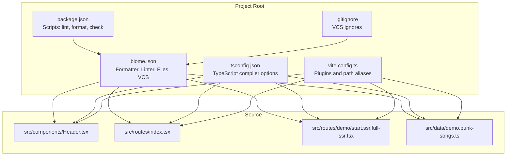
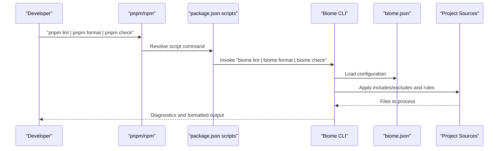
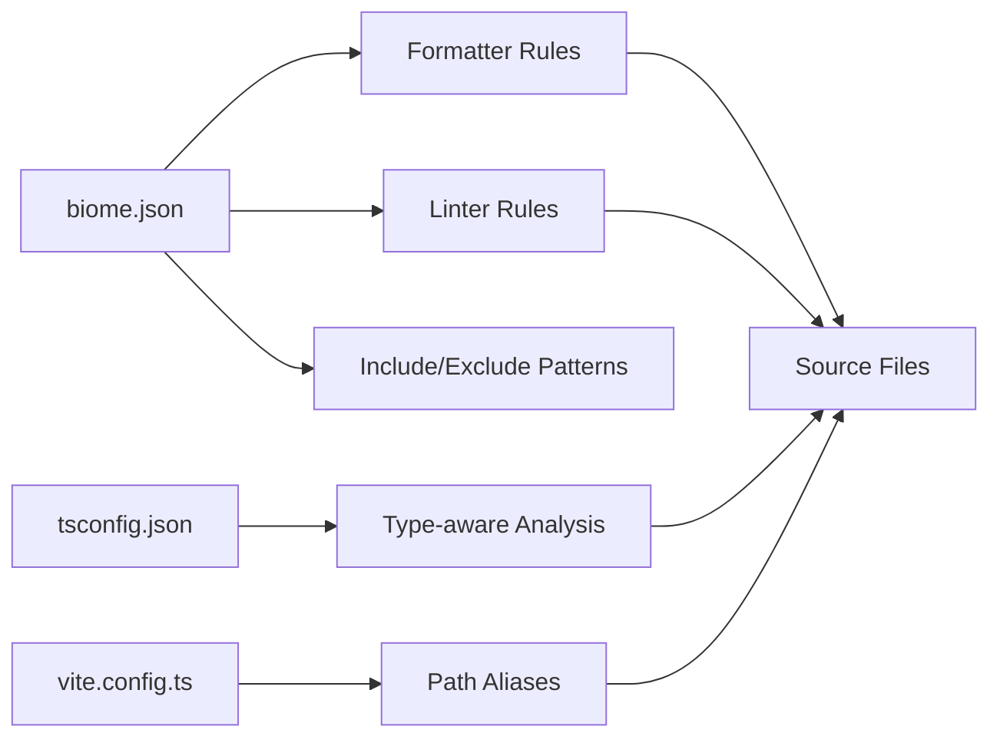

# Linting and Formatting with Biome

<cite>
**Referenced Files in This Document**
- [biome.json](file://biome.json)
- [package.json](file://package.json)
- [README.md](file://README.md)
- [tsconfig.json](file://tsconfig.json)
- [vite.config.ts](file://vite.config.ts)
- [.gitignore](file://.gitignore)
- [src/components/Header.tsx](file://src/components/Header.tsx)
- [src/routes/index.tsx](file://src/routes/index.tsx)
- [src/routes/demo/start.ssr.full-ssr.tsx](file://src/routes/demo/start.ssr.full-ssr.tsx)
- [src/data/demo.punk-songs.ts](file://src/data/demo.punk-songs.ts)
</cite>

## Table of Contents
1. [Introduction](#introduction)
2. [Project Structure](#project-structure)
3. [Core Components](#core-components)
4. [Architecture Overview](#architecture-overview)
5. [Detailed Component Analysis](#detailed-component-analysis)
6. [Dependency Analysis](#dependency-analysis)
7. [Performance Considerations](#performance-considerations)
8. [Troubleshooting Guide](#troubleshooting-guide)
9. [Conclusion](#conclusion)
10. [Appendices](#appendices)

## Introduction
This document explains how Biome is integrated into the development workflow to enforce code quality and consistency. It covers how the project’s package.json scripts map to Biome commands, how the Biome configuration enforces formatting and linting rules, and how these tools fit into the broader build and development process. Practical guidance is included for fixing linting errors, auto-formatting code, and analyzing type-related issues surfaced by Biome. Common configuration pitfalls and troubleshooting tips are also provided.

## Project Structure
The project uses Biome for linting and formatting, with scripts defined in package.json and a configuration file in biome.json. TypeScript configuration and Vite plugin setup support Biome’s analysis and formatting capabilities.

**Diagram sources**
- [package.json](file://package.json#L1-L49)
- [biome.json](file://biome.json#L1-L36)
- [tsconfig.json](file://tsconfig.json#L1-L29)
- [vite.config.ts](file://vite.config.ts#L1-L24)
- [.gitignore](file://.gitignore#L1-L14)

**Section sources**
- [package.json](file://package.json#L1-L49)
- [biome.json](file://biome.json#L1-L36)
- [tsconfig.json](file://tsconfig.json#L1-L29)
- [vite.config.ts](file://vite.config.ts#L1-L24)
- [.gitignore](file://.gitignore#L1-L14)

## Core Components
- Scripts in package.json map to Biome commands:
  - pnpm lint -> biome lint
  - pnpm format -> biome format
  - pnpm check -> biome check
- Biome configuration in biome.json defines:
  - Formatter: indentStyle tab, quoteStyle double
  - Linter: recommended rules enabled
  - Files: include patterns and exclusions
  - VCS: disabled, with explicit clientKind and ignore-file behavior
  - Assist actions: organizeImports enabled
- TypeScript configuration supports Biome’s type-aware linting and formatting.
- Vite configuration provides path aliases and TypeScript path mapping.

**Section sources**
- [package.json](file://package.json#L1-L49)
- [biome.json](file://biome.json#L1-L36)
- [tsconfig.json](file://tsconfig.json#L1-L29)
- [vite.config.ts](file://vite.config.ts#L1-L24)

## Architecture Overview
The Biome workflow integrates with the development process as follows:
- Developers run npm/pnpm scripts to invoke Biome commands.
- Biome reads its configuration to determine which files to include/exclude, how to format, and which lint rules to apply.
- Biome performs formatting and lint checks against the configured file patterns.
- Results surface as diagnostics and can be auto-applied where supported.

**Diagram sources**
- [package.json](file://package.json#L1-L49)
- [biome.json](file://biome.json#L1-L36)

## Detailed Component Analysis

### Biome Configuration (biome.json)
- VCS integration:
  - Disabled globally, with explicit clientKind git and useIgnoreFile disabled. This ensures Biome does not rely on VCS ignore files and operates deterministically.
- Files:
  - Includes: src tree, VS Code folder, index.html, vite.config.js.
  - Exclusions: routeTree.gen.ts and styles.css under src.
  - ignoreUnknown is false, meaning unknown file types are treated as errors.
- Formatter:
  - Enabled with indentStyle tab.
  - JavaScript-level quoteStyle double.
- Linter:
  - Enabled with recommended rules set activated.
- Assist:
  - organizeImports enabled for source actions.

Practical implications:
- Formatting is enforced consistently across TS/TSX and JS files matched by includes.
- Linting applies a curated set of rules suitable for React and TanStack Router projects.
- Exclusions prevent formatting and linting of generated files and styles.css.

**Section sources**
- [biome.json](file://biome.json#L1-L36)

### Package.json Scripts and Biome Commands
- Scripts:
  - lint -> biome lint
  - format -> biome format
  - check -> biome check
- These scripts enable developers to run Biome from the project’s package manager.

How this maps to Biome:
- Running pnpm lint executes biome lint, scanning files according to biome.json includes and applying recommended rules.
- Running pnpm format executes biome format, applying indentation and quoting rules.
- Running pnpm check executes biome check, which typically combines linting and type-related checks depending on the Biome version and configuration.

**Section sources**
- [package.json](file://package.json#L1-L49)

### TypeScript and Path Aliases
- tsconfig.json sets:
  - Target, module, lib, jsx runtime, and bundler moduleResolution.
  - Strictness flags and path aliases (@/* -> ./src/*).
- This supports Biome’s type-aware linting and formatting by aligning module resolution and path mapping.

**Section sources**
- [tsconfig.json](file://tsconfig.json#L1-L29)

### Vite Plugin and Path Mapping
- vite.config.ts registers vite-tsconfig-paths with the project’s tsconfig.json, enabling Biome and other tools to resolve paths consistently during formatting and linting.

**Section sources**
- [vite.config.ts](file://vite.config.ts#L1-L24)

### Example Source Files
- src/components/Header.tsx: Demonstrates React component structure and Tailwind classes.
- src/routes/index.tsx: File-based route component with Tailwind classes and JSX.
- src/routes/demo/start.ssr.full-ssr.tsx: Uses path aliases and imports from data modules.
- src/data/demo.punk-songs.ts: Server function definition using path aliases.

These files illustrate how Biome’s formatter and linter operate across typical project files.

**Section sources**
- [src/components/Header.tsx](file://src/components/Header.tsx#L1-L178)
- [src/routes/index.tsx](file://src/routes/index.tsx#L1-L119)
- [src/routes/demo/start.ssr.full-ssr.tsx](file://src/routes/demo/start.ssr.full-ssr.tsx#L1-L41)
- [src/data/demo.punk-songs.ts](file://src/data/demo.punk-songs.ts#L1-L14)

### Workflow: Fixing Linting Errors
Common scenarios Biome helps address:
- Missing semicolons or trailing commas in JSX/TSX.
- Unused variables or parameters flagged by strict TypeScript settings.
- Incorrect indentation or inconsistent quote usage.
- Import ordering issues addressed by organizeImports.

Recommended steps:
- Run pnpm lint to discover issues.
- Review diagnostics and fix issues iteratively.
- Re-run pnpm lint to confirm fixes.

**Section sources**
- [package.json](file://package.json#L1-L49)
- [biome.json](file://biome.json#L1-L36)
- [tsconfig.json](file://tsconfig.json#L1-L29)

### Workflow: Auto-Formatting Code
- Run pnpm format to apply formatting rules defined in biome.json.
- Biome will adjust indentation to tabs and quotes to double, aligning with the configuration.
- After formatting, re-run pnpm lint to ensure no lint violations remain.

**Section sources**
- [package.json](file://package.json#L1-L49)
- [biome.json](file://biome.json#L1-L36)

### Workflow: Analyzing Type Issues
- Biome’s check command can analyze type-related issues depending on the Biome version and configuration.
- Combine with tsconfig strictness flags to catch unused locals, parameters, and unchecked side effects.
- Use pnpm check to surface type-related diagnostics and address them in TypeScript files.

**Section sources**
- [package.json](file://package.json#L1-L49)
- [biome.json](file://biome.json#L1-L36)
- [tsconfig.json](file://tsconfig.json#L1-L29)

## Dependency Analysis
Biome depends on:
- Configuration file (biome.json) for rules, includes, and excludes.
- TypeScript compiler options (tsconfig.json) for type-aware analysis.
- Vite path mapping (vite.config.ts) for consistent module resolution.

**Diagram sources**
- [biome.json](file://biome.json#L1-L36)
- [tsconfig.json](file://tsconfig.json#L1-L29)
- [vite.config.ts](file://vite.config.ts#L1-L24)

**Section sources**
- [biome.json](file://biome.json#L1-L36)
- [tsconfig.json](file://tsconfig.json#L1-L29)
- [vite.config.ts](file://vite.config.ts#L1-L24)

## Performance Considerations
- Keep includes precise to reduce scan time. The current includes target src, VS Code folder, index.html, and vite.config.js.
- Disable VCS integration if your repository is large or has many ignored files to avoid unnecessary overhead.
- Use recommended linter rules to balance correctness and performance.
- Ensure path aliases are configured in Vite to avoid costly module resolution lookups during formatting/linting.

[No sources needed since this section provides general guidance]

## Troubleshooting Guide

### Ignored Files and Exclusions
- Symptom: Files not being formatted or linted.
- Check biome.json includes and exclusions. Generated files and styles.css are excluded by design.
- Verify .gitignore does not unintentionally ignore files Biome should process.

**Section sources**
- [biome.json](file://biome.json#L1-L36)
- [.gitignore](file://.gitignore#L1-L14)

### VCS Interference
- Symptom: Unexpected behavior due to VCS ignore files.
- Biome’s vcs.enabled is false and useIgnoreFile is false, preventing reliance on VCS ignores. Confirm this setting remains unchanged.

**Section sources**
- [biome.json](file://biome.json#L1-L36)

### Module Resolution Conflicts
- Symptom: Import errors or incorrect path resolution during formatting/linting.
- Ensure vite-tsconfig-paths is configured with the project’s tsconfig.json to align Biome’s module resolution with the build tool.

**Section sources**
- [vite.config.ts](file://vite.config.ts#L1-L24)
- [tsconfig.json](file://tsconfig.json#L1-L29)

### Performance Issues
- Symptom: Slow lint/format runs.
- Narrow includes to only necessary files.
- Disable VCS integration if not needed.
- Reduce strictness flags temporarily to speed up analysis during development, then re-enable for CI.

**Section sources**
- [biome.json](file://biome.json#L1-L36)
- [tsconfig.json](file://tsconfig.json#L1-L29)

### Rule Overrides and Exceptions
- Symptom: Overriding recommended rules or adding exceptions.
- Add or modify rules in biome.json linter.rules. Use caution to maintain consistency across the team.

**Section sources**
- [biome.json](file://biome.json#L1-L36)

## Conclusion
Biome is configured to enforce consistent formatting and robust linting across the project. The package.json scripts provide a simple interface to run biome lint, biome format, and biome check. The configuration emphasizes readability (tabs, double quotes), type-awareness via TypeScript, and predictable file inclusion/exclusion. By following the workflows and troubleshooting tips outlined here, teams can maintain high code quality and consistency with minimal friction.

[No sources needed since this section summarizes without analyzing specific files]

## Appendices

### Quick Reference: Commands and Configuration
- Commands:
  - pnpm lint -> biome lint
  - pnpm format -> biome format
  - pnpm check -> biome check
- Formatter settings:
  - indentStyle tab
  - quoteStyle double (JavaScript)
- Linter settings:
  - recommended rules enabled
- Files configuration:
  - includes: src, VS Code folder, index.html, vite.config.js
  - excludes: routeTree.gen.ts, styles.css (under src)
  - ignoreUnknown: false
- VCS:
  - enabled: false
  - clientKind: git
  - useIgnoreFile: false
- Assist:
  - organizeImports: on

**Section sources**
- [package.json](file://package.json#L1-L49)
- [biome.json](file://biome.json#L1-L36)
- [tsconfig.json](file://tsconfig.json#L1-L29)
- [vite.config.ts](file://vite.config.ts#L1-L24)
- [.gitignore](file://.gitignore#L1-L14)