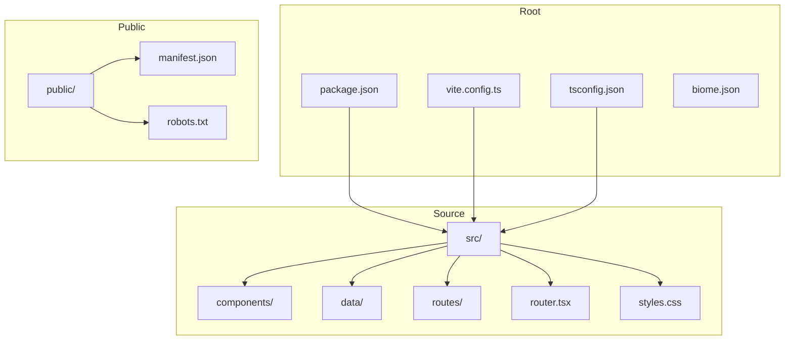
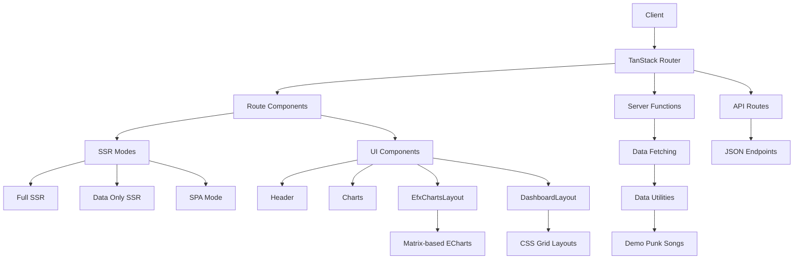
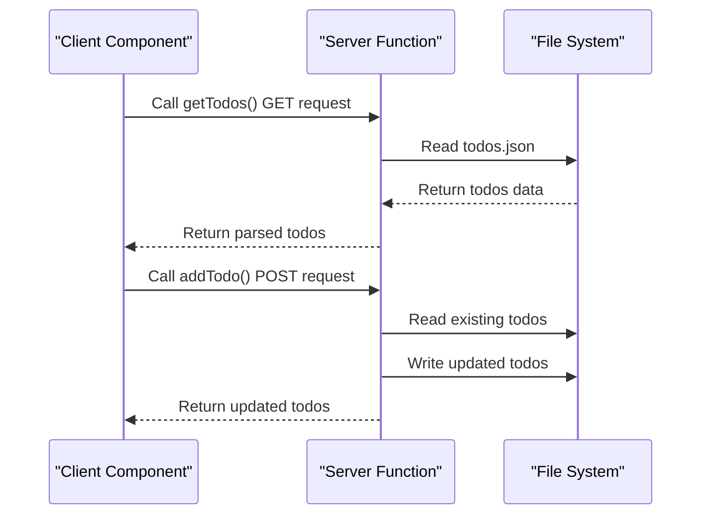
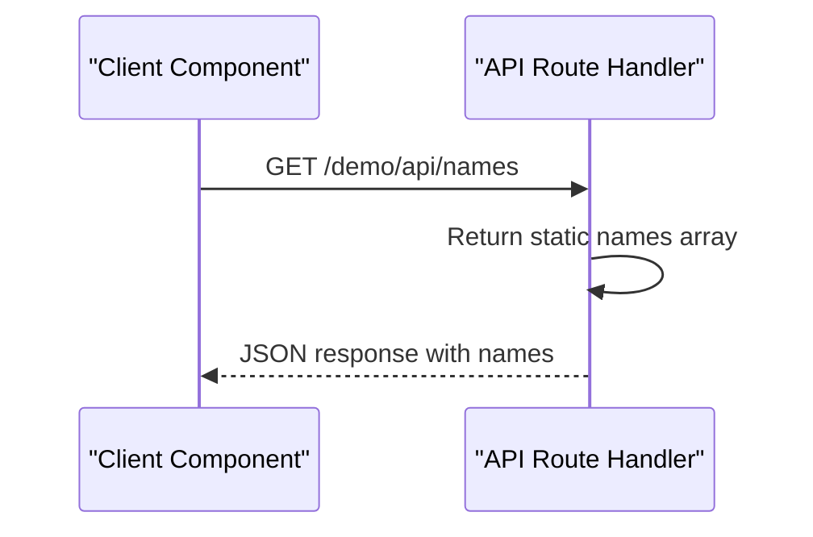
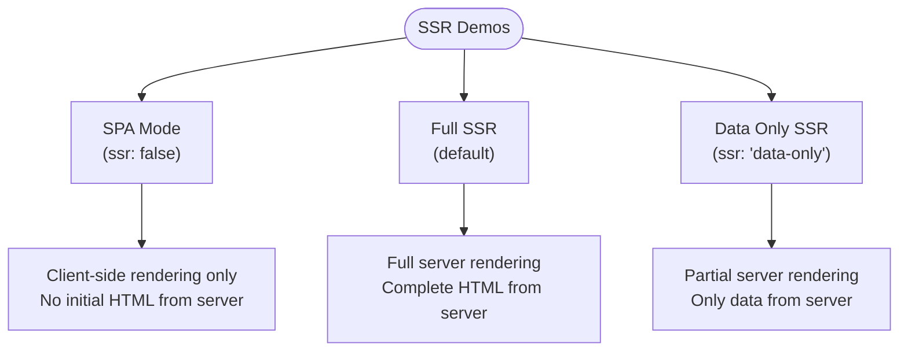
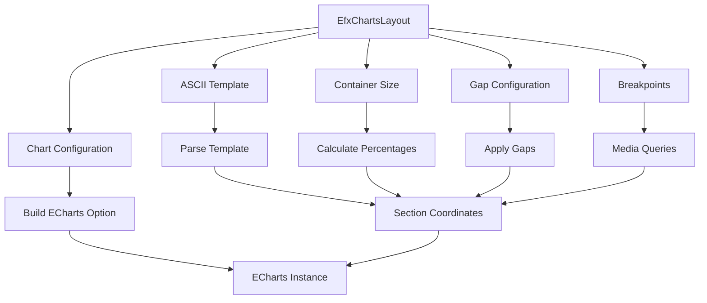
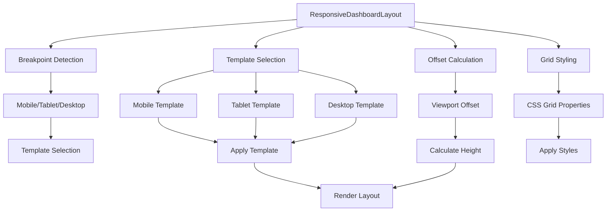
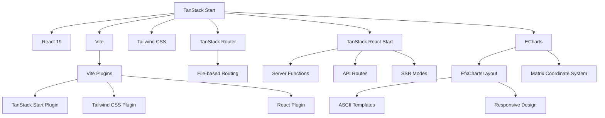

# Project Overview

<cite>
**Referenced Files in This Document**   
- [README.md](file://README.md)
- [package.json](file://package.json)
- [vite.config.ts](file://vite.config.ts)
- [tsconfig.json](file://tsconfig.json)
- [src/router.tsx](file://src/router.tsx)
- [src/routes/index.tsx](file://src/routes/index.tsx)
- [src/components/Header.tsx](file://src/components/Header.tsx)
- [src/routes/efx-charts.tsx](file://src/routes/efx-charts.tsx)
- [src/components/EfxChart/EfxChartsLayout.tsx](file://src/components/EfxChart/EfxChartsLayout.tsx)
- [src/components/EfxChart/types.ts](file://src/components/EfxChart/types.ts)
- [src/components/EfxChart/templates.ts](file://src/components/EfxChart/templates.ts)
- [src/components/layout/DashboardLayout.tsx](file://src/components/layout/DashboardLayout.tsx)
- [src/components/layout/ResponsiveDashboardLayout.tsx](file://src/components/layout/ResponsiveDashboardLayout.tsx)
- [src/components/EfxLayout/layoutPresets.ts](file://src/components/EfxLayout/layoutPresets.ts)
- [src/serverActions/efxChartsActions.ts](file://src/serverActions/efxChartsActions.ts)
</cite>

## Update Summary
**Changes Made**   
- Updated Introduction to reflect new ECharts integration, dashboard layout capabilities, and responsive design features
- Added new section on ECharts Integration and Dashboard Layouts
- Added new section on Responsive Design Implementation
- Updated Architecture Overview to include new layout components
- Updated Detailed Component Analysis with new EfxChartsLayout component
- Added new diagram for ECharts dashboard architecture
- Updated Dependency Analysis to include ECharts and related utilities

## Table of Contents
1. [Introduction](#introduction)
2. [Project Structure](#project-structure)
3. [Core Components](#core-components)
4. [Architecture Overview](#architecture-overview)
5. [Detailed Component Analysis](#detailed-component-analysis)
6. [ECharts Integration and Dashboard Layouts](#echarts-integration-and-dashboard-layouts)
7. [Responsive Design Implementation](#responsive-design-implementation)
8. [Dependency Analysis](#dependency-analysis)
9. [Performance Considerations](#performance-considerations)
10. [Troubleshooting Guide](#troubleshooting-guide)
11. [Conclusion](#conclusion)

## Introduction
The tanstack-start-multi-charts project serves as a demonstration application for the TanStack Start framework, designed to showcase full-stack React capabilities with modern web development practices. This project illustrates how to build applications using server functions, API routes, and multiple server-side rendering (SSR) modes within a unified framework. It functions as an educational resource for developers learning TanStack Start, providing practical examples of file-based routing, co-located route components, and type-safe integration between server and client code. The application leverages React 19, Vite, Tailwind CSS, and ECharts to render multi-chart visualizations, demonstrating a complete stack for modern web applications. Recent updates have enhanced the project with comprehensive ECharts integration, advanced dashboard layout capabilities, and responsive design features that adapt to different screen sizes.

## Project Structure

The project follows a well-organized directory structure that emphasizes clarity and separation of concerns. The `src` directory contains all application code, organized into logical subdirectories for components, data utilities, and routes. The routing system is file-based, with each route represented by a corresponding file in the `src/routes` directory, enabling intuitive navigation and route management. Static assets are stored in the `public` directory, while configuration files for development tools like Vite, TypeScript, and Biome are located in the project root.



**Diagram sources**
- [package.json](file://package.json#L1-L49)
- [vite.config.ts](file://vite.config.ts#L1-L24)
- [tsconfig.json](file://tsconfig.json#L1-L29)

**Section sources**
- [package.json](file://package.json#L1-L49)
- [vite.config.ts](file://vite.config.ts#L1-L24)
- [tsconfig.json](file://tsconfig.json#L1-L29)

## Core Components

The core components of the tanstack-start-multi-charts project include the Header component for navigation, the router configuration for route management, and various demo routes that illustrate different aspects of the TanStack Start framework. The project utilizes co-located route components, where each route file contains both the route definition and its corresponding UI component. Data utilities are organized in the `src/data` directory, providing reusable functions for fetching and processing data. The framework's integration with Vite enables fast development workflows, while Tailwind CSS provides utility-first styling capabilities.

**Section sources**
- [src/components/Header.tsx](file://src/components/Header.tsx#L1-L178)
- [src/router.tsx](file://src/router.tsx#L1-L16)
- [src/routes/index.tsx](file://src/routes/index.tsx#L1-L119)

## Architecture Overview

The tanstack-start-multi-charts application implements a modern full-stack architecture using the TanStack Start framework. The architecture is built around file-based routing, where routes are defined by the file structure in the `src/routes` directory. Each route can have associated server functions, API handlers, and SSR configurations, enabling flexible rendering strategies. The framework provides type-safe integration between server and client code, ensuring end-to-end type safety. The application uses React 19 features and is bundled with Vite for optimal development experience and production builds.



**Diagram sources**
- [src/router.tsx](file://src/router.tsx#L1-L16)
- [src/routes/efx-charts.tsx](file://src/routes/efx-charts.tsx#L1-L230)
- [src/components/EfxChart/EfxChartsLayout.tsx](file://src/components/EfxChart/EfxChartsLayout.tsx#L1-L227)
- [src/components/layout/DashboardLayout.tsx](file://src/components/layout/DashboardLayout.tsx#L1-L118)

## Detailed Component Analysis

### Demo Routes Analysis

The demo routes in the tanstack-start-multi-charts project illustrate various capabilities of the TanStack Start framework. These routes serve as practical examples for developers learning the framework, showcasing different rendering strategies and data fetching patterns.

#### Server Functions Demo
The server functions demo demonstrates how to create server-side functions that can be called from client components. These functions are type-safe and can handle different HTTP methods, with input validation and error handling built into the framework.



**Diagram sources**
- [src/routes/demo/start.server-funcs.tsx](file://src/routes/demo/start.server-funcs.tsx#L1-L110)

#### API Routes Demo
The API routes demo shows how to create type-safe API endpoints within the application. These routes can handle different HTTP methods and return JSON responses, enabling the creation of backend functionality without a separate server.



**Diagram sources**
- [src/routes/demo/api.names.ts](file://src/routes/demo/api.names.ts#L1-L11)
- [src/routes/demo/start.api-request.tsx](file://src/routes/demo/start.api-request.tsx#L1-L45)

#### SSR Strategies Demo
The SSR strategies demo compares different server-side rendering approaches available in the TanStack Start framework, allowing developers to understand the trade-offs between various rendering modes.



**Diagram sources**
- [src/routes/demo/start.ssr.index.tsx](file://src/routes/demo/start.ssr.index.tsx#L1-L44)
- [src/routes/demo/start.ssr.spa-mode.tsx](file://src/routes/demo/start.ssr.spa-mode.tsx#L1-L48)
- [src/routes/demo/start.ssr.full-ssr.tsx](file://src/routes/demo/start.ssr.full-ssr.tsx#L1-L41)
- [src/routes/demo/start.ssr.data-only.tsx](file://src/routes/demo/start.ssr.data-only.tsx#L1-L42)

**Section sources**
- [src/routes/demo/start.server-funcs.tsx](file://src/routes/demo/start.server-funcs.tsx#L1-L110)
- [src/routes/demo/start.api-request.tsx](file://src/routes/demo/start.api-request.tsx#L1-L45)
- [src/routes/demo/start.ssr.index.tsx](file://src/routes/demo/start.ssr.index.tsx#L1-L44)
- [src/routes/demo/start.ssr.full-ssr.tsx](file://src/routes/demo/start.ssr.full-ssr.tsx#L1-L41)
- [src/routes/demo/start.ssr.data-only.tsx](file://src/routes/demo/start.ssr.data-only.tsx#L1-L42)
- [src/routes/demo/start.ssr.spa-mode.tsx](file://src/routes/demo/start.ssr.spa-mode.tsx#L1-L48)

### Data Utilities Analysis

The data utilities in the project demonstrate how to create reusable server functions for data fetching. These utilities can be imported and used across different components, promoting code reuse and maintainability.

```mermaid
classDiagram
class getPunkSongs {
+method : 'GET'
+handler() : Promise~{id : number, name : string, artist : string}[]
}
class PunkSong {
+id : number
+name : string
+artist : string
}
getPunkSongs --> PunkSong : returns Array of
```

**Diagram sources**
- [src/data/demo.punk-songs.ts](file://src/data/demo.punk-songs.ts#L1-L14)

**Section sources**
- [src/data/demo.punk-songs.ts](file://src/data/demo.punk-songs.ts#L1-L14)

## ECharts Integration and Dashboard Layouts

### EfxChartsLayout Component

The EfxChartsLayout component is a key addition that enables matrix-based ECharts dashboard layouts. This component renders a single ECharts instance with multiple chart grids positioned according to an ASCII template. It supports responsive layouts and provides the same event API as echarts-for-react, making it easy to integrate with existing codebases.



**Diagram sources**
- [src/components/EfxChart/EfxChartsLayout.tsx](file://src/components/EfxChart/EfxChartsLayout.tsx#L1-L227)
- [src/components/EfxChart/types.ts](file://src/components/EfxChart/types.ts#L1-L452)
- [src/components/EfxChart/templates.ts](file://src/components/EfxChart/templates.ts#L1-L222)

The EfxChartsLayout component accepts several props that control its behavior:
- **template**: An ASCII-based layout template that defines the positioning of chart sections
- **sidebarPosition**: Controls whether the sidebar appears on the left or right
- **gap**: Uniform gap between all sections in pixels
- **gapX/gapY**: Horizontal and vertical gaps between columns and rows
- **breakpoints**: Custom breakpoints for responsive behavior
- **onChartReady**: Callback when the chart instance is ready
- **onEvents**: Event handlers for ECharts events

The component uses a matrix coordinate system to position charts, which is particularly useful for financial dashboards and other complex layouts. The ASCII template system allows developers to visually design their dashboard layouts using a simple text-based format.

### Dashboard Layout Templates

The project includes several pre-defined dashboard layout templates that can be used out of the box. These templates are defined in the `src/components/EfxChart/templates.ts` file and include:

- **FINANCE_LAYOUT**: A finance dashboard layout with header, sidebar, main content, and footer sections
- **DASHBOARD_LAYOUT**: A standard dashboard layout with header, main content, sidebar, and footer
- **COMPARISON_LAYOUT**: A side-by-side comparison layout with title and summary sections
- **GRID_2X2_LAYOUT**: A 2x2 equal grid layout for four quadrants
- **ANALYTICS_LAYOUT**: An analytics dashboard layout with KPI row and main content
- **MONITORING_LAYOUT**: A 3x2 grid layout for monitoring dashboards

These templates can be imported and used directly in components, or developers can create their own custom templates using the same ASCII-based format.

**Section sources**
- [src/components/EfxChart/templates.ts](file://src/components/EfxChart/templates.ts#L1-L222)
- [src/components/EfxChart/types.ts](file://src/components/EfxChart/types.ts#L1-L452)

## Responsive Design Implementation

### ResponsiveDashboardLayout Component

The ResponsiveDashboardLayout component provides responsive CSS Grid layouts that automatically adapt to different screen sizes. This component uses the `useBreakpoint` hook to detect the current viewport size and applies the appropriate layout template.



**Diagram sources**
- [src/components/layout/ResponsiveDashboardLayout.tsx](file://src/components/layout/ResponsiveDashboardLayout.tsx#L1-L120)
- [src/hooks/useMediaQuery.ts](file://src/hooks/useMediaQuery.ts#L1-L20)

The component supports three breakpoints: mobile, tablet, and desktop. Developers can define different layout templates for each breakpoint, allowing for truly responsive dashboards that reorganize content based on screen size. The component also supports responsive viewport offsets, which can be used to account for headers or other fixed elements.

### Layout Presets

The project includes a collection of layout presets that can be used to quickly create common dashboard patterns. These presets are defined in the `src/components/EfxLayout/layoutPresets.ts` file and include:

- **analytics**: An analytics dashboard with KPI cards and main content area
- **report**: A report layout with header, main content, sidebar, and footer
- **comparison**: A comparison layout with side-by-side views
- **monitoring**: A monitoring layout with multiple charts
- **pageWithTitle**: A simple page layout with title and content
- **pageWithControls**: A page layout with title, controls bar, and content

These presets can be used directly or as a starting point for custom layouts. The responsive versions of these presets define different layouts for mobile, tablet, and desktop breakpoints, making it easy to create fully responsive dashboards.

**Section sources**
- [src/components/EfxLayout/layoutPresets.ts](file://src/components/EfxLayout/layoutPresets.ts#L1-L127)
- [src/components/layout/layoutPresets.ts](file://src/components/layout/layoutPresets.ts#L1-L84)
- [src/hooks/useMediaQuery.ts](file://src/hooks/useMediaQuery.ts#L1-L20)

## Dependency Analysis

The tanstack-start-multi-charts project has a well-defined dependency structure that supports its full-stack capabilities. The project uses React 19 as the core UI library, with React Router for navigation and routing. Vite serves as the build tool and development server, providing fast hot module replacement and optimized production builds. Tailwind CSS enables utility-first styling, while ECharts provides data visualization capabilities. The TanStack ecosystem libraries provide server functions, API routing, and SSR capabilities, creating a cohesive full-stack framework.



**Diagram sources**
- [package.json](file://package.json#L1-L49)
- [vite.config.ts](file://vite.config.ts#L1-L24)
- [src/components/EfxChart/EfxChartsLayout.tsx](file://src/components/EfxChart/EfxChartsLayout.tsx#L1-L227)
- [src/components/EfxChart/templates.ts](file://src/components/EfxChart/templates.ts#L1-L222)

## Performance Considerations

The tanstack-start-multi-charts project incorporates several performance optimizations through its architecture and tooling choices. The use of Vite ensures fast development server startup and hot module replacement, improving developer experience. The framework's support for different SSR modes allows developers to choose the optimal rendering strategy for each route, balancing initial load performance with interactivity. The integration with ECharts enables efficient rendering of complex data visualizations, while the type-safe server-client integration reduces runtime errors that could impact performance. The project's modular structure also supports code splitting, allowing for smaller initial bundle sizes and faster page loads.

The EfxChartsLayout component is optimized for performance by using memoization to prevent unnecessary re-renders and by efficiently handling container resizing. The responsive design implementation uses CSS Grid, which is highly performant and well-supported across modern browsers. The use of ASCII templates for layout definition reduces the complexity of the component code and makes it easier to optimize.

## Troubleshooting Guide

When working with the tanstack-start-multi-charts project, developers may encounter common issues related to routing, server functions, or SSR configurations. The framework provides development tools like TanStack Router Devtools to help debug routing issues. For server function problems, checking the input validation and error handling is recommended. When experiencing issues with SSR modes, verifying the `ssr` configuration in route definitions can help identify misconfigurations. The project's use of Biome for linting and formatting can prevent many common coding errors before they reach runtime.

For issues with the EfxChartsLayout component, ensure that:
- The ASCII template syntax is correct
- All section IDs in the template match the section props in EfxChart components
- The container has sufficient height and width
- The data format matches the expected structure for the chart type

For responsive design issues, verify that:
- Breakpoints are correctly defined
- Layout templates are properly configured for each breakpoint
- Viewport offsets are correctly calculated
- CSS Grid properties are properly applied

**Section sources**
- [README.md](file://README.md#L1-L302)
- [biome.json](file://biome.json)

## Conclusion

The tanstack-start-multi-charts project serves as an excellent demonstration of the TanStack Start framework's capabilities for building full-stack React applications. By showcasing server functions, API routes, and multiple SSR modes, the project provides a comprehensive learning resource for developers adopting this modern framework. The clear separation between instructional demo files and core framework usage makes it easy to understand the different capabilities without confusion. The integration of React 19, Vite, Tailwind CSS, and ECharts creates a powerful stack for building modern web applications with rich data visualizations. This project effectively illustrates how to leverage the TanStack ecosystem for end-to-end type safety, efficient development workflows, and flexible rendering strategies.

Recent updates have significantly enhanced the project with comprehensive ECharts integration, advanced dashboard layout capabilities, and responsive design features. The EfxChartsLayout component enables developers to create complex, matrix-based dashboard layouts using simple ASCII templates, while the ResponsiveDashboardLayout component provides fully responsive CSS Grid layouts. These features make the project an even more valuable resource for developers building data-intensive applications with complex visualization requirements.