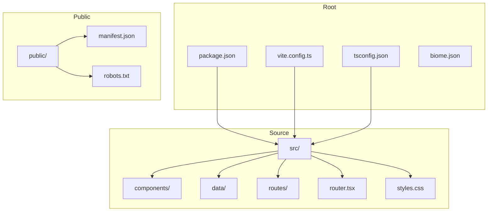
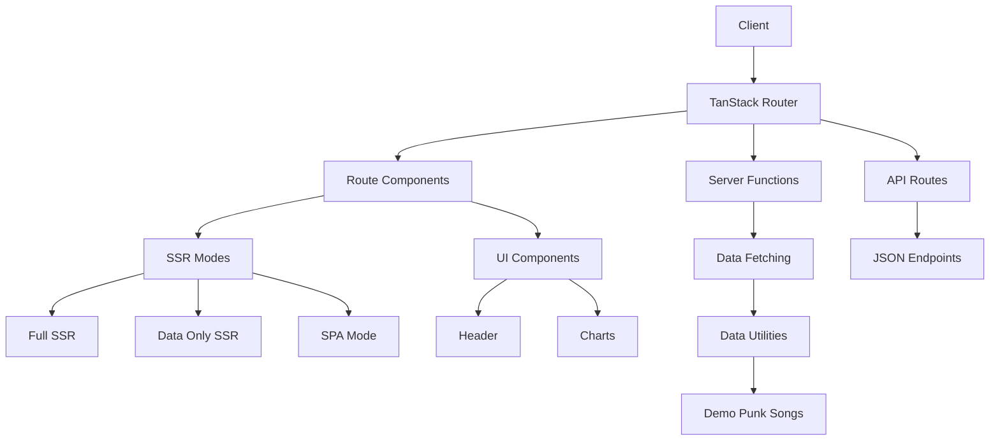
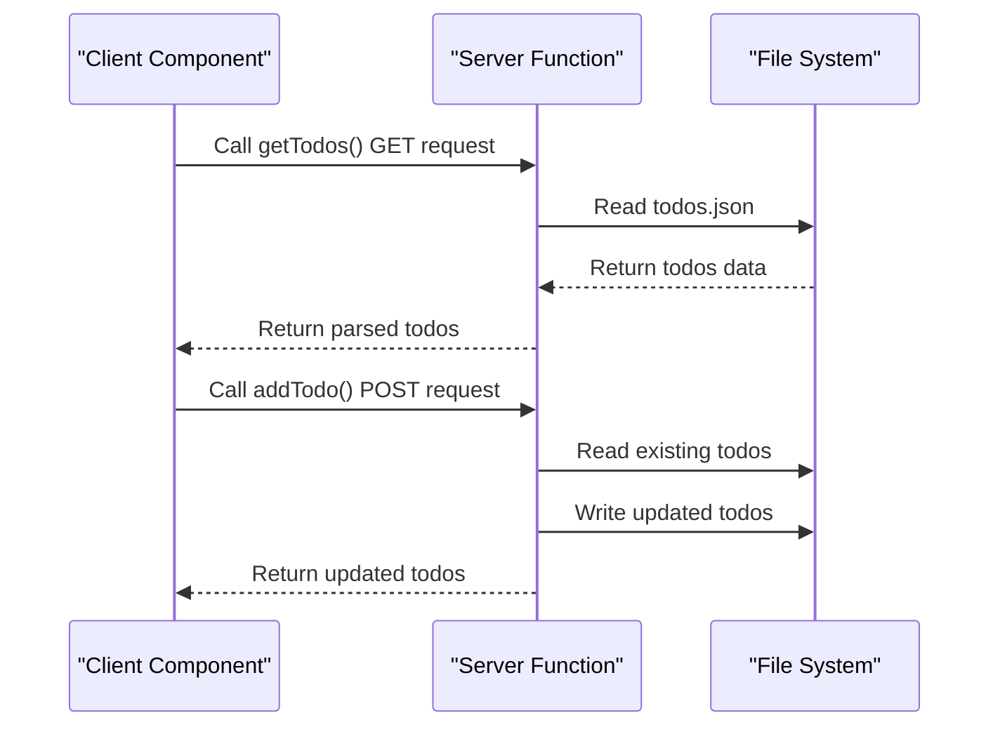
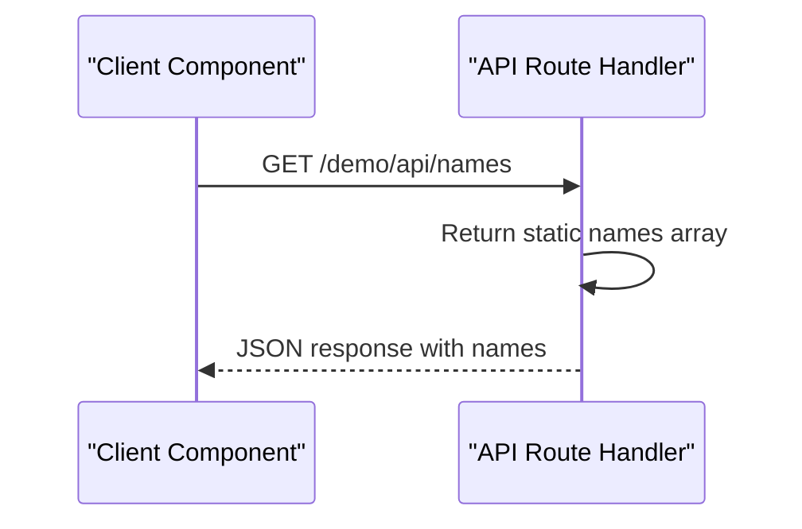
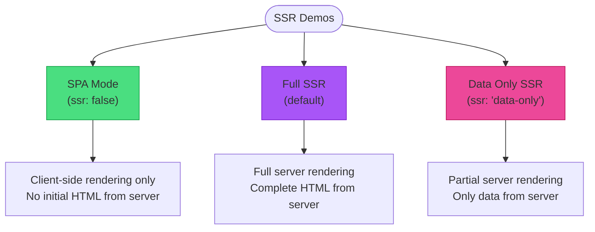
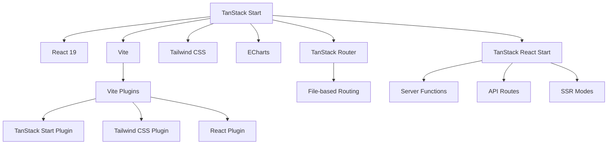

# Project Overview

<cite>
**Referenced Files in This Document**   
- [README.md](file://README.md)
- [package.json](file://package.json)
- [vite.config.ts](file://vite.config.ts)
- [tsconfig.json](file://tsconfig.json)
- [src/router.tsx](file://src/router.tsx)
- [src/routes/index.tsx](file://src/routes/index.tsx)
- [src/components/Header.tsx](file://src/components/Header.tsx)
- [src/routes/demo/start.server-funcs.tsx](file://src/routes/demo/start.server-funcs.tsx)
- [src/routes/demo/start.api-request.tsx](file://src/routes/demo/start.api-request.tsx)
- [src/routes/demo/start.ssr.index.tsx](file://src/routes/demo/start.ssr.index.tsx)
- [src/routes/demo/start.ssr.full-ssr.tsx](file://src/routes/demo/start.ssr.full-ssr.tsx)
- [src/routes/demo/start.ssr.data-only.tsx](file://src/routes/demo/start.ssr.data-only.tsx)
- [src/routes/demo/start.ssr.spa-mode.tsx](file://src/routes/demo/start.ssr.spa-mode.tsx)
- [src/data/demo.punk-songs.ts](file://src/data/demo.punk-songs.ts)
- [src/routes/demo/api.names.ts](file://src/routes/demo/api.names.ts)
</cite>

## Table of Contents
1. [Introduction](#introduction)
2. [Project Structure](#project-structure)
3. [Core Components](#core-components)
4. [Architecture Overview](#architecture-overview)
5. [Detailed Component Analysis](#detailed-component-analysis)
6. [Dependency Analysis](#dependency-analysis)
7. [Performance Considerations](#performance-considerations)
8. [Troubleshooting Guide](#troubleshooting-guide)
9. [Conclusion](#conclusion)

## Introduction
The tanstack-start-multi-charts project serves as a demonstration application for the TanStack Start framework, designed to showcase full-stack React capabilities with modern web development practices. This project illustrates how to build applications using server functions, API routes, and multiple server-side rendering (SSR) modes within a unified framework. It functions as an educational resource for developers learning TanStack Start, providing practical examples of file-based routing, co-located route components, and type-safe integration between server and client code. The application leverages React 19, Vite, Tailwind CSS, and ECharts to render multi-chart visualizations, demonstrating a complete stack for modern web applications.

## Project Structure

The project follows a well-organized directory structure that emphasizes clarity and separation of concerns. The `src` directory contains all application code, organized into logical subdirectories for components, data utilities, and routes. The routing system is file-based, with each route represented by a corresponding file in the `src/routes` directory, enabling intuitive navigation and route management. Static assets are stored in the `public` directory, while configuration files for development tools like Vite, TypeScript, and Biome are located in the project root.



**Diagram sources**
- [package.json](file://package.json#L1-L49)
- [vite.config.ts](file://vite.config.ts#L1-L24)
- [tsconfig.json](file://tsconfig.json#L1-L29)

**Section sources**
- [package.json](file://package.json#L1-L49)
- [vite.config.ts](file://vite.config.ts#L1-L24)
- [tsconfig.json](file://tsconfig.json#L1-L29)

## Core Components

The core components of the tanstack-start-multi-charts project include the Header component for navigation, the router configuration for route management, and various demo routes that illustrate different aspects of the TanStack Start framework. The project utilizes co-located route components, where each route file contains both the route definition and its corresponding UI component. Data utilities are organized in the `src/data` directory, providing reusable functions for fetching and processing data. The framework's integration with Vite enables fast development workflows, while Tailwind CSS provides utility-first styling capabilities.

**Section sources**
- [src/components/Header.tsx](file://src/components/Header.tsx#L1-L178)
- [src/router.tsx](file://src/router.tsx#L1-L16)
- [src/routes/index.tsx](file://src/routes/index.tsx#L1-L119)

## Architecture Overview

The tanstack-start-multi-charts application implements a modern full-stack architecture using the TanStack Start framework. The architecture is built around file-based routing, where routes are defined by the file structure in the `src/routes` directory. Each route can have associated server functions, API handlers, and SSR configurations, enabling flexible rendering strategies. The framework provides type-safe integration between server and client code, ensuring end-to-end type safety. The application uses React 19 features and is bundled with Vite for optimal development experience and production builds.



**Diagram sources**
- [src/router.tsx](file://src/router.tsx#L1-L16)
- [src/routes/demo/start.server-funcs.tsx](file://src/routes/demo/start.server-funcs.tsx#L1-L110)
- [src/routes/demo/api.names.ts](file://src/routes/demo/api.names.ts#L1-L11)
- [src/routes/demo/start.ssr.full-ssr.tsx](file://src/routes/demo/start.ssr.full-ssr.tsx#L1-L41)
- [src/routes/demo/start.ssr.data-only.tsx](file://src/routes/demo/start.ssr.data-only.tsx#L1-L42)
- [src/routes/demo/start.ssr.spa-mode.tsx](file://src/routes/demo/start.ssr.spa-mode.tsx#L1-L48)

## Detailed Component Analysis

### Demo Routes Analysis

The demo routes in the tanstack-start-multi-charts project illustrate various capabilities of the TanStack Start framework. These routes serve as practical examples for developers learning the framework, showcasing different rendering strategies and data fetching patterns.

#### Server Functions Demo
The server functions demo demonstrates how to create server-side functions that can be called from client components. These functions are type-safe and can handle different HTTP methods, with input validation and error handling built into the framework.



**Diagram sources**
- [src/routes/demo/start.server-funcs.tsx](file://src/routes/demo/start.server-funcs.tsx#L1-L110)

#### API Routes Demo
The API routes demo shows how to create type-safe API endpoints within the application. These routes can handle different HTTP methods and return JSON responses, enabling the creation of backend functionality without a separate server.



**Diagram sources**
- [src/routes/demo/api.names.ts](file://src/routes/demo/api.names.ts#L1-L11)
- [src/routes/demo/start.api-request.tsx](file://src/routes/demo/start.api-request.tsx#L1-L45)

#### SSR Strategies Demo
The SSR strategies demo compares different server-side rendering approaches available in the TanStack Start framework, allowing developers to understand the trade-offs between various rendering modes.



**Diagram sources**
- [src/routes/demo/start.ssr.index.tsx](file://src/routes/demo/start.ssr.index.tsx#L1-L44)
- [src/routes/demo/start.ssr.spa-mode.tsx](file://src/routes/demo/start.ssr.spa-mode.tsx#L1-L48)
- [src/routes/demo/start.ssr.full-ssr.tsx](file://src/routes/demo/start.ssr.full-ssr.tsx#L1-L41)
- [src/routes/demo/start.ssr.data-only.tsx](file://src/routes/demo/start.ssr.data-only.tsx#L1-L42)

**Section sources**
- [src/routes/demo/start.server-funcs.tsx](file://src/routes/demo/start.server-funcs.tsx#L1-L110)
- [src/routes/demo/start.api-request.tsx](file://src/routes/demo/start.api-request.tsx#L1-L45)
- [src/routes/demo/start.ssr.index.tsx](file://src/routes/demo/start.ssr.index.tsx#L1-L44)
- [src/routes/demo/start.ssr.full-ssr.tsx](file://src/routes/demo/start.ssr.full-ssr.tsx#L1-L41)
- [src/routes/demo/start.ssr.data-only.tsx](file://src/routes/demo/start.ssr.data-only.tsx#L1-L42)
- [src/routes/demo/start.ssr.spa-mode.tsx](file://src/routes/demo/start.ssr.spa-mode.tsx#L1-L48)

### Data Utilities Analysis

The data utilities in the project demonstrate how to create reusable server functions for data fetching. These utilities can be imported and used across different components, promoting code reuse and maintainability.

```mermaid
classDiagram
class getPunkSongs {
+method : 'GET'
+handler() : Promise~{id : number, name : string, artist : string}[]
}
class PunkSong {
+id : number
+name : string
+artist : string
}
getPunkSongs --> PunkSong : returns Array of
```

**Diagram sources**
- [src/data/demo.punk-songs.ts](file://src/data/demo.punk-songs.ts#L1-L14)

**Section sources**
- [src/data/demo.punk-songs.ts](file://src/data/demo.punk-songs.ts#L1-L14)

## Dependency Analysis

The tanstack-start-multi-charts project has a well-defined dependency structure that supports its full-stack capabilities. The project uses React 19 as the core UI library, with React Router for navigation and routing. Vite serves as the build tool and development server, providing fast hot module replacement and optimized production builds. Tailwind CSS enables utility-first styling, while ECharts provides data visualization capabilities. The TanStack ecosystem libraries provide server functions, API routing, and SSR capabilities, creating a cohesive full-stack framework.



**Diagram sources**
- [package.json](file://package.json#L1-L49)
- [vite.config.ts](file://vite.config.ts#L1-L24)

**Section sources**
- [package.json](file://package.json#L1-L49)
- [vite.config.ts](file://vite.config.ts#L1-L24)

## Performance Considerations

The tanstack-start-multi-charts project incorporates several performance optimizations through its architecture and tooling choices. The use of Vite ensures fast development server startup and hot module replacement, improving developer experience. The framework's support for different SSR modes allows developers to choose the optimal rendering strategy for each route, balancing initial load performance with interactivity. The integration with ECharts enables efficient rendering of complex data visualizations, while the type-safe server-client integration reduces runtime errors that could impact performance. The project's modular structure also supports code splitting, allowing for smaller initial bundle sizes and faster page loads.

## Troubleshooting Guide

When working with the tanstack-start-multi-charts project, developers may encounter common issues related to routing, server functions, or SSR configurations. The framework provides development tools like TanStack Router Devtools to help debug routing issues. For server function problems, checking the input validation and error handling is recommended. When experiencing issues with SSR modes, verifying the `ssr` configuration in route definitions can help identify misconfigurations. The project's use of Biome for linting and formatting can prevent many common coding errors before they reach runtime.

**Section sources**
- [README.md](file://README.md#L1-L302)
- [biome.json](file://biome.json)

## Conclusion

The tanstack-start-multi-charts project serves as an excellent demonstration of the TanStack Start framework's capabilities for building full-stack React applications. By showcasing server functions, API routes, and multiple SSR modes, the project provides a comprehensive learning resource for developers adopting this modern framework. The clear separation between instructional demo files and core framework usage makes it easy to understand the different capabilities without confusion. The integration of React 19, Vite, Tailwind CSS, and ECharts creates a powerful stack for building modern web applications with rich data visualizations. This project effectively illustrates how to leverage the TanStack ecosystem for end-to-end type safety, efficient development workflows, and flexible rendering strategies.