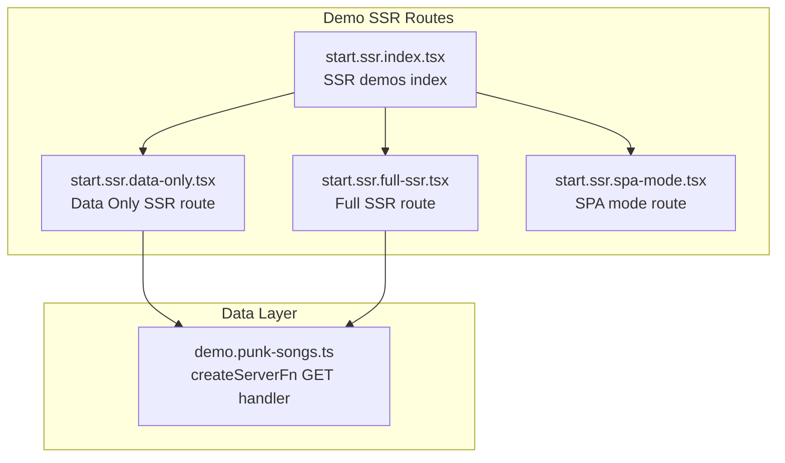
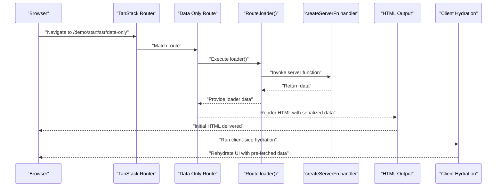
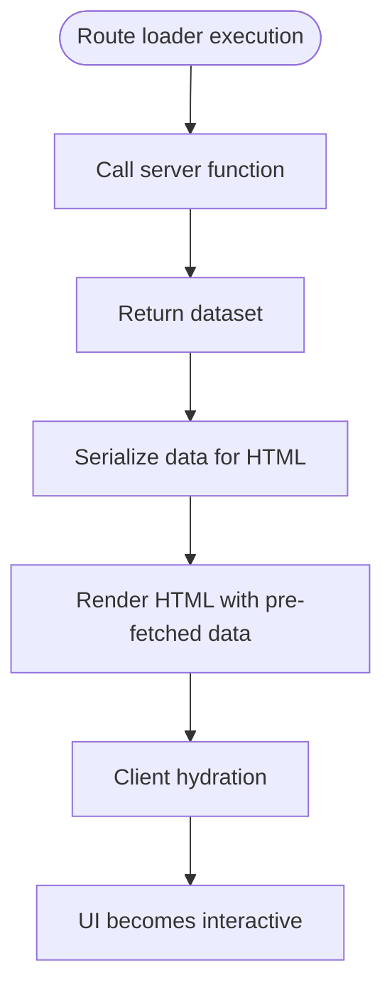
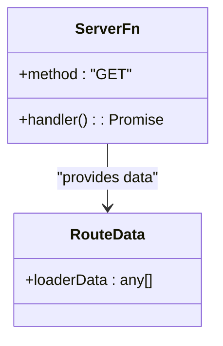
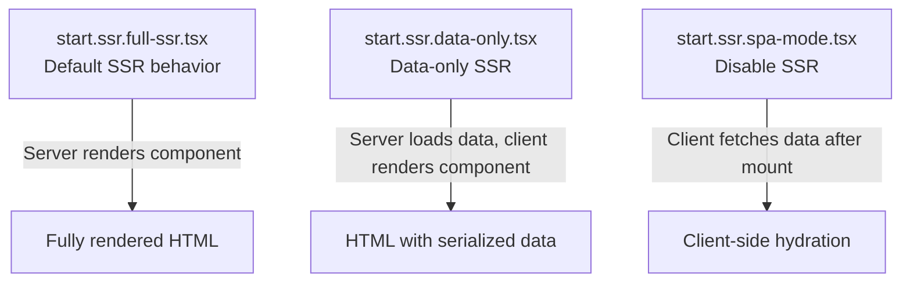
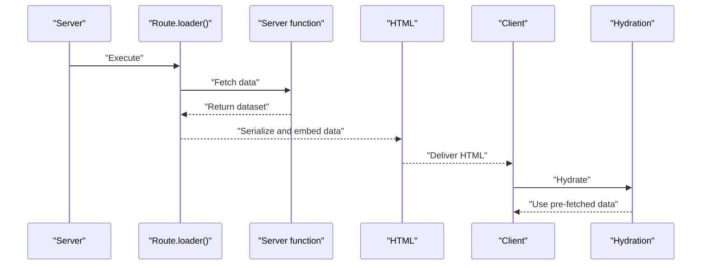
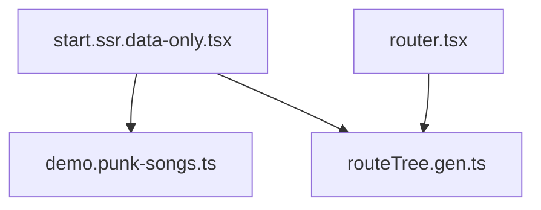

# Data Only SSR

<cite>
**Referenced Files in This Document**
- [start.ssr.data-only.tsx](file://src/routes/demo/start.ssr.data-only.tsx)
- [demo.punk-songs.ts](file://src/data/demo.punk-songs.ts)
- [start.ssr.full-ssr.tsx](file://src/routes/demo/start.ssr.full-ssr.tsx)
- [start.ssr.index.tsx](file://src/routes/demo/start.ssr.index.tsx)
- [start.ssr.spa-mode.tsx](file://src/routes/demo/start.ssr.spa-mode.tsx)
- [start.server-funcs.tsx](file://src/routes/demo/start.server-funcs.tsx)
- [router.tsx](file://src/router.tsx)
- [routeTree.gen.ts](file://src/routeTree.gen.ts)
</cite>

## Table of Contents
1. [Introduction](#introduction)
2. [Project Structure](#project-structure)
3. [Core Components](#core-components)
4. [Architecture Overview](#architecture-overview)
5. [Detailed Component Analysis](#detailed-component-analysis)
6. [Dependency Analysis](#dependency-analysis)
7. [Performance Considerations](#performance-considerations)
8. [Troubleshooting Guide](#troubleshooting-guide)
9. [Conclusion](#conclusion)

## Introduction
This document explains the Data Only SSR mode in this project. It demonstrates how data is preloaded on the server (via a loader) while component rendering is deferred to the client, using the ssr flag set to a data-only strategy. The example uses a dedicated route file to illustrate how a server function is executed on the server, returning data that is embedded in the HTML and later hydrated on the client. This hybrid approach delivers SEO-friendly content quickly while preserving client-side interactivity after hydration.

## Project Structure
The Data Only SSR example is implemented as a file-based route under the demo SSR section. The route defines:
- A loader that executes a server function to fetch data
- An ssr flag configured for data-only behavior
- A component that reads the loader data and renders the UI

**Diagram sources**
- [start.ssr.index.tsx](file://src/routes/demo/start.ssr.index.tsx#L1-L44)
- [start.ssr.data-only.tsx](file://src/routes/demo/start.ssr.data-only.tsx#L1-L42)
- [start.ssr.full-ssr.tsx](file://src/routes/demo/start.ssr.full-ssr.tsx#L1-L41)
- [start.ssr.spa-mode.tsx](file://src/routes/demo/start.ssr.spa-mode.tsx#L1-L48)
- [demo.punk-songs.ts](file://src/data/demo.punk-songs.ts#L1-L14)

**Section sources**
- [start.ssr.index.tsx](file://src/routes/demo/start.ssr.index.tsx#L1-L44)
- [routeTree.gen.ts](file://src/routeTree.gen.ts#L1-L220)

## Core Components
- Data-only route definition: The route sets the ssr flag to a data-only strategy and defines a loader that invokes a server function to fetch data. The component then reads the loader data and renders the UI.
- Server function: A server function is created with a GET method and returns a static dataset for demonstration. In practice, this could call external APIs or read from a database.
- Router integration: The router is configured with default preload behavior suitable for interactive apps.

Key responsibilities:
- Preload data server-side and embed it in the HTML for fast initial render
- Defer component rendering to the client to preserve interactivity
- Maintain SEO-friendly content by rendering initial HTML on the server

**Section sources**
- [start.ssr.data-only.tsx](file://src/routes/demo/start.ssr.data-only.tsx#L1-L42)
- [demo.punk-songs.ts](file://src/data/demo.punk-songs.ts#L1-L14)
- [router.tsx](file://src/router.tsx#L1-L16)

## Architecture Overview
The Data Only SSR flow combines server-side data loading with client-side rendering. The loader executes on the server, and the resulting data is serialized into the HTML. On the client, the app hydrates and reuses the pre-fetched data, enabling immediate interactivity.

**Diagram sources**
- [start.ssr.data-only.tsx](file://src/routes/demo/start.ssr.data-only.tsx#L1-L42)
- [demo.punk-songs.ts](file://src/data/demo.punk-songs.ts#L1-L14)
- [routeTree.gen.ts](file://src/routeTree.gen.ts#L188-L194)

## Detailed Component Analysis

### Data Only SSR Route
This route demonstrates the data-only SSR pattern:
- Sets the ssr flag to a data-only strategy
- Defines a loader that calls a server function to fetch data
- Renders a UI component that consumes the loader data

**Diagram sources**
- [start.ssr.data-only.tsx](file://src/routes/demo/start.ssr.data-only.tsx#L1-L42)
- [demo.punk-songs.ts](file://src/data/demo.punk-songs.ts#L1-L14)

**Section sources**
- [start.ssr.data-only.tsx](file://src/routes/demo/start.ssr.data-only.tsx#L1-L42)

### Server Function Implementation
The server function encapsulates the data-fetching logic and is invoked by the route’s loader. It returns a dataset suitable for embedding in the HTML.

**Diagram sources**
- [demo.punk-songs.ts](file://src/data/demo.punk-songs.ts#L1-L14)

**Section sources**
- [demo.punk-songs.ts](file://src/data/demo.punk-songs.ts#L1-L14)

### Comparison with Other SSR Modes
- Full SSR: Renders the component on the server and sends fully-rendered HTML. This route does not set the ssr flag, so it uses the framework’s default behavior.
- SPA Mode: Disables SSR (ssr: false) and fetches data client-side after mount.

**Diagram sources**
- [start.ssr.full-ssr.tsx](file://src/routes/demo/start.ssr.full-ssr.tsx#L1-L41)
- [start.ssr.data-only.tsx](file://src/routes/demo/start.ssr.data-only.tsx#L1-L42)
- [start.ssr.spa-mode.tsx](file://src/routes/demo/start.ssr.spa-mode.tsx#L1-L48)

**Section sources**
- [start.ssr.full-ssr.tsx](file://src/routes/demo/start.ssr.full-ssr.tsx#L1-L41)
- [start.ssr.spa-mode.tsx](file://src/routes/demo/start.ssr.spa-mode.tsx#L1-L48)

### Practical Example: Serialized Data Embedding and Hydration
- During server render, the loader executes and the server function returns data.
- The framework serializes the loader data and embeds it into the HTML output.
- On the client, hydration reuses the pre-fetched data, avoiding redundant network requests and enabling immediate interactivity.

**Diagram sources**
- [start.ssr.data-only.tsx](file://src/routes/demo/start.ssr.data-only.tsx#L1-L42)
- [demo.punk-songs.ts](file://src/data/demo.punk-songs.ts#L1-L14)

## Dependency Analysis
The Data Only SSR route depends on:
- The server function for data fetching
- The router’s route tree for route resolution
- The router configuration for preload behavior

**Diagram sources**
- [start.ssr.data-only.tsx](file://src/routes/demo/start.ssr.data-only.tsx#L1-L42)
- [demo.punk-songs.ts](file://src/data/demo.punk-songs.ts#L1-L14)
- [routeTree.gen.ts](file://src/routeTree.gen.ts#L188-L194)
- [router.tsx](file://src/router.tsx#L1-L16)

**Section sources**
- [routeTree.gen.ts](file://src/routeTree.gen.ts#L188-L194)
- [router.tsx](file://src/router.tsx#L1-L16)

## Performance Considerations
- Bundle size reduction: Keep server functions focused and avoid bundling unnecessary client-only code into server-executed loaders.
- Data shape simplicity: Prefer plain, serializable data structures to minimize serialization overhead and reduce payload sizes.
- Selective hydration: Defer heavy client-side initialization until after hydration to improve perceived performance.
- Caching strategies: Use route-level caching for loaders to avoid repeated server work. Consider cache keys that incorporate query parameters and user context when applicable.
- Preloading: Configure router preload behavior to balance initial load speed with subsequent navigations.

[No sources needed since this section provides general guidance]

## Troubleshooting Guide
Common issues and resolutions:
- Data serialization mismatches: Ensure the loader returns serializable data. Avoid functions, symbols, or circular references. Validate that the client expects the same shape as the server.
- Hydration mismatches: Confirm that the client renders identical content to the server. Differences in conditional logic or random values can cause mismatches.
- Loader timing: Verify that the loader completes before the route renders. If the loader throws, handle errors gracefully and provide fallback UI.
- Caching pitfalls: When caching loader results, ensure cache invalidation aligns with data freshness requirements. Consider cache tags or TTLs appropriate for the data.

**Section sources**
- [start.ssr.data-only.tsx](file://src/routes/demo/start.ssr.data-only.tsx#L1-L42)
- [demo.punk-songs.ts](file://src/data/demo.punk-songs.ts#L1-L14)

## Conclusion
Data Only SSR offers a pragmatic hybrid approach: fast, SEO-friendly initial content served from the server, combined with client-side interactivity after hydration. By leveraging a loader to fetch data server-side and deferring component rendering to the client, this pattern balances performance and user experience. Use it when you want quick data availability alongside dynamic client behavior, and apply the performance and troubleshooting guidance to maintain reliability and responsiveness.