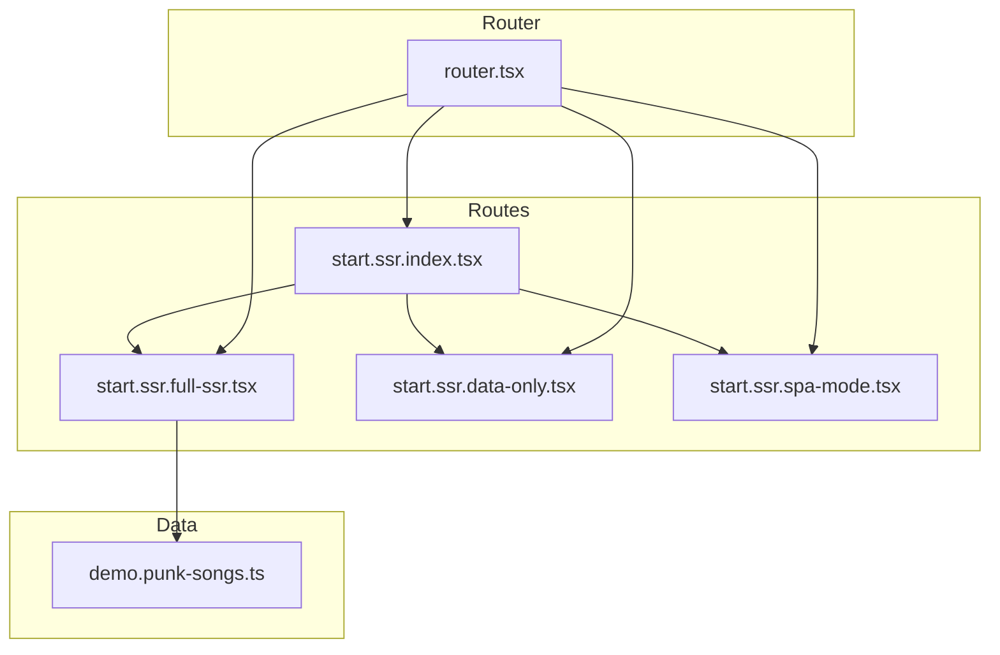
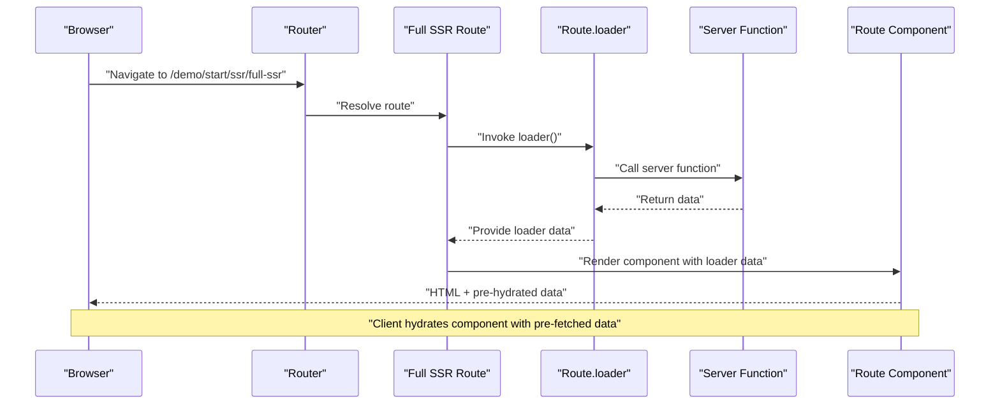
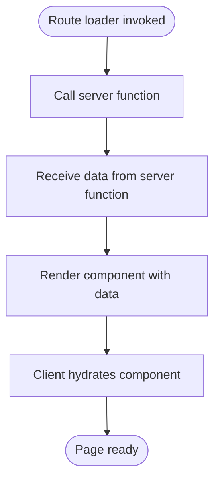
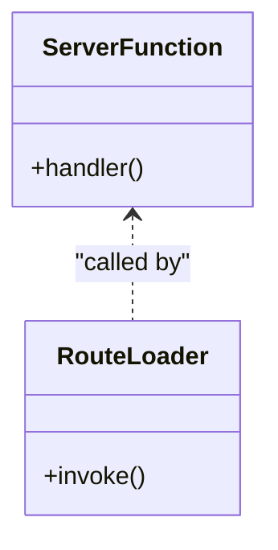
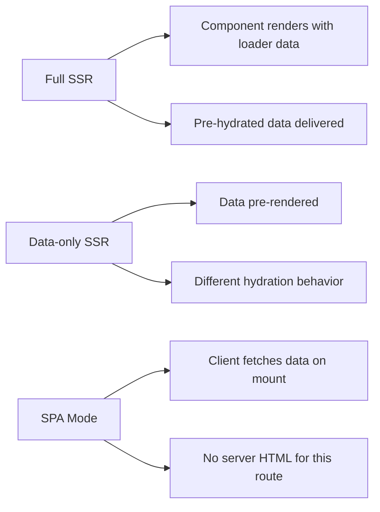
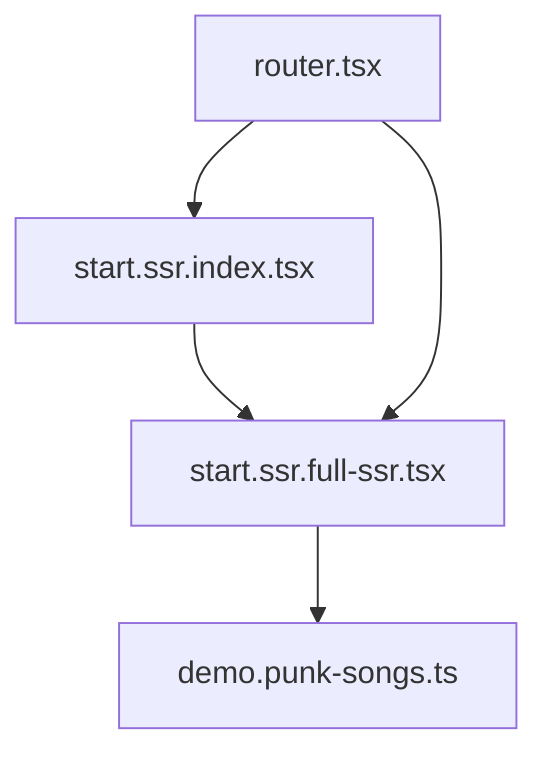

# Full SSR

<cite>
**Referenced Files in This Document**
- [start.ssr.full-ssr.tsx](file://src/routes/demo/start.ssr.full-ssr.tsx)
- [demo.punk-songs.ts](file://src/data/demo.punk-songs.ts)
- [start.ssr.data-only.tsx](file://src/routes/demo/start.ssr.data-only.tsx)
- [start.ssr.spa-mode.tsx](file://src/routes/demo/start.ssr.spa-mode.tsx)
- [router.tsx](file://src/router.tsx)
- [start.ssr.index.tsx](file://src/routes/demo/start.ssr.index.tsx)
</cite>

## Table of Contents
1. [Introduction](#introduction)
2. [Project Structure](#project-structure)
3. [Core Components](#core-components)
4. [Architecture Overview](#architecture-overview)
5. [Detailed Component Analysis](#detailed-component-analysis)
6. [Dependency Analysis](#dependency-analysis)
7. [Performance Considerations](#performance-considerations)
8. [Troubleshooting Guide](#troubleshooting-guide)
9. [Conclusion](#conclusion)

## Introduction
This document explains the Full SSR mode implementation in the demo. It focuses on how both HTML and data are rendered on the server using the loader pattern and createFileRoute configuration. The start.ssr.full-ssr.tsx file demonstrates server-side data fetching via a server function and direct usage of loader data in the component. It also clarifies the ssr flag semantics, the pre-rendered page behavior, and how to interpret the network payload with pre-hydrated data and initial HTML. Finally, it covers hydration behavior, SEO benefits, performance trade-offs, and optimization tips for time-to-first-byte and server processing.

## Project Structure
The Full SSR demo is organized under the demo routes. The key files involved in Full SSR are:
- A route file that defines a loader and component
- A server function that performs data fetching
- Supporting route files for comparison (data-only SSR and SPA mode)
- The router configuration

**Diagram sources**
- [start.ssr.index.tsx](file://src/routes/demo/start.ssr.index.tsx#L1-L44)
- [start.ssr.full-ssr.tsx](file://src/routes/demo/start.ssr.full-ssr.tsx#L1-L41)
- [start.ssr.data-only.tsx](file://src/routes/demo/start.ssr.data-only.tsx#L1-L42)
- [start.ssr.spa-mode.tsx](file://src/routes/demo/start.ssr.spa-mode.tsx#L1-L48)
- [demo.punk-songs.ts](file://src/data/demo.punk-songs.ts#L1-L14)
- [router.tsx](file://src/router.tsx#L1-L16)

**Section sources**
- [start.ssr.index.tsx](file://src/routes/demo/start.ssr.index.tsx#L1-L44)
- [start.ssr.full-ssr.tsx](file://src/routes/demo/start.ssr.full-ssr.tsx#L1-L41)
- [start.ssr.data-only.tsx](file://src/routes/demo/start.ssr.data-only.tsx#L1-L42)
- [start.ssr.spa-mode.tsx](file://src/routes/demo/start.ssr.spa-mode.tsx#L1-L48)
- [demo.punk-songs.ts](file://src/data/demo.punk-songs.ts#L1-L14)
- [router.tsx](file://src/router.tsx#L1-L16)

## Core Components
- Full SSR route definition: The route uses createFileRoute with a loader that fetches data via a server function and renders a component that consumes the loader data.
- Loader pattern: The loader runs on the server to compute data prior to rendering, enabling immediate HTML emission and pre-hydrated data delivery.
- Server function: A server function encapsulates data fetching logic and is invoked by the loader.
- Comparison modes:
  - Data-only SSR: Uses an explicit ssr flag set to a data-only mode, still rendering data on the server but with different hydration behavior.
  - SPA mode: Disables SSR for the route, deferring data fetching to the client.

Key implementation references:
- Full SSR route and loader: [start.ssr.full-ssr.tsx](file://src/routes/demo/start.ssr.full-ssr.tsx#L1-L41)
- Server function: [demo.punk-songs.ts](file://src/data/demo.punk-songs.ts#L1-L14)
- Data-only SSR route: [start.ssr.data-only.tsx](file://src/routes/demo/start.ssr.data-only.tsx#L1-L42)
- SPA mode route: [start.ssr.spa-mode.tsx](file://src/routes/demo/start.ssr.spa-mode.tsx#L1-L48)

**Section sources**
- [start.ssr.full-ssr.tsx](file://src/routes/demo/start.ssr.full-ssr.tsx#L1-L41)
- [demo.punk-songs.ts](file://src/data/demo.punk-songs.ts#L1-L14)
- [start.ssr.data-only.tsx](file://src/routes/demo/start.ssr.data-only.tsx#L1-L42)
- [start.ssr.spa-mode.tsx](file://src/routes/demo/start.ssr.spa-mode.tsx#L1-L48)

## Architecture Overview
The Full SSR flow integrates route loaders, server functions, and the router to produce a pre-rendered page with hydrated data.

**Diagram sources**
- [start.ssr.full-ssr.tsx](file://src/routes/demo/start.ssr.full-ssr.tsx#L1-L41)
- [demo.punk-songs.ts](file://src/data/demo.punk-songs.ts#L1-L14)
- [router.tsx](file://src/router.tsx#L1-L16)

## Detailed Component Analysis

### Full SSR Route: start.ssr.full-ssr.tsx
- Route configuration:
  - Uses createFileRoute with a loader that returns the result of a server function.
  - Renders a component that reads the loader data via a route hook.
- Loader behavior:
  - Runs on the server before rendering, ensuring the component receives data synchronously.
  - Enables immediate HTML emission and pre-hydrated data delivery to the client.
- Component consumption:
  - Reads loader data and renders a list of items.
- Hydration:
  - The client hydrates the component using the pre-fetched data, minimizing re-renders.

**Diagram sources**
- [start.ssr.full-ssr.tsx](file://src/routes/demo/start.ssr.full-ssr.tsx#L1-L41)
- [demo.punk-songs.ts](file://src/data/demo.punk-songs.ts#L1-L14)

**Section sources**
- [start.ssr.full-ssr.tsx](file://src/routes/demo/start.ssr.full-ssr.tsx#L1-L41)

### Server Function: demo.punk-songs.ts
- Encapsulates data fetching logic.
- Returns a static dataset used by the Full SSR route’s loader.
- Demonstrates how server functions integrate with route loaders.

**Diagram sources**
- [demo.punk-songs.ts](file://src/data/demo.punk-songs.ts#L1-L14)
- [start.ssr.full-ssr.tsx](file://src/routes/demo/start.ssr.full-ssr.tsx#L1-L41)

**Section sources**
- [demo.punk-songs.ts](file://src/data/demo.punk-songs.ts#L1-L14)

### Data-Only SSR vs SPA Mode
- Data-only SSR:
  - Explicitly sets an ssr flag to a data-only mode in the route configuration.
  - Still pre-renders data on the server but differs from Full SSR in hydration and HTML emission semantics.
- SPA mode:
  - Disables SSR for the route, causing the client to render the component and fetch data on mount.

**Diagram sources**
- [start.ssr.full-ssr.tsx](file://src/routes/demo/start.ssr.full-ssr.tsx#L1-L41)
- [start.ssr.data-only.tsx](file://src/routes/demo/start.ssr.data-only.tsx#L1-L42)
- [start.ssr.spa-mode.tsx](file://src/routes/demo/start.ssr.spa-mode.tsx#L1-L48)

**Section sources**
- [start.ssr.data-only.tsx](file://src/routes/demo/start.ssr.data-only.tsx#L1-L42)
- [start.ssr.spa-mode.tsx](file://src/routes/demo/start.ssr.spa-mode.tsx#L1-L48)

## Dependency Analysis
- The Full SSR route depends on:
  - The server function for data.
  - The router for route resolution and navigation.
- The server function is independent and reusable by other routes or loaders.
- The index route provides navigation to the Full SSR demo and other modes.

**Diagram sources**
- [start.ssr.index.tsx](file://src/routes/demo/start.ssr.index.tsx#L1-L44)
- [start.ssr.full-ssr.tsx](file://src/routes/demo/start.ssr.full-ssr.tsx#L1-L41)
- [demo.punk-songs.ts](file://src/data/demo.punk-songs.ts#L1-L14)
- [router.tsx](file://src/router.tsx#L1-L16)

**Section sources**
- [start.ssr.index.tsx](file://src/routes/demo/start.ssr.index.tsx#L1-L44)
- [start.ssr.full-ssr.tsx](file://src/routes/demo/start.ssr.full-ssr.tsx#L1-L41)
- [demo.punk-songs.ts](file://src/data/demo.punk-songs.ts#L1-L14)
- [router.tsx](file://src/router.tsx#L1-L16)

## Performance Considerations
- Time-to-first-byte (TTFB):
  - Full SSR reduces TTFB because the server emits HTML immediately after computing the loader data.
  - Minimize server processing time by keeping loaders lean and caching expensive computations.
- Server load:
  - Full SSR increases server CPU usage due to rendering and data computation for each request.
  - Offload heavy tasks to background jobs or cache frequently accessed data.
- Hydration:
  - Pre-hydrated data reduces client-side re-renders and improves perceived performance.
- Network payload:
  - The initial HTML includes pre-rendered markup and embedded data, reducing the need for additional requests.
- Recommendations:
  - Use caching strategies for loader data.
  - Keep server functions deterministic and fast.
  - Consider lazy initialization of heavy resources.
  - Profile server-side rendering to identify bottlenecks.

[No sources needed since this section provides general guidance]

## Troubleshooting Guide
- Loader not returning data:
  - Verify the server function resolves correctly and is awaited in the loader.
  - Confirm the route’s loader is defined and exported.
- Component not rendering data:
  - Ensure the component reads loader data via the appropriate route hook.
  - Check that the route is navigated to and resolved by the router.
- Hydration mismatches:
  - Ensure server and client render identical content.
  - Avoid relying on browser APIs during server rendering.
- Navigation issues:
  - Confirm the router is initialized and routes are registered.

**Section sources**
- [start.ssr.full-ssr.tsx](file://src/routes/demo/start.ssr.full-ssr.tsx#L1-L41)
- [demo.punk-songs.ts](file://src/data/demo.punk-songs.ts#L1-L14)
- [router.tsx](file://src/router.tsx#L1-L16)

## Conclusion
Full SSR pre-renders both HTML and data on the server, delivering a fully formed page to the client with minimal hydration overhead. The loader pattern ensures data availability before rendering, while the server function encapsulates data fetching logic. Compared to data-only SSR and SPA mode, Full SSR prioritizes speed to first meaningful content and SEO benefits. However, it increases server load and requires careful optimization to minimize processing time and maximize throughput.

[No sources needed since this section summarizes without analyzing specific files]