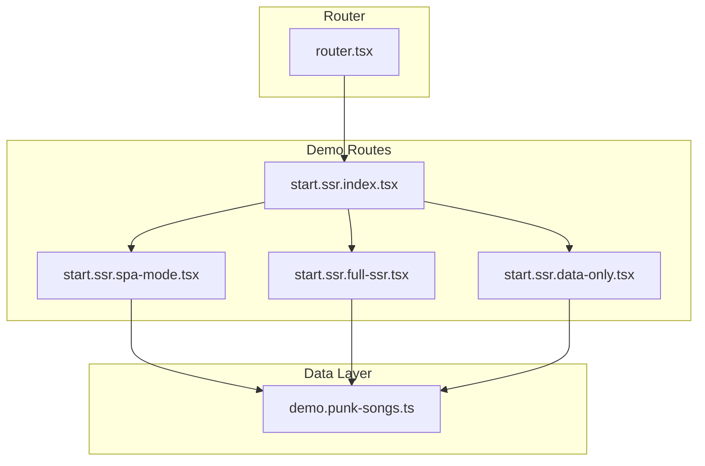
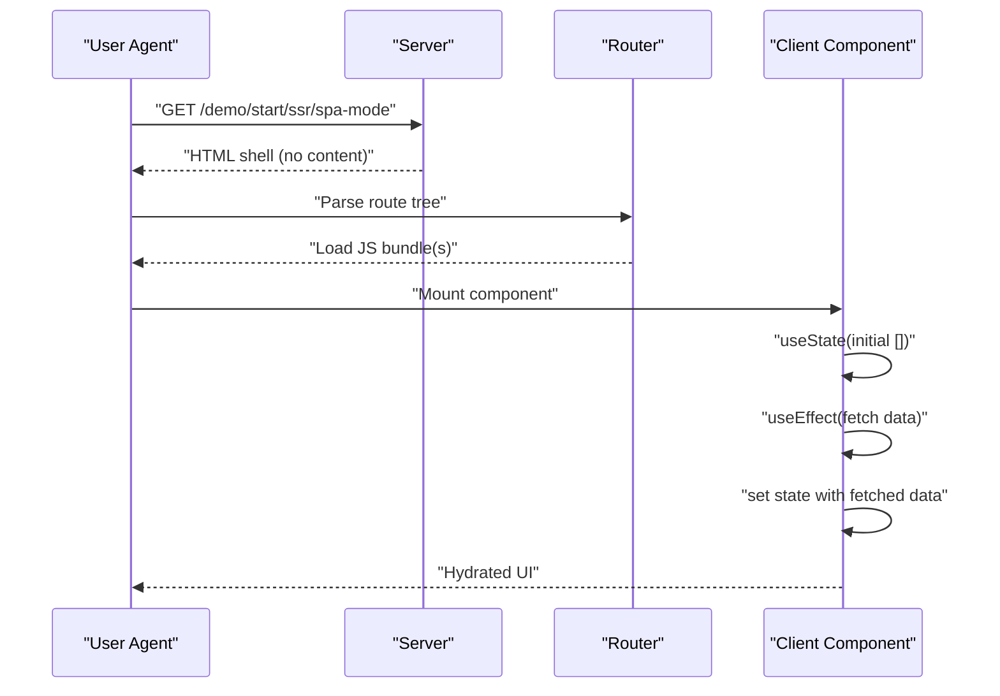
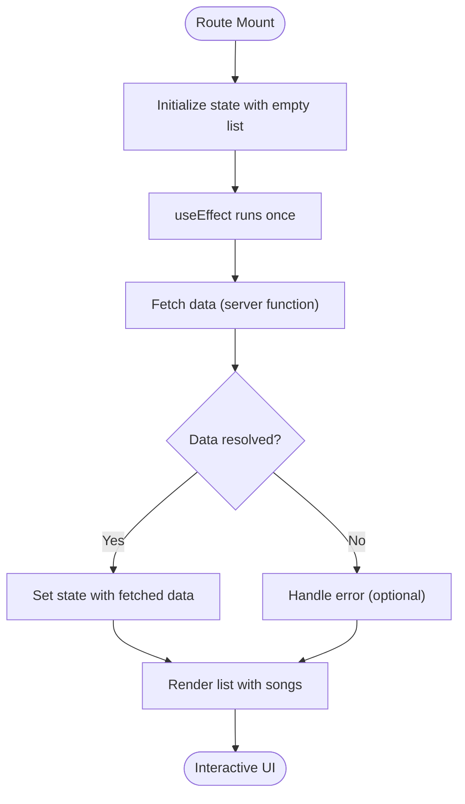
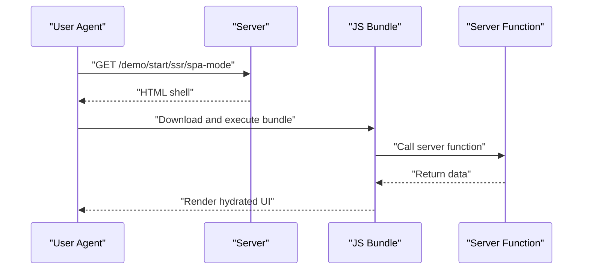
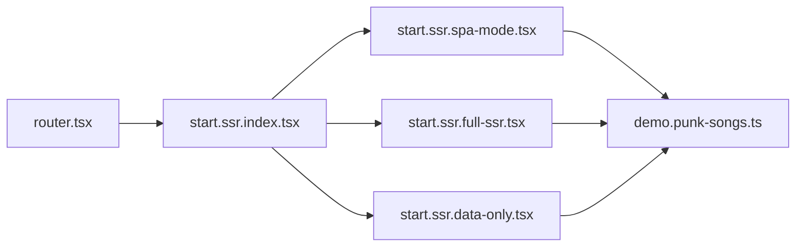

# SPA Mode

<cite>
**Referenced Files in This Document**
- [start.ssr.spa-mode.tsx](file://src/routes/demo/start.ssr.spa-mode.tsx)
- [start.ssr.full-ssr.tsx](file://src/routes/demo/start.ssr.full-ssr.tsx)
- [start.ssr.data-only.tsx](file://src/routes/demo/start.ssr.data-only.tsx)
- [start.ssr.index.tsx](file://src/routes/demo/start.ssr.index.tsx)
- [demo.punk-songs.ts](file://src/data/demo.punk-songs.ts)
- [router.tsx](file://src/router.tsx)
- [README.md](file://README.md)
</cite>

## Table of Contents
1. [Introduction](#introduction)
2. [Project Structure](#project-structure)
3. [Core Components](#core-components)
4. [Architecture Overview](#architecture-overview)
5. [Detailed Component Analysis](#detailed-component-analysis)
6. [Dependency Analysis](#dependency-analysis)
7. [Performance Considerations](#performance-considerations)
8. [Troubleshooting Guide](#troubleshooting-guide)
9. [Conclusion](#conclusion)
10. [Appendices](#appendices)

## Introduction
This document explains Single-Page Application (SPA) Mode in the context of TanStack Start’s flexible rendering model. When a route sets ssr: false, the server returns only a minimal HTML shell. The browser receives a blank initial page until the client bundle loads, executes useEffect-driven data fetching, and hydrates the UI. This contrasts with server loaders (loader functions) that pre-render content on the server. We use the SPA Mode route to demonstrate client-only data fetching via React hooks, dynamic imports, and client-side state management. We also outline the typical network waterfall, SEO implications, time-to-interactive, perceived performance, ideal use cases, and troubleshooting strategies.

## Project Structure
The SPA Mode demonstration is part of a small demo suite under src/routes/demo. It includes:
- A route index that links to the demos
- Three variants of SSR modes: SPA Mode, Full SSR, and Data Only
- A shared data utility that wraps a server function

**Diagram sources**
- [start.ssr.index.tsx](file://src/routes/demo/start.ssr.index.tsx#L1-L44)
- [start.ssr.spa-mode.tsx](file://src/routes/demo/start.ssr.spa-mode.tsx#L1-L48)
- [start.ssr.full-ssr.tsx](file://src/routes/demo/start.ssr.full-ssr.tsx#L1-L41)
- [start.ssr.data-only.tsx](file://src/routes/demo/start.ssr.data-only.tsx#L1-L42)
- [demo.punk-songs.ts](file://src/data/demo.punk-songs.ts#L1-L14)
- [router.tsx](file://src/router.tsx#L1-L16)

**Section sources**
- [start.ssr.index.tsx](file://src/routes/demo/start.ssr.index.tsx#L1-L44)
- [start.ssr.spa-mode.tsx](file://src/routes/demo/start.ssr.spa-mode.tsx#L1-L48)
- [start.ssr.full-ssr.tsx](file://src/routes/demo/start.ssr.full-ssr.tsx#L1-L41)
- [start.ssr.data-only.tsx](file://src/routes/demo/start.ssr.data-only.tsx#L1-L42)
- [demo.punk-songs.ts](file://src/data/demo.punk-songs.ts#L1-L14)
- [router.tsx](file://src/router.tsx#L1-L16)

## Core Components
- SPA Mode route: Disables server rendering for this route and performs client-only data fetching using React hooks.
- Full SSR route: Uses a server loader to pre-render content on the server.
- Data Only route: Renders HTML on the server but does not execute client component lifecycle.
- Shared data utility: A server function that returns static demo data.

Key differences:
- SPA Mode: ssr: false, client-side state via useState, client-side data fetching via useEffect, no server loader.
- Full SSR: server loader populates data for the component.
- Data Only: server sends HTML with data, but client does not mount the component.

**Section sources**
- [start.ssr.spa-mode.tsx](file://src/routes/demo/start.ssr.spa-mode.tsx#L1-L48)
- [start.ssr.full-ssr.tsx](file://src/routes/demo/start.ssr.full-ssr.tsx#L1-L41)
- [start.ssr.data-only.tsx](file://src/routes/demo/start.ssr.data-only.tsx#L1-L42)
- [demo.punk-songs.ts](file://src/data/demo.punk-songs.ts#L1-L14)

## Architecture Overview
The SPA Mode route demonstrates a classic client-side rendering flow:
- Server responds with a minimal HTML shell because ssr: false.
- Browser downloads the JS bundle.
- Client initializes React, mounts the route component, and runs useEffect to fetch data.
- Once data resolves, the UI hydrates and becomes interactive.

**Diagram sources**
- [start.ssr.spa-mode.tsx](file://src/routes/demo/start.ssr.spa-mode.tsx#L1-L48)
- [router.tsx](file://src/router.tsx#L1-L16)

## Detailed Component Analysis

### SPA Mode Route: Client-only Rendering and Data Fetching
- Route configuration disables server rendering for this route.
- Component uses React hooks to manage local state and trigger a client-only data fetch on mount.
- The data utility is a server function that returns demo data.

**Diagram sources**
- [start.ssr.spa-mode.tsx](file://src/routes/demo/start.ssr.spa-mode.tsx#L1-L48)
- [demo.punk-songs.ts](file://src/data/demo.punk-songs.ts#L1-L14)

Implementation highlights:
- Route-level configuration sets ssr: false to prevent server rendering for this route.
- Client-only data fetching uses useEffect to call the server function and update local state.
- The component renders a list of songs using the local state.

Contrast with server loaders:
- Full SSR route uses a loader to pre-render data on the server and pass it to the component via a hook.
- Data Only route renders HTML with data but does not mount the client component lifecycle.

**Section sources**
- [start.ssr.spa-mode.tsx](file://src/routes/demo/start.ssr.spa-mode.tsx#L1-L48)
- [start.ssr.full-ssr.tsx](file://src/routes/demo/start.ssr.full-ssr.tsx#L1-L41)
- [start.ssr.data-only.tsx](file://src/routes/demo/start.ssr.data-only.tsx#L1-L42)
- [demo.punk-songs.ts](file://src/data/demo.punk-songs.ts#L1-L14)

### Dynamic Imports and Client-side State Management
- Dynamic imports enable code-splitting and lazy loading of heavy features, reducing initial bundle size.
- Client-side state management via useState and useEffect allows fine-grained control over data fetching timing and UI updates.
- These patterns are essential in SPA Mode to optimize initial load performance and user experience.

Practical guidance:
- Split large components or heavy libraries using dynamic imports.
- Defer non-critical data fetching to useEffect to keep the initial render fast.
- Manage loading and error states explicitly to improve perceived performance.

**Section sources**
- [start.ssr.spa-mode.tsx](file://src/routes/demo/start.ssr.spa-mode.tsx#L1-L48)
- [README.md](file://README.md#L108-L140)

### Network Waterfall in SPA Mode
The typical SPA Mode waterfall:
1. HTML shell: Minimal HTML returned by the server due to ssr: false.
2. JS bundle: Client downloads and parses the application bundle(s).
3. API/data fetch: useEffect triggers client-only data fetching.
4. Render: Component renders with hydrated data.

**Diagram sources**
- [start.ssr.spa-mode.tsx](file://src/routes/demo/start.ssr.spa-mode.tsx#L1-L48)
- [demo.punk-songs.ts](file://src/data/demo.punk-songs.ts#L1-L14)

## Dependency Analysis
- SPA Mode route depends on:
  - Router configuration for route resolution and navigation.
  - Data utility that encapsulates a server function.
- Full SSR and Data Only routes share the same data utility but differ in rendering strategy.

**Diagram sources**
- [router.tsx](file://src/router.tsx#L1-L16)
- [start.ssr.index.tsx](file://src/routes/demo/start.ssr.index.tsx#L1-L44)
- [start.ssr.spa-mode.tsx](file://src/routes/demo/start.ssr.spa-mode.tsx#L1-L48)
- [start.ssr.full-ssr.tsx](file://src/routes/demo/start.ssr.full-ssr.tsx#L1-L41)
- [start.ssr.data-only.tsx](file://src/routes/demo/start.ssr.data-only.tsx#L1-L42)
- [demo.punk-songs.ts](file://src/data/demo.punk-songs.ts#L1-L14)

**Section sources**
- [router.tsx](file://src/router.tsx#L1-L16)
- [start.ssr.index.tsx](file://src/routes/demo/start.ssr.index.tsx#L1-L44)
- [start.ssr.spa-mode.tsx](file://src/routes/demo/start.ssr.spa-mode.tsx#L1-L48)
- [start.ssr.full-ssr.tsx](file://src/routes/demo/start.ssr.full-ssr.tsx#L1-L41)
- [start.ssr.data-only.tsx](file://src/routes/demo/start.ssr.data-only.tsx#L1-L42)
- [demo.punk-songs.ts](file://src/data/demo.punk-songs.ts#L1-L14)

## Performance Considerations
- Initial page weight: With ssr: false, the server returns minimal HTML. Keep the initial JS bundle lean and defer non-critical code.
- Time-to-interactive: Interactive time improves when the UI hydrates quickly. Use code-splitting and lazy loading for heavy features.
- Perceived performance: Show skeleton loaders or placeholders while data is fetching. Consider caching strategies for repeated navigations.
- SEO: SPA Mode pages are not indexed by crawlers without additional strategies (e.g., server-side pre-rendering for critical pages or client-side rendering with SSR for SEO-sensitive content).
- Hydration: Ensure client and server render identical markup to avoid hydration mismatches.

[No sources needed since this section provides general guidance]

## Troubleshooting Guide
Common issues and remedies in SPA Mode:

- Loading states
  - Symptom: Blank screen or flicker during data fetch.
  - Fix: Initialize state with a loading indicator and update state upon completion. Consider optimistic updates for responsiveness.

- Race conditions
  - Symptom: UI flicker or inconsistent data display.
  - Fix: Use stable keys for list items, guard against stale data, and cancel in-flight requests on unmount.

- Code-splitting and initial load
  - Symptom: Slow initial load.
  - Fix: Split large components and libraries. Lazy-load non-critical features. Preload critical resources.

- Hydration mismatches
  - Symptom: Console warnings about mismatched markup after hydration.
  - Fix: Ensure server and client render identical content. Avoid relying on browser APIs during SSR.

- SEO and indexing
  - Symptom: Content not visible to search engines.
  - Fix: For SEO-critical pages, consider Full SSR or Data Only rendering. Alternatively, implement server-side pre-rendering for key routes.

**Section sources**
- [start.ssr.spa-mode.tsx](file://src/routes/demo/start.ssr.spa-mode.tsx#L1-L48)
- [README.md](file://README.md#L108-L140)

## Conclusion
SPA Mode in TanStack Start enables a pure client-side rendering experience with ssr: false. The SPA Mode route demonstrates client-only data fetching via useEffect and useState, contrasting with server loaders used in Full SSR and Data Only modes. While SPA Mode reduces server overhead and simplifies deployment, it requires careful attention to initial load performance, loading states, and SEO. Use code-splitting, dynamic imports, and strategic data fetching to balance interactivity and perceived performance. For content requiring strong SEO, consider Full SSR or Data Only rendering.

[No sources needed since this section summarizes without analyzing specific files]

## Appendices

### Practical Example: SPA Mode Route
- Route configuration sets ssr: false.
- Component initializes state and fetches data on mount.
- Data utility is a server function returning demo data.

**Section sources**
- [start.ssr.spa-mode.tsx](file://src/routes/demo/start.ssr.spa-mode.tsx#L1-L48)
- [demo.punk-songs.ts](file://src/data/demo.punk-songs.ts#L1-L14)

### Comparative Rendering Modes
- SPA Mode: ssr: false, client-only rendering and data fetching.
- Full SSR: server loader pre-renders content.
- Data Only: server renders HTML with data, client does not mount lifecycle.

**Section sources**
- [start.ssr.spa-mode.tsx](file://src/routes/demo/start.ssr.spa-mode.tsx#L1-L48)
- [start.ssr.full-ssr.tsx](file://src/routes/demo/start.ssr.full-ssr.tsx#L1-L41)
- [start.ssr.data-only.tsx](file://src/routes/demo/start.ssr.data-only.tsx#L1-L42)