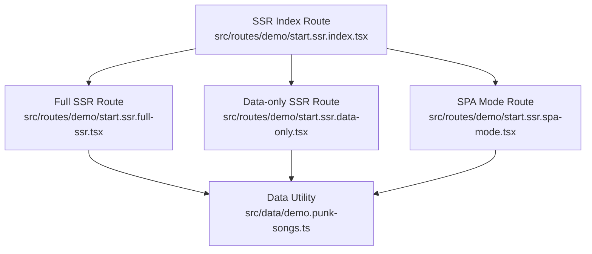
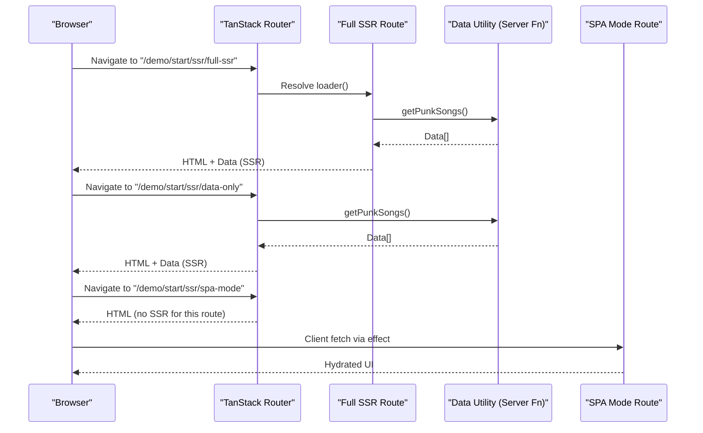
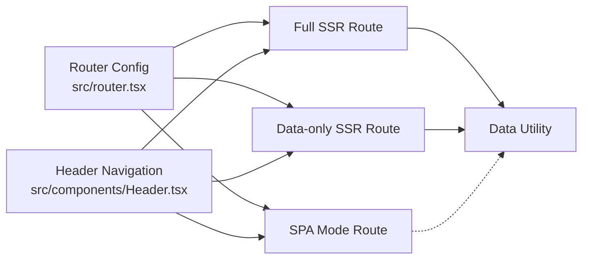

# SSR Strategies

<cite>
**Referenced Files in This Document**
- [start.ssr.full-ssr.tsx](file://src/routes/demo/start.ssr.full-ssr.tsx)
- [start.ssr.data-only.tsx](file://src/routes/demo/start.ssr.data-only.tsx)
- [start.ssr.spa-mode.tsx](file://src/routes/demo/start.ssr.spa-mode.tsx)
- [start.ssr.index.tsx](file://src/routes/demo/start.ssr.index.tsx)
- [start.server-funcs.tsx](file://src/routes/demo/start.server-funcs.tsx)
- [demo.punk-songs.ts](file://src/data/demo.punk-songs.ts)
- [router.tsx](file://src/router.tsx)
- [Header.tsx](file://src/components/Header.tsx)
</cite>

## Table of Contents
1. [Introduction](#introduction)
2. [Project Structure](#project-structure)
3. [Core Components](#core-components)
4. [Architecture Overview](#architecture-overview)
5. [Detailed Component Analysis](#detailed-component-analysis)
6. [Dependency Analysis](#dependency-analysis)
7. [Performance Considerations](#performance-considerations)
8. [Troubleshooting Guide](#troubleshooting-guide)
9. [Conclusion](#conclusion)
10. [Appendices](#appendices)

## Introduction
This document explains three Server-Side Rendering (SSR) strategies demonstrated in the project’s demo routes:
- Full SSR: The server renders both HTML and data, delivering a fully hydrated page.
- Data-only SSR: The server preloads data and sends it to the client, which hydrates the UI.
- SPA Mode: Client-side rendering only, with no server HTML for the route.

It focuses on how the ssr flag and loader patterns differ across these modes, the trade-offs in performance, SEO, and time-to-interactive, and how to configure each mode. It also covers common pitfalls like hydration mismatches and data fetching race conditions, with optimization tips for selecting the right strategy per page.

## Project Structure
The SSR demos live under the demo routes and are navigated from a central index route. The data-fetching utility is a server function that returns static demo data.

**Diagram sources**
- [start.ssr.index.tsx](file://src/routes/demo/start.ssr.index.tsx#L1-L44)
- [start.ssr.full-ssr.tsx](file://src/routes/demo/start.ssr.full-ssr.tsx#L1-L41)
- [start.ssr.data-only.tsx](file://src/routes/demo/start.ssr.data-only.tsx#L1-L42)
- [start.ssr.spa-mode.tsx](file://src/routes/demo/start.ssr.spa-mode.tsx#L1-L48)
- [demo.punk-songs.ts](file://src/data/demo.punk-songs.ts#L1-L14)

**Section sources**
- [start.ssr.index.tsx](file://src/routes/demo/start.ssr.index.tsx#L1-L44)
- [router.tsx](file://src/router.tsx#L1-L16)

## Core Components
- Full SSR route: Uses a loader to fetch data on the server and renders HTML on the server.
- Data-only SSR route: Sets ssr to a data-only mode, still runs the loader on the server but defers hydration to the client.
- SPA Mode route: Disables SSR for the route and fetches data client-side via effects.
- Data utility: A server function that returns static demo data used by the loaders.

Key configuration points:
- ssr flag values:
  - Omitted or default: Full SSR with server-rendered HTML and data.
  - ssr: "data-only": Server preloads data; client hydrates.
  - ssr: false: No server HTML; client-side only.
- Loader pattern:
  - Routes define a loader that returns data consumed by the component via a hook.
  - The data utility is a server function returning static data for predictable demos.

**Section sources**
- [start.ssr.full-ssr.tsx](file://src/routes/demo/start.ssr.full-ssr.tsx#L1-L41)
- [start.ssr.data-only.tsx](file://src/routes/demo/start.ssr.data-only.tsx#L1-L42)
- [start.ssr.spa-mode.tsx](file://src/routes/demo/start.ssr.spa-mode.tsx#L1-L48)
- [demo.punk-songs.ts](file://src/data/demo.punk-songs.ts#L1-L14)

## Architecture Overview
The routing framework orchestrates SSR behavior per route. The router is configured with default preload behavior and scroll restoration. Each demo route sets its own ssr strategy and loader.

**Diagram sources**
- [router.tsx](file://src/router.tsx#L1-L16)
- [start.ssr.full-ssr.tsx](file://src/routes/demo/start.ssr.full-ssr.tsx#L1-L41)
- [start.ssr.data-only.tsx](file://src/routes/demo/start.ssr.data-only.tsx#L1-L42)
- [start.ssr.spa-mode.tsx](file://src/routes/demo/start.ssr.spa-mode.tsx#L1-L48)
- [demo.punk-songs.ts](file://src/data/demo.punk-songs.ts#L1-L14)

## Detailed Component Analysis

### Full SSR Mode
- Behavior:
  - The route defines a loader that fetches data on the server.
  - The component renders server-side HTML with the preloaded data.
  - Hydration occurs seamlessly because the server and client render identical HTML.
- Configuration:
  - No explicit ssr flag; defaults to server-rendered HTML and data.
- Trade-offs:
  - SEO: Best, as the server delivers fully formed HTML.
  - Performance: Slightly slower initial server render; benefits from immediate content delivery.
  - Time-to-interactive: Lower initial TTI because the shell is ready immediately.
- Network payload:
  - Single response containing HTML and data for the route.

Implementation highlights:
- Loader runs on the server and returns data to the component.
- Component reads data via the route’s loader hook.

**Section sources**
- [start.ssr.full-ssr.tsx](file://src/routes/demo/start.ssr.full-ssr.tsx#L1-L41)
- [demo.punk-songs.ts](file://src/data/demo.punk-songs.ts#L1-L14)

### Data-only SSR Mode
- Behavior:
  - The route sets ssr to a data-only mode.
  - The server still runs the loader and sends data to the client.
  - Hydration happens on the client; the server does not render HTML for this route.
- Configuration:
  - ssr: "data-only" signals the framework to preload data without server HTML.
- Trade-offs:
  - SEO: Moderate; HTML is not produced on the server for this route.
  - Performance: Faster server response (no HTML render), but client hydration adds latency.
  - Time-to-interactive: Can improve TTI if the client handles hydration efficiently.
- Network payload:
  - Server response includes data; client renders HTML and hydrates.

Implementation highlights:
- Loader runs on the server and returns data.
- Client hydrates the component and mounts event handlers.

**Section sources**
- [start.ssr.data-only.tsx](file://src/routes/demo/start.ssr.data-only.tsx#L1-L42)
- [demo.punk-songs.ts](file://src/data/demo.punk-songs.ts#L1-L14)

### SPA Mode
- Behavior:
  - The route disables SSR via ssr: false.
  - The server returns minimal HTML; data is fetched client-side.
  - Hydration and interactivity occur on the client.
- Configuration:
  - ssr: false prevents server HTML for this route.
- Trade-offs:
  - SEO: Lowest among the three; no server HTML for this route.
  - Performance: Fastest server response; client bears all rendering and hydration costs.
  - Time-to-interactive: Depends on client-side fetch and hydration.
- Network payload:
  - Minimal server response; client fetches data and renders UI.

Implementation highlights:
- No loader on the server for this route.
- Client-side effect fetches data and sets state.

**Section sources**
- [start.ssr.spa-mode.tsx](file://src/routes/demo/start.ssr.spa-mode.tsx#L1-L48)
- [demo.punk-songs.ts](file://src/data/demo.punk-songs.ts#L1-L14)

### Loader Pattern Across Modes
- Shared data utility:
  - A server function returns static demo data used by all routes’ loaders.
- Consistent consumption:
  - Components consume data via the route’s loader hook, ensuring consistent behavior regardless of SSR mode.

**Section sources**
- [demo.punk-songs.ts](file://src/data/demo.punk-songs.ts#L1-L14)
- [start.ssr.full-ssr.tsx](file://src/routes/demo/start.ssr.full-ssr.tsx#L1-L41)
- [start.ssr.data-only.tsx](file://src/routes/demo/start.ssr.data-only.tsx#L1-L42)
- [start.ssr.spa-mode.tsx](file://src/routes/demo/start.ssr.spa-mode.tsx#L1-L48)

### Server Functions Demo (Optional SSR Integration)
- The server functions demo illustrates server-side data access and mutation via server functions, complementing the loader pattern.
- It demonstrates:
  - Server function creation and handler execution.
  - Using loaders to fetch server-side data.
  - Client-side invalidation and re-fetch after mutations.

**Section sources**
- [start.server-funcs.tsx](file://src/routes/demo/start.server-funcs.tsx#L1-L110)

## Dependency Analysis
The SSR modes depend on the router configuration and route-level ssr flags. The loader pattern is consistent across modes, while the ssr flag determines whether the server produces HTML and whether hydration occurs on the server or client.

**Diagram sources**
- [router.tsx](file://src/router.tsx#L1-L16)
- [start.ssr.full-ssr.tsx](file://src/routes/demo/start.ssr.full-ssr.tsx#L1-L41)
- [start.ssr.data-only.tsx](file://src/routes/demo/start.ssr.data-only.tsx#L1-L42)
- [start.ssr.spa-mode.tsx](file://src/routes/demo/start.ssr.spa-mode.tsx#L1-L48)
- [demo.punk-songs.ts](file://src/data/demo.punk-songs.ts#L1-L14)
- [Header.tsx](file://src/components/Header.tsx#L131-L177)

**Section sources**
- [router.tsx](file://src/router.tsx#L1-L16)
- [Header.tsx](file://src/components/Header.tsx#L131-L177)

## Performance Considerations
- Full SSR:
  - Pros: Better SEO, earlier content availability, lower client hydration cost.
  - Cons: Higher server CPU during initial render.
  - Best for: Content-heavy pages, marketing pages, SEO-critical routes.
- Data-only SSR:
  - Pros: Faster server response; still preloads data.
  - Cons: Client hydration adds latency; less SEO benefit than full SSR.
  - Best for: Pages requiring dynamic client behavior early, but data can be preloaded.
- SPA Mode:
  - Pros: Fastest server response; client controls hydration.
  - Cons: Worst SEO; higher client-side work.
  - Best for: Internal dashboards, admin areas, or highly interactive client apps.

[No sources needed since this section provides general guidance]

## Troubleshooting Guide
Common issues and remedies:

- Hydration mismatches:
  - Cause: Server-rendered HTML differs from client-rendered HTML.
  - Symptoms: Console warnings about mismatched markup.
  - Fixes:
    - Ensure deterministic rendering on server and client.
    - Avoid relying on browser APIs or random values in server-rendered content.
    - Keep component logic identical across environments.

- Data fetching race conditions:
  - Cause: Client-side fetches compete with server-preloaded data.
  - Symptoms: Stale or inconsistent UI state.
  - Fixes:
    - Prefer server loaders for critical data to avoid races.
    - Use client-side queries with appropriate cache configuration and invalidation.

- SSR vs SPA navigation:
  - Cause: Navigating between routes with different ssr settings.
  - Fixes:
    - Keep navigation consistent with the chosen strategy per route.
    - Use the index route to switch between modes for comparison.

- Server function integration:
  - Cause: Misconfigured server functions or missing middleware.
  - Fixes:
    - Verify server function handlers and inputs.
    - Use server functions for server-only data/mutation flows.

**Section sources**
- [start.ssr.full-ssr.tsx](file://src/routes/demo/start.ssr.full-ssr.tsx#L1-L41)
- [start.ssr.data-only.tsx](file://src/routes/demo/start.ssr.data-only.tsx#L1-L42)
- [start.ssr.spa-mode.tsx](file://src/routes/demo/start.ssr.spa-mode.tsx#L1-L48)
- [start.server-funcs.tsx](file://src/routes/demo/start.server-funcs.tsx#L1-L110)

## Conclusion
Choose the SSR strategy based on your page’s priorities:
- Full SSR for SEO and fast initial content.
- Data-only SSR for balanced server/client responsibilities.
- SPA Mode for highly interactive client experiences where SEO is less critical.

The demos illustrate how a single loader pattern and a simple ssr flag can dramatically alter runtime behavior and user experience.

[No sources needed since this section summarizes without analyzing specific files]

## Appendices

### Practical Configuration Examples
- Full SSR:
  - Define a loader on the route; omit ssr flag to default to server-rendered HTML.
  - Reference: [start.ssr.full-ssr.tsx](file://src/routes/demo/start.ssr.full-ssr.tsx#L1-L41)

- Data-only SSR:
  - Set ssr: "data-only" and keep the loader.
  - Reference: [start.ssr.data-only.tsx](file://src/routes/demo/start.ssr.data-only.tsx#L1-L42)

- SPA Mode:
  - Set ssr: false and fetch data client-side.
  - Reference: [start.ssr.spa-mode.tsx](file://src/routes/demo/start.ssr.spa-mode.tsx#L1-L48)

### Network Payloads (Conceptual)
- Full SSR:
  - Server returns HTML + data for the route.
- Data-only SSR:
  - Server returns data; client renders HTML and hydrates.
- SPA Mode:
  - Minimal server response; client fetches data and renders UI.

[No sources needed since this section provides conceptual guidance]