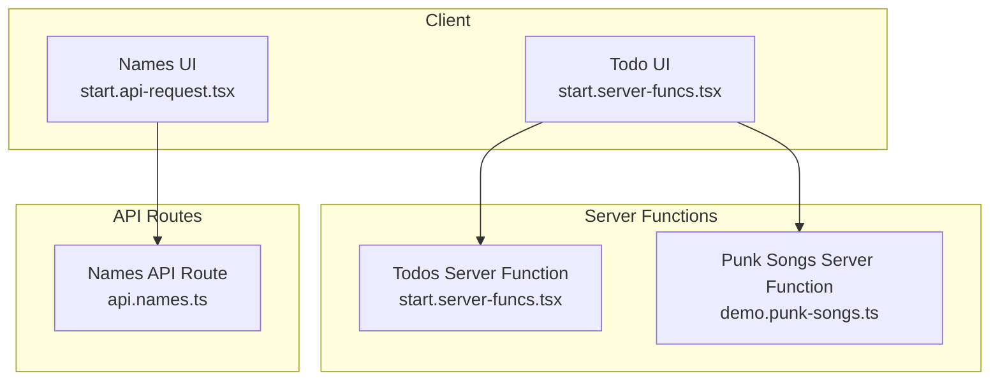
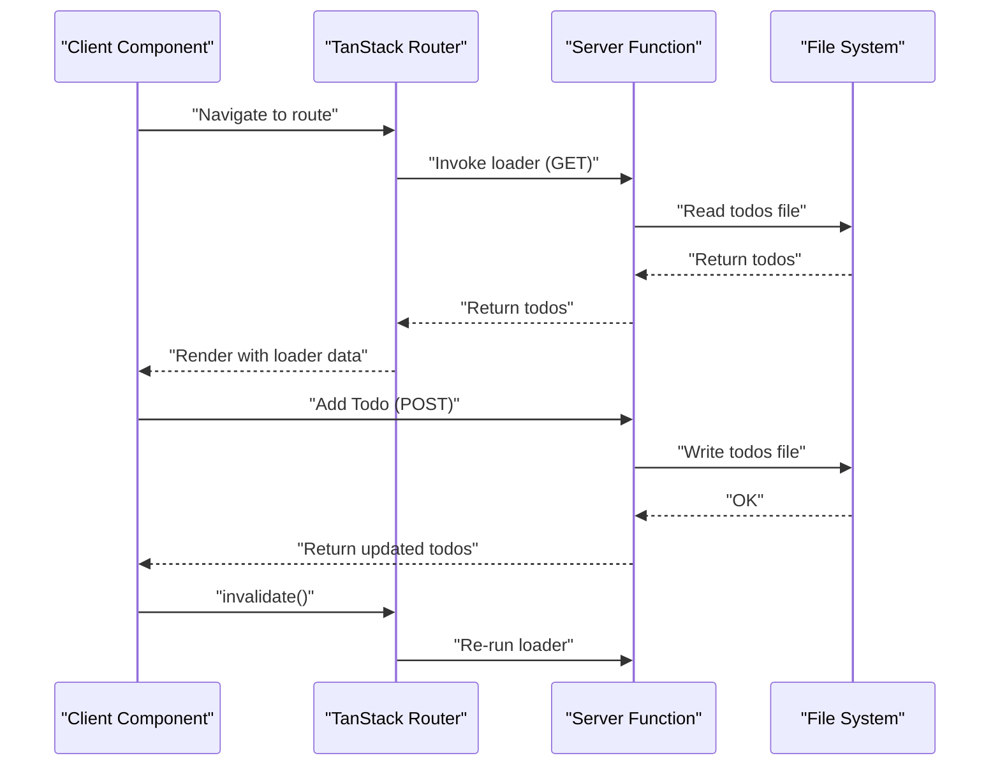
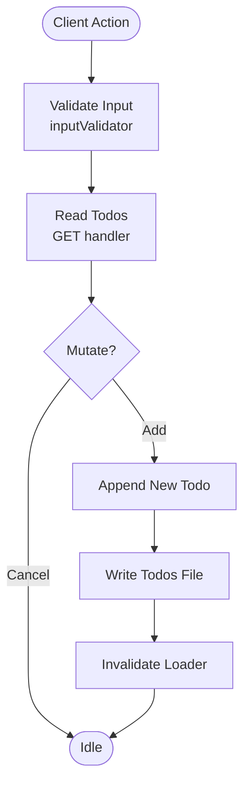
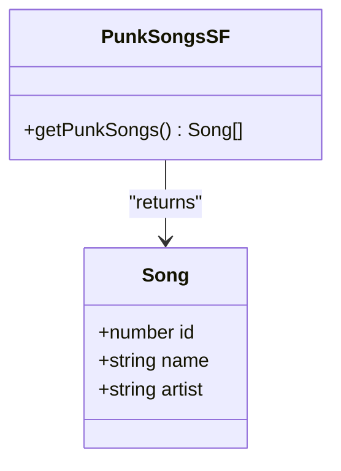
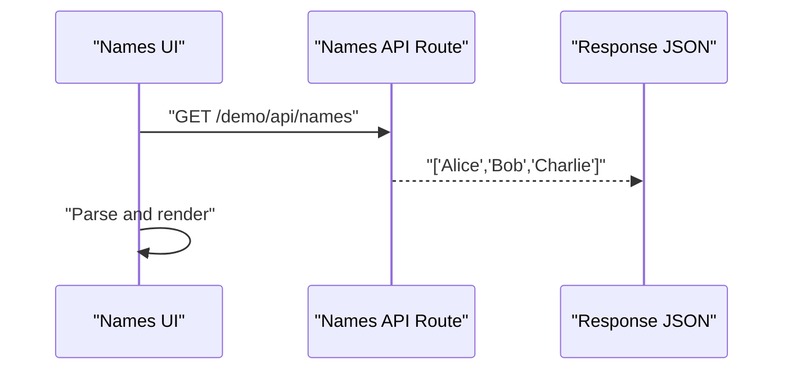
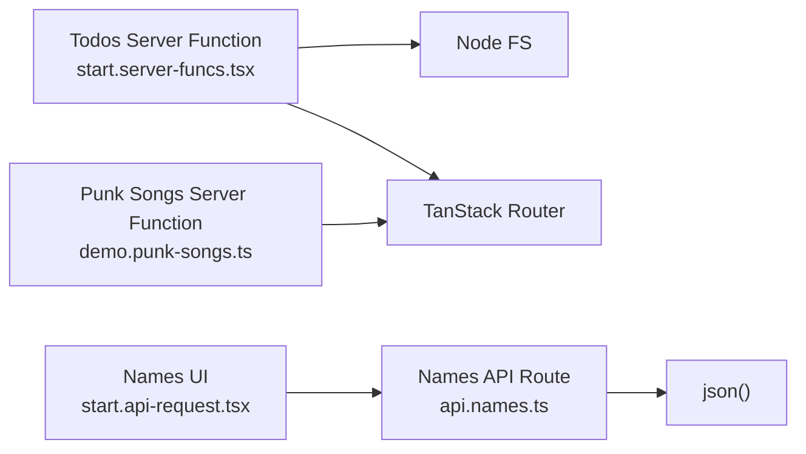

# Server Functions

<cite>
**Referenced Files in This Document**
- [start.server-funcs.tsx](file://src/routes/demo/start.server-funcs.tsx)
- [demo.punk-songs.ts](file://src/data/demo.punk-songs.ts)
- [api.names.ts](file://src/routes/demo/api.names.ts)
- [start.api-request.tsx](file://src/routes/demo/start.api-request.tsx)
- [Header.tsx](file://src/components/Header.tsx)
- [index.tsx](file://src/routes/index.tsx)
</cite>

## Table of Contents
1. [Introduction](#introduction)
2. [Project Structure](#project-structure)
3. [Core Components](#core-components)
4. [Architecture Overview](#architecture-overview)
5. [Detailed Component Analysis](#detailed-component-analysis)
6. [Dependency Analysis](#dependency-analysis)
7. [Performance Considerations](#performance-considerations)
8. [Troubleshooting Guide](#troubleshooting-guide)
9. [Conclusion](#conclusion)

## Introduction
Server Functions enable type-safe backend logic execution within a full-stack React application. They allow you to define server-side functions that are callable from the client, with strong typing and automatic serialization across the security boundary. This document explains how server functions work in this project, focusing on:
- How client components invoke server functions
- Error handling and loading states
- Domain models for todos and punk songs
- Serialization, security boundaries, and performance implications
- Practical examples from the repository

## Project Structure
The Server Functions feature is demonstrated across several files:
- A Todo CRUD example using server functions and a local file-backed persistence
- A data-fetching example for punk songs via a server function
- An API route example for names
- A client component that performs a standard fetch to an API route
- Navigation links to demos

**Diagram sources**
- [start.server-funcs.tsx](file://src/routes/demo/start.server-funcs.tsx#L1-L109)
- [demo.punk-songs.ts](file://src/data/demo.punk-songs.ts#L1-L14)
- [api.names.ts](file://src/routes/demo/api.names.ts#L1-L11)
- [start.api-request.tsx](file://src/routes/demo/start.api-request.tsx#L1-L45)

**Section sources**
- [start.server-funcs.tsx](file://src/routes/demo/start.server-funcs.tsx#L1-L109)
- [demo.punk-songs.ts](file://src/data/demo.punk-songs.ts#L1-L14)
- [api.names.ts](file://src/routes/demo/api.names.ts#L1-L11)
- [start.api-request.tsx](file://src/routes/demo/start.api-request.tsx#L1-L45)
- [Header.tsx](file://src/components/Header.tsx#L72-L98)
- [index.tsx](file://src/routes/index.tsx#L1-L51)

## Core Components
- Todos Server Function: Defines a GET function to read persisted todos and a POST function to add a new todo. It uses a local file as storage and validates input via an input validator.
- Punk Songs Server Function: Provides a GET function returning a static list of punk songs.
- Names API Route: Demonstrates a traditional API route that returns JSON data.
- Client UIs: The Todo UI invokes server functions and invalidates loaders to refresh data. The Names UI performs a standard fetch to the API route.

Key implementation patterns:
- Defining server functions with createServerFn and handler blocks
- Using inputValidator to enforce input types
- Calling server functions from client components and using router invalidation to refresh data
- Returning arrays of domain objects from server functions

**Section sources**
- [start.server-funcs.tsx](file://src/routes/demo/start.server-funcs.tsx#L1-L109)
- [demo.punk-songs.ts](file://src/data/demo.punk-songs.ts#L1-L14)
- [api.names.ts](file://src/routes/demo/api.names.ts#L1-L11)

## Architecture Overview
The system separates client and server concerns while maintaining type safety. Server functions are defined on the server and invoked from the client. The client can:
- Call server functions directly from components
- Use loaders to hydrate route data on the server
- Invalidate loaders to trigger re-fetches

**Diagram sources**
- [start.server-funcs.tsx](file://src/routes/demo/start.server-funcs.tsx#L1-L109)

## Detailed Component Analysis

### Todos CRUD with Server Functions
This example demonstrates:
- A GET server function to read todos from a local file
- A POST server function to add a new todo and persist it
- Loader hydration for initial data
- Client-side invalidation to refresh data after mutations

Implementation highlights:
- Server function creation and handler definition
- Input validation for mutation payloads
- Persistence using the file system
- Loader usage to pre-render data on the server
- Router invalidation to refresh cached data

**Diagram sources**
- [start.server-funcs.tsx](file://src/routes/demo/start.server-funcs.tsx#L1-L109)

**Section sources**
- [start.server-funcs.tsx](file://src/routes/demo/start.server-funcs.tsx#L1-L109)

### Punk Songs Data Retrieval
This example shows a simple GET server function that returns a typed array of song objects. It demonstrates:
- Defining a server function in a data module
- Returning structured domain data
- Consuming the function from a client component

Domain model:
- Song: id (number), name (string), artist (string)

**Diagram sources**
- [demo.punk-songs.ts](file://src/data/demo.punk-songs.ts#L1-L14)

**Section sources**
- [demo.punk-songs.ts](file://src/data/demo.punk-songs.ts#L1-L14)

### Names API Route (Fetch Example)
This example illustrates a traditional API route that returns JSON. The client performs a standard fetch to retrieve data.

**Diagram sources**
- [api.names.ts](file://src/routes/demo/api.names.ts#L1-L11)
- [start.api-request.tsx](file://src/routes/demo/start.api-request.tsx#L1-L45)

**Section sources**
- [api.names.ts](file://src/routes/demo/api.names.ts#L1-L11)
- [start.api-request.tsx](file://src/routes/demo/start.api-request.tsx#L1-L45)

## Dependency Analysis
- Todos Server Function depends on:
  - createServerFn for function definition
  - Node.js file system for persistence
  - TanStack Router for loaders and invalidation
- Punk Songs Server Function depends on:
  - createServerFn for function definition
- Names API Route depends on:
  - createFileRoute for route definition
  - json for response serialization
- Client UIs depend on:
  - TanStack Router for navigation and loaders
  - Standard fetch for API routes

**Diagram sources**
- [start.server-funcs.tsx](file://src/routes/demo/start.server-funcs.tsx#L1-L109)
- [demo.punk-songs.ts](file://src/data/demo.punk-songs.ts#L1-L14)
- [api.names.ts](file://src/routes/demo/api.names.ts#L1-L11)
- [start.api-request.tsx](file://src/routes/demo/start.api-request.tsx#L1-L45)

**Section sources**
- [start.server-funcs.tsx](file://src/routes/demo/start.server-funcs.tsx#L1-L109)
- [demo.punk-songs.ts](file://src/data/demo.punk-songs.ts#L1-L14)
- [api.names.ts](file://src/routes/demo/api.names.ts#L1-L11)
- [start.api-request.tsx](file://src/routes/demo/start.api-request.tsx#L1-L45)

## Performance Considerations
- Server functions execute on the server; keep heavy computations there to avoid blocking the client.
- Use loaders to pre-render data on the server for improved initial load performance.
- Persist data efficiently; in-memory caches can reduce disk I/O.
- Avoid unnecessary invalidations; batch updates when possible.
- For large datasets, consider pagination or streaming responses.

[No sources needed since this section provides general guidance]

## Troubleshooting Guide
Common issues and solutions:
- Type mismatches
  - Symptom: Runtime errors when serializing or deserializing payloads
  - Cause: Mismatch between declared input types and actual values
  - Solution: Use inputValidator to enforce types and ensure payloads match the expected shape
  - Reference: [start.server-funcs.tsx](file://src/routes/demo/start.server-funcs.tsx#L1-L109)
- Network errors
  - Symptom: Fetch failures or timeouts
  - Cause: API route not found or server down
  - Solution: Verify route paths and ensure the server is running; handle errors in the client
  - Reference: [api.names.ts](file://src/routes/demo/api.names.ts#L1-L11), [start.api-request.tsx](file://src/routes/demo/start.api-request.tsx#L1-L45)
- Serialization problems
  - Symptom: Unexpected undefined or circular references
  - Cause: Non-serializable values in returned data
  - Solution: Return plain objects and primitives; avoid functions or complex objects
  - References: [start.server-funcs.tsx](file://src/routes/demo/start.server-funcs.tsx#L1-L109), [demo.punk-songs.ts](file://src/data/demo.punk-songs.ts#L1-L14)
- Loading states
  - Symptom: UI flickering or stale data
  - Cause: Not invalidating loaders after mutations
  - Solution: Call router.invalidate() after successful mutations to refresh data
  - Reference: [start.server-funcs.tsx](file://src/routes/demo/start.server-funcs.tsx#L1-L109)

**Section sources**
- [start.server-funcs.tsx](file://src/routes/demo/start.server-funcs.tsx#L1-L109)
- [demo.punk-songs.ts](file://src/data/demo.punk-songs.ts#L1-L14)
- [api.names.ts](file://src/routes/demo/api.names.ts#L1-L11)
- [start.api-request.tsx](file://src/routes/demo/start.api-request.tsx#L1-L45)

## Conclusion
Server Functions provide a powerful, type-safe way to execute backend logic from the client while preserving strong typing and automatic serialization across the security boundary. In this project:
- Todos CRUD is implemented with server functions and file persistence
- Punk songs data is fetched via a server function returning typed domain objects
- API routes demonstrate traditional fetch-based data retrieval
- Client components orchestrate invocations, handle errors, and manage loading states through loaders and invalidation

By following the patterns shown here—defining server functions with input validators, using loaders for hydration, and invalidating after mutations—you can build robust, type-safe full-stack applications with minimal boilerplate.